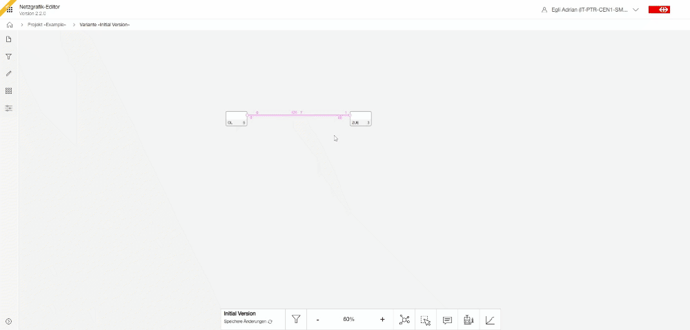

# Creation

The user can define nodes, trains with their routes and attributes to create a comprehensive
Netzgrafik.

## Project/Variant

### Create a new Project

To create a new project, simply click on the "+" symbol and enter a name, an abstract and a short
description.
You have already created a project which can contain many variants.

### Create a new Variant within an Project

To create a new variant of a project, simply click on the "+" symbol and enter a name. You have
already created a new variant in the project and the editor opens automatically

### Become creative (start editing)

#### Clear template Netzgrafik

The editor opens the new created Netzgrafik. The new Netzgrafik contains some initial created nodes
from which users could draw trainruns with its sections. In most project those nodes are not
required. If so press CTRL+A to select all elements of the current Netzgrafik and press DEL to
delete them.

#### Import nodes from a comma-seperate-value file (CSV)

Nodes can be imported using a predefined semicolon-separated file (CSV). This allows the basis to be
created very quickly. In addition to node properties, such as stopping times per train type, node
positions can also be imported so that the layout comes directly from the import.

##### Import CSV interface description

|                  |                      BP                      |                     Bahnhof                      |   Kategorie    |    Region     |              Fahrgastwechselzeit_IPV               |               Fahrgastwechselzeit_A                |               Fahrgastwechselzeit_B                |               Fahrgastwechselzeit_C                |               Fahrgastwechselzeit_D                |      ZAZ      |           Umsteigezeit           |              Labels              |         X         |          Y          |                            Erstellen                            |
|:----------------:|:--------------------------------------------:|:------------------------------------------------:|:--------------:|:-------------:|:--------------------------------------------------:|:--------------------------------------------------:|:--------------------------------------------------:|:--------------------------------------------------:|:--------------------------------------------------:|:-------------:|:--------------------------------:|:--------------------------------:|:-----------------:|:-------------------:|:---------------------------------------------------------------:|
|     Datatype     |                    string                    |                      string                      |     string     |   nummeric    |                      nummeric                      |                      nummeric                      |                      nummeric                      |                      nummeric                      |                      nummeric                      |   nummeric    |             nummeric             |             nummeric             |     nummeric      |      nummeric       |                          'JA' or empty                          |
|   Description    |                      id                      |                    full name                     | category label | region number | if <= 0 -> non stop, otherwise > default stop time | if <= 0 -> non stop, otherwise > default stop time | if <= 0 -> non stop, otherwise > default stop time | if <= 0 -> non stop, otherwise > default stop time | if <= 0 -> non stop, otherwise > default stop time | no implemened | min. connectiontime - Default: 2 | comma separated filerable labels | vertical position | horizontal position | if 'JA' missing nodes gets created, otherwise just updated (ID) |
| More information | this is a unique identifier  (non-empty) | full name of the station (node)  (non-empty) | empty allowed  | empty allowed |                   empty allowed                    |                   empty allowed                    |                   empty allowed                    |                   empty allowed                    |                   empty allowed                    | empty allowed |          empty allowed           |          empty allowed           |   empty allowed   |    empty allowed    |                          empty allowed                          |

**category label:** If the node gets created or updated the category labels gets added as filterable
label. The label template ist "Kategorie:" + value. Comma separated values allows to add more than
one category label.
**region number:** If the node gets created or updated the region number gets added as filterable
label. The label template ist "Region:" + value. Comma separated values allows to add more than one
region label.

[>> Demo base data CSV file]29-01-2024-004-Stammdaten_importieren.csv)

#### Create new trainrun

Drag-and-drop a new trainrun from a node to another node. Just use the left mouse button, press
mouse button on a node and hold the button pressed while moving to another node. Then release the
pressed button and the trainrun gets created. The trainrun dialog opens - enter all
information about the trainrun. Then click outside the window or press 'ESC' to close the dialog
window. If you like to reopen the dialog just click on the trainrun name in the editor or click any
time (number). The dialog gets shown again. If you click on the trainrun - its gets selected and you
can modify it. Click for a second time the pearls view gets opened.

For mor details have a look into [create and modifiy trainrun](CREATE_TRAINRUN.md).

##### Move nodes

If you move the node - the Netzgrafik routes all trainrun section automatically. The Netzgrafik
recalculates the routing and results in a new well aligned readable layout.

Example 1:

Example 2:

