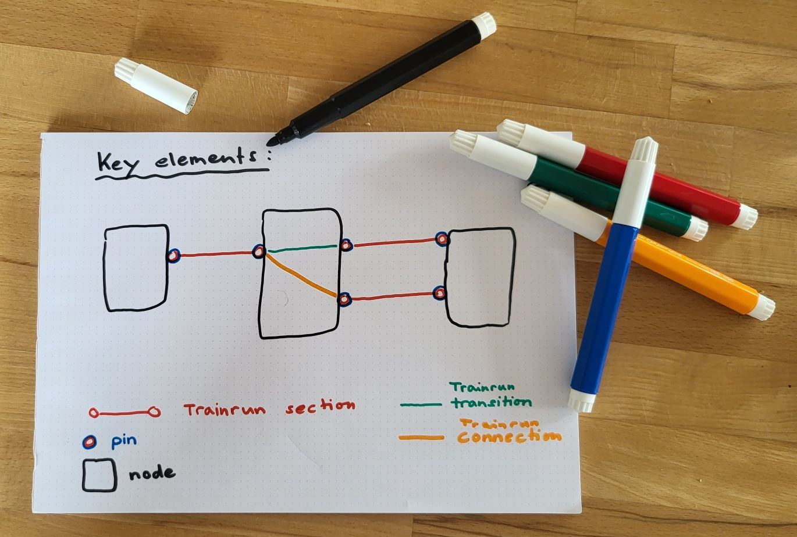

## Data model

The data model consists of the following key elements: *trainrun*, *trainrun section*,
*transition*, *trainrun connection*, *port* and *node*.

### Business orientated description

The nodes in the data model represent the specific locations, such as stations or stops, where a
trainrun can have different actions or events associated with it. These nodes serve as key points in
the trainrun's route, determining where it stops, passes through, or starts and ends.

On the other hand, the trainrun section represents a specific segment or portion of a trainrun that
connects two nodes. It encapsulates all the relevant information related to that particular section,
including temporal details like departure and arrival times. Additionally, it also stores the travel
time, which indicates the duration it takes for the trainrun to move from one node to another.

The trainrun connection signifies the point in the logistic network where two trains need to
coordinated to ensure a smooth connection between them.

By combining the nodes and trainrun sections in this data model, we can create a representation of
the trainrun network, mapping out the connections and relationships between the different stations
and the time it takes to traverse between them. This enables us to analyze and visualize complex
trainrun routes and schedules.

### Technically orientated description

Thus, the data model, consisting of TrainrunSection and nodes, forms a network of edges and nodes,
similar to an undirected graph. The TrainrunSections represent the connections between the nodes and
enable the representation and analysis of complex relationships in the model.

- ***TrainrunSection*** corresponds to the edges between nodes in an undirected graph.
- ***Nodes*** represent the points in the graph, allowing the connection of trainrun section .
- A *pin* represents a ***port*** (point) in the graph where a trainrun section is connected to a
  Node.
- The ***transition*** extends the graph within the node. A transition corresponds to an edge that
  connects two pins within the Node, thereby connecting two trainrun section.
- If two trainruns should make a connection at a station, this can be defined using a
  ***connection***. The trainrun connection links two pins, each have to be associated with a
  different train.

Together, these elements form an undirected graph consisting of edges (TrainrunSections,
Transitions) and nodes (Ports).

The last key element is the ***trainrun***. The trainrun consists of an ordered sequence of
trainrun sections and transitions. This ordered sequence defines the route of the Trainrun and
establishes a direction in the undirected graph. This direction corresponds to the exact path of the
train.

