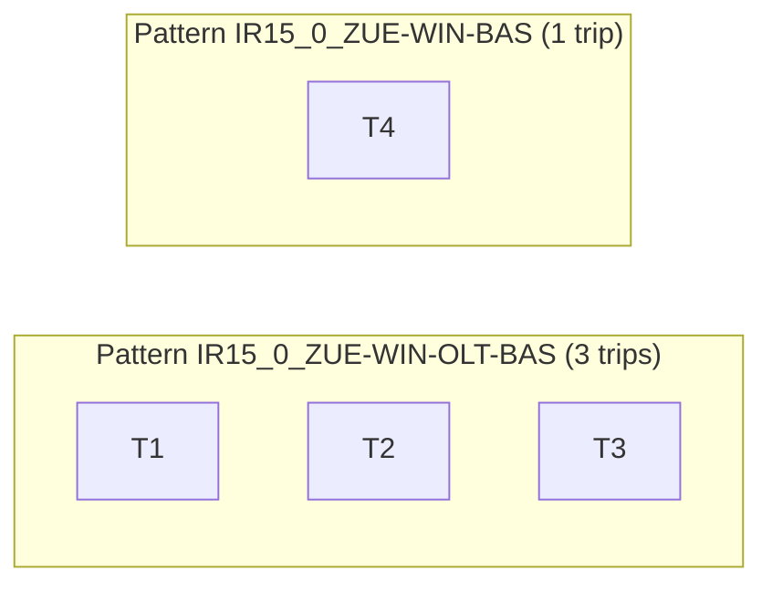
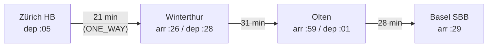
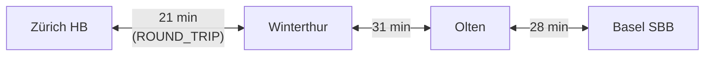

# GTFS Import: End-to-End Algorithm and Data Mapping

## 1. Purpose and Scope

This document describes the GTFS import workflow in Netzgrafik Editor, including:

- parsing and conversion from GTFS to Netzgrafik,
- mapping of categories, frequencies, and trainrun metadata,
- post-creation topology consolidation,
- non-stop vs. stop transition semantics,
- and iterative convergence behavior.

The chapters are ordered exactly by execution flow.

## 2. External GTFS References

The implementation assumes a standard GTFS feed structure and terminology.

Recommended references:

- https://opentransportdata.swiss/de/cookbook/timetable-cookbook/gtfs/
- https://gtfs.org/documentation/schedule/reference/

## 3. Input and Import Preconditions

Expected GTFS input files:

- `stops.txt`
- `routes.txt`
- `trips.txt`
- `stop_times.txt`
- optional calendar files (`calendar.txt`, `calendar_dates.txt`)

Import options include (among others):

- topology consolidation enabled/disabled,
- allowed detour by percentage (`xx%`),
- allowed detour by absolute minutes (`yy`),
- minimum edge travel time `A` (default `1`),
- maximum consolidation iterations `n` (default `10`),
- optional round-trip merge.

## 4. Phase A: GTFS Parsing and Pattern Preparation

### 4.1 Parse Feed Data

GTFS CSV tables are parsed and normalized into in-memory structures.

### 4.2 Build Trip Patterns

Trips are grouped by route and stop sequence into pattern candidates.

### 4.3 Normalize Stop-to-Station Mapping

Platform stops are mapped to parent station IDs (if available).
If a required parent station does not exist as an explicit stop row, a virtual station node may be synthesized.

## 5. Phase B: Filtering, Pattern Grouping, and Trainrun Creation

Before any Netzgrafik objects can be created, the raw GTFS data must be filtered down to only the relevant subset, then grouped into logical trip patterns from which one representative master trip is selected per pattern. The subsequent steps — node creation, category/frequency mapping, trainrun creation, and section creation — all operate on this reduced, pattern-indexed data.

### 5.0 Data Filtering Pipeline

The GTFS feed is filtered in three sequential stages. Each stage reduces the working set further; subsequent stages only see what passes earlier stages.

**Stage 1 — Agency filter.**
All agencies in `agency.txt` are matched against a user-provided list of agency names (e.g., `"Schweizerische Bundesbahnen SBB"`). Matching is case-insensitive and keyed by `agency_name`. The result is a set of allowed `agency_id` values. Any agency not in this set is discarded. If no agency filter is specified, all agencies pass.

**Stage 2 — Route type and route filter.**
`routes.txt` is filtered by:
- `route_type`: only routes whose integer type is in the allowed set pass (e.g., `2` = Rail). Default is Rail-only.
- `agency_id`: only routes belonging to surviving agencies pass.
- `route_desc` (optional category filter): if a category allowlist is provided, only routes whose `route_desc` matches (case-insensitive) are kept.

**Stage 3 — Trip filter.**
`trips.txt` is filtered to only trips whose `route_id` is in the surviving route set. If a specific operating day (`Betriebstag`) is provided, an additional calendar check is applied: for each trip, its `service_id` is looked up in `calendar.txt` (weekday + date range check) and `calendar_dates.txt` (exception type 1 = added, type 2 = removed). A trip is kept only if it operates on the target day. `stop_times.txt` is then loaded and filtered to only the surviving trip IDs.

```
agencies.txt  →  [agency filter]  →  allowed_agency_ids
routes.txt    →  [type + agency + category filter]  →  allowed_routes
trips.txt     →  [route filter + calendar/day filter]  →  allowed_trips
stop_times.txt→  [trip filter]  →  working_stop_times
```

### 5.1 Trip Pattern Grouping and Master Trip Selection

After filtering, the remaining trips must be collapsed into **patterns** — groups of trips that share an identical stop sequence — so that the Netzgrafik receives one clean trainrun per service pattern rather than one per individual trip.

**Building the pattern key.**
For each trip, its stop-times are sorted by `stop_sequence`. Each stop ID is mapped to its `parent_station` ID (if it has one), so that multiple platform rows at the same station are treated as one station. Consecutive duplicate station IDs are collapsed to a single entry. The resulting ordered list of station IDs forms the **stop sequence**. A pattern key is assembled as:

```
patternKey = route_id + "_" + direction_id + "_" + stationId1 + "-" + stationId2 + "..." + stationIdN
```

All trips that produce the same key are placed in the same pattern group.

**Example:**

Suppose route `IR15` has four trips on a Tuesday operating day:

| trip_id | stops (after platform→station mapping) | direction |
|---------|----------------------------------------|-----------|
| T1      | ZUE – WIN – OLT – BAS               | 0         |
| T2      | ZUE – WIN – OLT – BAS               | 0         |
| T3      | ZUE – WIN – OLT – BAS               | 0         |
| T4      | ZUE – WIN – BAS  (skips OLT)        | 0         |

T1, T2, T3 share key `IR15_0_ZUE-WIN-OLT-BAS` → one pattern group with 3 trips.
T4 has key `IR15_0_ZUE-WIN-BAS` → a separate pattern group with 1 trip.



**Selecting the master (representative) trip.**
For each pattern group, the first trip in the group (index 0 after insertion order) is used as the **representative trip**. Its stop-times provide the authoritative timing for all sections created from this pattern. All trips in the group are recorded in the `trainrunToTrips` map attached to the output DTO (for traceability), but only the representative trip's times appear in the Netzgrafik sections.

> **Why the first trip?** The filtering and grouping guarantee that all trips in a group have an identical stop sequence. Any one of them would produce the same set of sections. The first trip is the simplest deterministic choice. Future improvements could select the median departure or a "cleanest timetable" representative, but the current heuristic is sufficient because the symmetry model normalises minute-within-hour times anyway.

### 5.2 Node Creation

Once the pattern set is fixed, all station IDs referenced in any pattern's stop sequence are collected. This is the **working node set** — no station outside it will appear in the output.

Only station-level entries are turned into nodes. Platform rows (`location_type != 1` with a non-empty `parent_station`) are not directly turned into nodes; they are always accessed through their parent. If a `parent_station` ID appears in the working set but has no own row in `stops.txt` (i.e., the feed only contains platform rows and no explicit station entry), a **virtual station record** is synthesised:
- name: the first child platform's `stop_name` with any trailing platform suffix stripped (regex: `\s+(Gleis|Track|Platform|Quai)\s+.*$`),
- coordinates: copied from the first child platform.

Coordinates are projected from WGS 84 to a flat canvas: the distance from Swiss centre (46.8° N / 8.2° E) is multiplied by a fixed scale factor (15,000) to produce pixel-like x/y values. After projection, all nodes are translated so that their centroid lies at canvas origin (0, 0).

Each station is assigned an integer node ID equal to its 1-based index in the ordered station list. A `stopId → nodeId` lookup map is built, with all platform IDs of a station mapped to the same node ID as their parent.

### 5.3 Category Mapping

The set of unique `route_desc` values across all remaining routes defines the **category universe**. Each unique description is resolved against the existing `TrainrunCategory` pool in strict priority order:

1. **Short name match**: the first 10 characters of the description are compared case-insensitively against the `shortName` field of existing categories. If a match is found, the existing category's ID is reused.
2. **Full name match**: the full description string is compared case-insensitively against the `name` field of existing categories.
3. **Create new**: if no match is found, a new category is created with ID `2026_000i` (counter continuing from the highest existing ID + 1). The colour reference is derived from keyword matching against known prefixes (`IC`/`ICE`/`TGV` → `EC`, `IR`/`InterRegio` → `IR`, `RE`/`RegionalExpress` → `RE`, `S`/`S-Bahn` → `S`, etc.); unrecognised descriptions default to `RE`.

The result is a `description → categoryId` map consumed in step 5.5.

### 5.4 Frequency Detection and Mapping

Frequency is determined per route by analysing the departure intervals of its trips in **one direction only** (direction 0 preferred; direction 1 used as fallback if no direction-0 data exists). Using both directions would double-count and distort the interval histogram.

**Algorithm (pseudo-code):**

```
for each route R:
  collect all departure times across stops, direction=0 only
  for each stop S that has ≥ 2 departures:
    sort departures chronologically
    for consecutive pair (depA, depB):
      interval = depB - depA  (minutes)
      snap interval to nearest standard value:
        ≤ 17 min  → 15
        ≤ 25 min  → 20
        ≤ 45 min  → 30
        ≤ 90 min  → 60
        ≤ 150 min → 120
        > 150 min → 60  (long-haul default)
      append snapped value to histogram
  mostCommonFrequency = mode of histogram  (ties: first encountered wins)
  R.frequency = mostCommonFrequency
```

**120-minute offset detection.**
When the mode is 120, the algorithm additionally determines whether the route departs on even hours (0, 2, 4 …) or odd hours (1, 3, 5 …). It takes the smallest first-departure time across all stops, extracts the hour, and stores `offsetHour = hour mod 2`. This produces frequency keys `120_0` (even-hour trains) and `120_60` (odd-hour trains), allowing two interleaved 2-hourly patterns to coexist in the Netzgrafik without collision.

**Representative trip selection.**
After the frequency is determined, one trip is selected as the sample trip for the route: the code scans all direction-0 departures sorted chronologically and picks the first one whose departure minute matches the standard grid for the detected frequency (e.g., `:00` for 60-min, `:00` or `:30` for 30-min). If no grid-aligned departure exists, the chronologically first departure is used.

**Mapping to `TrainrunFrequency`.**
The detected frequency key (`"15"`, `"30"`, `"60"`, `"120_0"`, etc.) is looked up in the `TrainrunFrequency` pool. If a matching entry exists, its ID is reused. A new entry is only created if the pool does not contain a matching entry (unusual with a complete default set).

### 5.5 Trainrun Creation — All Patterns Start as ONE_WAY

For each accepted trip pattern, exactly one `TrainrunDto` is created. At this stage, **every trainrun is unconditionally created with `direction = ONE_WAY`**, regardless of whether it is a forward or a backward trip in the GTFS feed. This is intentional: the Netzgrafik model does not distinguish directions at the trainrun level at creation time; the direction attribute is only upgraded to `ROUND_TRIP` in phase C if a valid matching reverse pattern is found.

The trainrun receives:
- **categoryId**: from the category map (step 5.3), keyed by `route_desc` of the pattern's route.
- **frequencyId**: from the frequency map (step 5.4), keyed by frequency string (`"60"`, `"120_0"`, etc.).
- **timeCategoryId**: taken from the first entry of the time-category pool.
- **direction**: `ONE_WAY` (always at this stage).
- **name**: constructed as `<routeNumber> → <headsign> (<tripShortName>)`. The category prefix is stripped from `route_short_name` to avoid duplication (e.g., category `IR` + route short name `IR15` → display name `15 → Basel`).
- **debug label**: `<routeName> → <firstStopName> → <lastStopName>` for traceability in the filter panel.

Two metadata maps are populated per trainrun:
- `trainrunToTrips`: maps trainrun ID → list of all GTFS trip IDs in the pattern.
- `initialStopNodeIdsByTrainrun`: maps trainrun ID → set of node IDs where passengers may board or alight (i.e., at least one stop-time row in the pattern had `pickup_type != 1` or `drop_off_type != 1`). This map is used later in phase E to enforce correct stop/non-stop transition semantics.

### 5.6 TrainrunSection Creation

For each pattern, the representative trip's stop-times are first consolidated into **station groups** (one group per unique parent-station in sequence order):

```
rawStopTimes = stopTimes[representativeTrip].sortBy(stop_sequence)

for each stopTime in rawStopTimes:
  stationId = parentStation(stopTime.stop_id)
  if stationGroups is empty OR last group's stationId ≠ stationId:
    push new group { stationId, nodeId, isStop=false, arrMin=+∞, depMin=-∞ }
  group.arrMin   = min(group.arrMin,   toMinutes(stopTime.arrival_time))
  group.depMin   = max(group.depMin,   toMinutes(stopTime.departure_time))
  if stopTime.pickup_type ≠ "1" OR stopTime.drop_off_type ≠ "1":
    group.isStop = true
```

A group with `isStop = false` means the train passes through the station without allowing boarding or alighting — for example, a through-run coded with `pickup_type=1, drop_off_type=1`.

For each **consecutive pair** of station groups `(src, tgt)`, one `TrainrunSectionDto` is emitted:

**Travel time:**
```
travelTime = max(1, tgt.arrMin - src.depMin)
```

**Symmetric times (60-x rule):**

The Netzgrafik clock-face model requires that for a given section, the departure from the source and the arrival at the target are symmetric around the 30-minute mark within the hour. The GTFS departure and arrival minutes are used directly for the forward direction; the return direction is derived algebraically:

```
sourceDep  = src.depMin mod 60       // forward: GTFS value
targetArr  = tgt.arrMin mod 60       // forward: GTFS value
sourceArr  = (60 - sourceDep) mod 60 // return: 60-x symmetry
targetDep  = (60 - targetArr) mod 60 // return: 60-x symmetry
```

**Example** — section Zürich HB → Winterthur (IR15, departure :05, arrival :26):

| Field          | Value | Meaning                              |
|----------------|-------|--------------------------------------|
| `sourceDep`    | 5     | train leaves Zürich at :05           |
| `targetArr`    | 26    | train arrives Winterthur at :26      |
| `travelTime`   | 21    | 21 minutes                           |
| `sourceArr`    | 55    | return train arrives Zürich at :55   |
| `targetDep`    | 34    | return train leaves Winterthur at :34|

This symmetry is what makes round-trip detection in phase C possible without any additional time data.

**`numberOfStops`:**
- `0` if both `src.isStop` and `tgt.isStop` are true (both ends allow boarding/alighting),
- `1` if either end is a pass-through (indicating the section touches a non-stopping node).

**Loop guard:**
A section is silently skipped if:
- the target node has already been visited in this trainrun (prevents loops), or
- the directed edge `srcNodeId → tgtNodeId` has already been used in this trainrun (prevents duplicate edges).

**Result after phase B** (example for IR15, direction 0):



All sections belong to one `TrainrunDto` with `direction = ONE_WAY`. An identical but reversed trainrun (direction 1, Basel → Zürich) has also been created at this point and is also `ONE_WAY`. Both exist independently until phase C.

## 6. Phase C: Round-Trip Detection and Merge

After all one-way trainruns and their sections are created, the algorithm attempts to pair up opposite-direction counterparts and merge them into `ROUND_TRIP` trainruns. This step is optional and controlled by the `mergeRoundTrips` option (default: enabled).

The motivation is that Netzgrafik's symmetric clock-face model represents a line as a single bidirectional object. Having two separate `ONE_WAY` trainruns for the same line wastes display space and makes time-symmetry verification impossible. Phase C identifies and merges these pairs.

### 6.1 Matching Algorithm

The algorithm iterates all trainruns in order. For each unmatched trainrun `T1`, all subsequent unmatched trainruns `T2` are tested as candidates. A candidate pair is accepted only when **all five criteria** pass simultaneously:

**Criterion 1 — Same line name.**
`route_short_name` of `T1`'s route must equal `route_short_name` of `T2`'s route (case-insensitive). `route_long_name` is used as fallback if `route_short_name` is absent. Two IR15 trips in opposite directions share the same `route_short_name = "IR15"`, so they pass. An IR15 and an IC5 do not.

**Criterion 2 — Same category.**
`route_desc` of both routes must match exactly (case-sensitive). This ensures that, for example, `"IR"` trains are not accidentally merged with `"IC"` trains that happen to share a route name in some feeds.

**Criterion 3 — Same frequency.**
The resolved cycle time (`R.frequency`) of both routes must be identical. A 60-min train cannot be merged with a 30-min train even if they share the same name, because their Netzgrafik representations differ.

**Criterion 4 — Reversed stop sequence.**
The station sequence of `T2`'s pattern must be the **exact reverse** of `T1`'s pattern:

```
T1 stop sequence:  ZUE – WIN – OLT – BAS
T2 stop sequence:  BAS – OLT – WIN – ZUE   ← exact reverse of T1 ✓

T1 stop sequence:  ZUE – WIN – OLT – BAS
T2 stop sequence:  BAS – WIN – ZUE          ← different length ✗
```

Length must also match. Any deviation — missing intermediate stop, extra stop, reordered stop — causes rejection.

**Criterion 5 — Time symmetry.**
For each section index `i`, the pair `(section_i of T1, reversed section_i of T2)` must satisfy the 60-x symmetry rule within a configurable tolerance (default 180 seconds = 3 minutes):

```
for i in 0 .. sections.length - 1:
  sec1 = T1.sections[i]
  sec2 = T2.sections[reversed_index(i)]

  expected_sec2_targetArr = (60 - sec1.sourceDep) mod 60
  actual_sec2_targetArr   = sec2.targetArr

  delta = circularDistance(actual, expected)  // handles :59 vs :01 wrap-around
  if delta * 60 > toleranceSeconds → REJECT ("Time symmetry failed")
```

This check ensures that the two one-way trains actually form a symmetric clock-face timetable pair, not just two trains that happen to travel the same corridor in opposite directions at unrelated times.

**Example** — IR15 Basel→Zürich section (reversed):

| Field                   | T1 (ZUE→BAS) section 0 | T2 (BAS→ZUE) reversed section 0 | Check |
|-------------------------|-------------------------|----------------------------------|-------|
| `sourceDep`             | :05                     | `targetArr` = :55                | expected: (60-5)%60 = :55 ✓ |
| `targetArr`             | :26                     | `sourceDep` = :34                | expected: (60-26)%60 = :34 ✓ |

Both checks pass within tolerance → pair accepted.

### 6.2 Preferred Direction and Discarded Data

When a valid pair `(T1, T2)` is found, the algorithm chooses which trainrun to **keep** and which to **discard**. The criterion is geographic: for each candidate, the direction vector of its first section is computed:

```
Δx = targetNode.positionX - sourceNode.positionX
Δy = targetNode.positionY - sourceNode.positionY
score = (Δx > 0 ? 1 : 0) + (Δy > 0 ? 1 : 0)   // max = 2 (eastward + southward)
```

The trainrun with the higher score is **kept** as the canonical direction; the other is **discarded**. If scores are equal, `T1` (the earlier trainrun) is kept. The rationale is that Swiss rail maps conventionally orient from west/north to east/south; this heuristic aligns the displayed arrow direction with convention.

**What is discarded:**
- the removed trainrun object itself,
- **all** `TrainrunSectionDto` objects whose `trainrunId` matches the removed trainrun.

**What is preserved:**
- the surviving trainrun's sections are kept unchanged,
- all label IDs from the removed trainrun are appended to the surviving trainrun's `labelIds` list (so debug filter labels from both directions remain searchable),
- the surviving trainrun's `direction` is updated from `ONE_WAY` to `ROUND_TRIP`.

After the merge, the surviving trainrun's sections already encode both directions via the 60-x symmetric times computed in step 5.6. No additional data needs to be written.

**Result after phase C** (example for IR15):



The `↔` arrows indicate `ROUND_TRIP`: both :05 departure from Zürich and :55 return arrival at Zürich are encoded in the same section, derived from the 60-x symmetric times.

### 6.3 Unmatched Trainruns

Trainruns for which no valid match is found remain as `ONE_WAY`. This happens when:
- the reverse direction is filtered out (different agency, route type, or operating day),
- the reverse pattern has a different stop sequence (e.g., asymmetric routing),
- the time symmetry criterion fails beyond tolerance (e.g., irregular timetable or special service),
- the route simply has no reverse counterpart in the feed.

The failure reason is recorded per trainrun and emitted in the converter's console log for diagnostic purposes.

### 6.4 Frequency in the Merged Output

Frequency assignment is computed once in phase A (step 5.4) and attached to each route. It is not recomputed during or after the merge. The surviving `ROUND_TRIP` trainrun retains the frequency of the kept one-way pattern. Because criterion 3 of the matching algorithm enforces that both directions have the same frequency, the surviving value is always consistent.

Topology consolidation is executed only after this phase completes, operating on the final set of trainruns and trainrun sections with their definitive `ONE_WAY` or `ROUND_TRIP` direction flags.

## 7. Phase D: Topology Consolidation (Post-Creation) 

Once all trains have been created, meaning trainruns with their `n` trainrun sections, and once it is known whether a train is `ONE_WAY` or `ROUND_TRIP`, topology consolidation is executed as a follow-up step. This consolidation runs only when explicitly enabled. If enabled, the global detour limits are applied for alternative-path mapping: the alternative connection may be at most `(1 + xx%) * travelTime` of the replaced section, or at most `travelTime + yy` minutes. In addition, an edge is replaced only if the found alternative path contains more than one edge.

The basis is an undirected graph built from already-created trainrun sections. For each trainrun section, `sourceNode` and `targetNode` are read; all appearing nodes form vertex set `V`, and all connections form edge set `E`. Each edge stores the list of attached trainrun sections, since `1:m` sections can belong to one edge. Edge weight is the minimum travel time over attached sections, constrained by lower bound `A`. This defines the basis graph `G(V,E)`.

Consolidation starts by sorting all edges ascending by weight. Then edges are processed one by one. For an edge `e` between `n1` and `n2`, an alternative path from `n1` to `n2` is searched while temporarily excluding `e`. This is the shortest path without `e`. If no path is found, nothing happens. If path travel time exceeds the allowed threshold, nothing happens. If the path has only one edge, an error is logged, because that indicates an invalid parallel duplicate connection between the same node pair.

If all criteria are met, all trainrun sections attached to edge `e` are replaced atomically: the direct connection between `n1` and `n2` is replaced by the alternative edge chain. One new trainrun section is created per path edge. Travel times of these new sections are interpolated proportionally based on cumulative minimum path travel time and the original section travel time. Each segment must be at least `A` minutes, with default `A = 1`, configurable via import options.

After successful replacement, the old edge is removed from the basis graph, new sections are attached to affected edge lists, and minimum edge weights are recomputed. A change flag marks that the graph changed in this round. After one full pass over all edges, the next pass starts. This repeats until no further changes occur or maximum iterations are reached. The default starting value is `n = 10` full passes.

Additional safety rules prevent invalid remappings: an alternative path may be used for a specific trainrun only if its newly inserted intermediate nodes do not already appear elsewhere in the same trainrun. This prevents loops and backtracking such as `A -> B -> C -> B -> D`. After replacement, the affected trainrun must still be a simple linear path without reusing already visited intermediate nodes. Optionally, replacements can also be forbidden when they reuse edges already used elsewhere in the same trainrun.

For transition semantics, the target behavior is: GTFS-defined stops stay stop transitions, while consolidation-inserted intermediate nodes are non-stop passages. Note the boolean semantics: `isNonStopTransit = false` means stop, and `isNonStopTransit = true` means non-stop. Therefore, after 3rd-party transition materialization, GTFS stop nodes are explicitly enforced as stop per trainrun, and all other nodes on the route are marked non-stop.

### 7.1 Activation Condition

Topology consolidation runs only if explicitly enabled.

### 7.2 Detour Criteria

An edge replacement is allowed only if the alternative path travel time satisfies at least one criterion:

$$
T_{alt} \le (1 + xx\%) \cdot T_{section}
$$

or

$$
T_{alt} \le T_{section} + yy
$$

And the alternative path must contain more than one edge.

### 7.3 Build Basis Graph $G(V,E)$

The basis graph is built from already-created trainrun sections:

- vertices $V$: all section endpoint nodes,
- edges $E$: undirected node pairs,
- edge payload: list of all attached trainrun sections (`1:m` possible),
- edge weight: minimum travel time over attached sections, constrained by $A$:

$$
w(e) = \max\left(A, \min(T_{section})\right)
$$

Default: $A = 1$.

### 7.4 Edge Ordering

All edges are sorted ascending by weight.

### 7.5 Alternative Path Search per Edge

For each edge $e = (n_1, n_2)$:

- temporarily exclude edge $e$,
- compute shortest path from $n_1$ to $n_2$ on the remaining undirected graph,
- if no path: skip,
- if one-edge path: log error (indicates duplicate parallel edge condition), skip,
- if path violates detour constraints: skip.

### 7.6 Section Replacement

If eligible:

- all trainrun sections attached to edge $e$ are replaced atomically,
- direct section $(n_1, n_2)$ becomes a chain along the alternative path,
- one new trainrun section is created per replacement path edge,
- durations are interpolated proportionally using cumulative path weights,
- each new segment respects minimum travel time $A$.

### 7.7 Transition and Stop Semantics

Target semantics:

- original GTFS-defined stops must remain stops,
- intermediate nodes inserted by consolidation are pass-through/non-stop.

Runtime enforcement strategy:

- an initial GTFS stop-node map per trainrun is persisted through import,
- after 3rd-party transition materialization, transitions are forced using that map,
- at a GTFS stop node: `isNonStopTransit = false`,
- otherwise: `isNonStopTransit = true`.

## 8. Convergence Loop

After one full edge pass, if any replacement changed the basis graph, run another pass.

Stop conditions:

- no changes in a full pass (fixed point), or
- max iteration count reached.

Default max iterations:

$$
n = 10
$$

## 9. Logical Safety Constraints

### 9.1 Trainrun-Context Node Reuse Guard

A candidate alternative path is rejected for a specific trainrun if newly inserted intermediate nodes already appear elsewhere in the same trainrun.

This prevents loops and backtracking patterns such as:

`A -> B -> C -> B -> D`.

### 9.2 Linearity Constraint

After replacement, the affected trainrun must remain a simple linear path without reusing previously visited intermediate nodes.

### 9.3 Optional Edge-Reuse Constraint

Optional stricter policy: also reject replacements that reuse an edge already used elsewhere in the same trainrun.

## 10. Output and Loading Path

### 10.1 Exported DTO

The converter outputs a Netzgrafik DTO containing:

- nodes,
- trainruns,
- trainrun sections,
- metadata,
- labels and filter data,
- additional import metadata (e.g., trainrun-to-trips and GTFS stop-node map).

### 10.2 3rd-Party Materialization

During 3rd-party loading/import, ports/transitions/connections are materialized.
After this materialization, GTFS stop-node enforcement is applied to transition non-stop flags.

## 11. Practical Validation Checklist

When validating a feed import, verify:

1. no zig-zag regressions introduced by consolidation,
2. GTFS stop nodes are stop transitions,
3. inserted consolidation corridor nodes are non-stop,
4. no trainrun-level node reuse violations,
5. convergence reached within configured max iterations.

## 12. Summary

The GTFS import pipeline first creates full trainruns/trainrun sections, then performs optional post-creation topology consolidation on an undirected basis graph with strict safety guards, iterative convergence, and stop/non-stop behavior enforcement aligned with original GTFS stop semantics.

