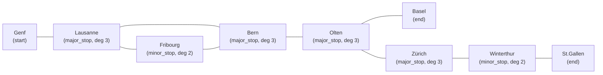
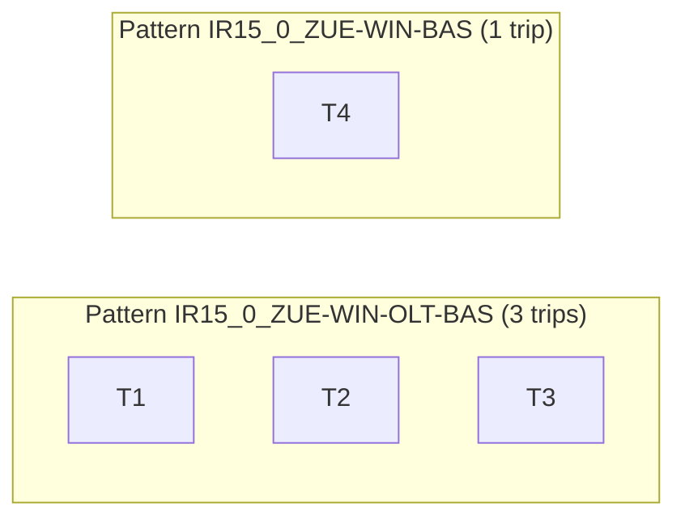
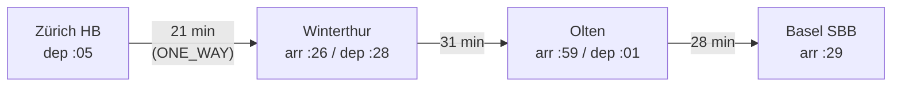
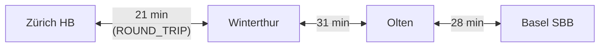
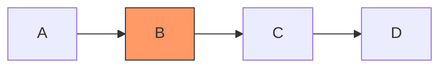
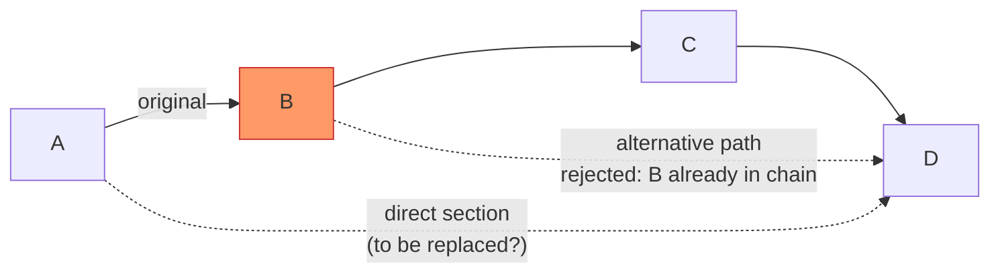

# GTFS Import: End-to-End Algorithm and Data Mapping

## 1. Introduction to GTFS

General Transit Feed Specification (GTFS) is a standardized data format for public transport schedules and related network metadata. A GTFS feed is usually delivered as a ZIP archive that contains multiple CSV files. Together, these files describe agencies, routes, trips, stops, calendars, and timing sequences.

GTFS matters because it gives transport systems a shared language. A schedule created in one country can be consumed by planners, routing engines, researchers, and visualization tools in another without custom adapters for each operator.

Two reference sources are especially relevant for this project:

- **Swiss GTFS cookbook** (SBB / opentransportdata.swiss):
  https://opentransportdata.swiss/de/cookbook/timetable-cookbook/gtfs/
  This explains Swiss-specific feed conventions, including frequent `parent_station` usage, route category conventions, and operational calendar modeling.

- **Official GTFS Schedule reference**:
  https://gtfs.org/documentation/schedule/reference/
  This defines all fields, datatypes, and expected semantics.

### 1.1 Core Semantics: Files and Concepts

The import process in Netzgrafik Editor primarily relies on these GTFS files:

| File | Required | Semantic role |
|------|----------|---------------|
| `agency.txt` | yes | Operator identity and naming |
| `routes.txt` | yes | Service lines and line categories/types |
| `trips.txt` | yes | Concrete operational runs of routes |
| `stop_times.txt` | yes | Ordered timing events within each trip |
| `stops.txt` | yes | Stop hierarchy and geospatial position |
| `calendar.txt` | optional | Base weekly service pattern with date range |
| `calendar_dates.txt` | optional | Service overrides (add/remove for exact dates) |
| `frequencies.txt` | optional in GTFS | Frequency-based service blocks (headway mode) |
| `shapes.txt` | optional in GTFS | Geometric path of trips |

Key terms used throughout this document:

| GTFS term | Meaning in this document |
|-----------|-------------------------|
| `agency` | Transport operator (e.g., SBB) |
| `route` | Service line (e.g., IR15) |
| `trip` | One operational run of a route |
| `stop` | Physical location, platform, or parent station |
| `parent_station` | Station grouping platform-level stops |
| `stop_time` | Timed call at a stop including pickup/drop-off semantics |
| `service_id` | Service calendar key used by trips |
| `direction_id` | Feed-specific directional marker (`0`/`1`) |

### 1.2 Time Semantics in GTFS

GTFS times are not plain wall-clock timestamps. They are service-day-relative values and can exceed 24 hours. For example, `25:30:00` means 01:30 on the next civil day, but still belongs to the same service day.

This has direct implementation impact:

- parsing must allow hour values greater than 23,
- arithmetic must happen in absolute service-day minutes,
- modulo logic for clock-face visualization must be applied only where intended,
- rollover around midnight must not split one logical trip into two unrelated segments.

### 1.3 Why GTFS Is a Global Standard

GTFS became globally dominant because it is:

- simple to publish (flat files, low implementation barrier),
- expressive enough for planning and passenger information,
- supported by a large ecosystem (tools, validators, routing engines, map platforms),
- stable over time while remaining extensible.

For a planning tool like Netzgrafik Editor, GTFS is the most practical interoperability substrate between timetable producers and timetable consumers.

### 1.4 Interpretation Challenges

Even with a standard, feeds are not always semantically identical. Common interpretation challenges include:

- mixed stop hierarchy quality (platform-only feeds, partial parent stations),
- category overloading in `route_desc`,
- incomplete or irregular pickup/drop-off coding,
- inconsistent calendar usage across operators,
- trips with uncommon time patterns or sparse service,
- optional files (`frequencies.txt`, `shapes.txt`) that may be absent.

The following chapters describe how the current implementation resolves these ambiguities.

## 2. Why GTFS Matters in Netzgrafik Editor

GTFS integration is not just an import convenience. It is the foundation for reproducible and comparable timetable topology.

### 2.1 Value for Different Audiences

- **Software developers** get a deterministic ingestion path from standardized input to strongly-typed internal data.
- **Long-term timetable planners** get a scalable baseline model of lines, stop structure, and cycle times that can be iterated and optimized.
- **Interested public and stakeholders** get a transparent transformation from published timetable data to a visual network representation.

### 2.2 What Breaks Without GTFS Integration

Without GTFS support, the editor depends on manual graph construction or ad hoc custom imports. That creates:

- higher modeling effort,
- inconsistent naming and categorization,
- lower reproducibility,
- weaker traceability from visual output back to source timetable data,
- harder collaboration between technical and operational teams.

### 2.3 How GTFS Improves Netzgrafik Quality

GTFS-based import improves quality by:

- anchoring nodes and trainruns in externally maintained source data,
- preserving operational structure (routes, trips, service days, stop hierarchy),
- enabling objective checks (symmetry, cycle consistency, stop coverage),
- reducing manual errors before visual editing starts.

## 3. Goal of the Transformation

The transformation goal is to convert a GTFS feed into a Netzgrafik model that is usable for analysis, visualization, and editing.

In short: **GTFS -> typed import structures -> normalized trainrun graph -> materialized editor objects.**

### 3.1 High-Level Data Flow

```
GTFS ZIP
  -> CSV parsing and filtering
  -> trip pattern grouping
  -> node and trainrun creation
  -> round-trip merge and topology consolidation
  -> Netzgrafik DTO
  -> editor materialization (ports, transitions, connections)
```

### 3.2 What Is Taken, Computed, Interpreted, and Discarded

| Type | Examples in current implementation |
|------|------------------------------------|
| Directly transferred | agencies, routes, trips, stop sequences, stop hierarchy |
| Computed | route frequencies, representative trips, node roles, symmetric section times, consolidation detour checks |
| Interpreted | category mapping from `route_desc`, stop/pass-through semantics from pickup/drop-off flags, preferred canonical direction in round-trip merge |
| Discarded or not materialized directly | per-trip duplicates inside a pattern, reverse trainrun after successful merge, non-selected stop-time rows, optional geometry details not needed for the timetable topology |

### 3.3 Mapping Table (GTFS -> Netzgrafik)

| GTFS source | Main target in Netzgrafik model | Notes |
|-------------|----------------------------------|-------|
| `stops.txt` + `parent_station` | `NodeDto` | Platforms collapse to station-level nodes |
| `trips.txt` + grouped `stop_times.txt` | `TrainrunDto` | One representative trainrun per stop pattern |
| consecutive stop pairs in `stop_times.txt` | `TrainrunSectionDto` | Travel time and symmetric minute model applied |
| `routes.txt.route_desc` | `TrainrunCategory` | Reuse or create category mapping |
| inferred route headway | `TrainrunFrequency` | 120-min offset handling supported |
| GTFS stop/pass-through semantics | transition `isNonStopTransit` | Enforced after materialization |
| `calendar.txt` + `calendar_dates.txt` | trip inclusion for target day | Service-day filtering during import |
| `frequencies.txt` | currently limited / feed-dependent | See assumptions and limitations |
| `shapes.txt` | currently not primary topology source | Visual topology is timetable-first |

### 3.4 Technical Transformation Mechanics

The implementation combines five technical operations:

- **Parsing**: ZIP extraction plus CSV parsing, with chunked processing for very large `stop_times.txt`.
- **Mapping**: file-level entities are linked across GTFS keys (`route_id`, `trip_id`, `service_id`, `stop_id`).
- **Normalization**: platform-to-station collapse, canonical stop sequences, time normalization for symmetry logic.
- **Aggregation**: many trips become one pattern-level trainrun, preserving traceability via metadata maps.
- **Validation-oriented shaping**: round-trip checks and topology consolidation enforce a model that is internally consistent and visually usable.

### 3.5 Time, Calendar, and Hierarchy Handling

Important behavior in the current implementation context:

- **Calendars**: `calendar.txt` and `calendar_dates.txt` are combined to resolve day-level trip activity.
- **Times**: service-day times are converted to minutes; minute-within-hour symmetry is then used for section time encoding.
- **Rollover**: times beyond 24:00 are interpreted as valid service-day times and remain part of one trip timeline.
- **Stop hierarchy**: `parent_station` is used to map platform-level records to station-level modeling nodes.

### 3.6 Routes, Trips, Shapes, and Delays

- **Routes and trips** are core sources and directly drive pattern grouping and trainrun creation.
- **Shapes** are optional GTFS geometry aids; the current pipeline focuses on timetable topology and section timing rather than exact polyline replay.
- **Real-time delays** are generally GTFS-Realtime concerns, not static GTFS Schedule. They are not the primary input of this static import pipeline unless explicitly pre-merged into schedule-like data upstream.

### 3.7 Assumptions, Limitations, and Improvement Areas

Current assumptions and constraints include:

- route categorization quality depends on feed consistency (`route_desc` conventions),
- representative-trip selection is deterministic but heuristic,
- one-way versus round-trip outcome depends on strict sequence and symmetry criteria,
- optional GTFS files can be absent without blocking import, but this may reduce semantic richness.

Potential improvements:

- stronger explicit support for `frequencies.txt` headway blocks where feeds use frequency-based service modeling,
- richer shape-aware layout support for corridor geometry,
- expanded diagnostics for malformed calendar and stop hierarchy data,
- configurable strategies for representative trip selection.

The pipeline overview below describes execution in ordered algorithmic phases.

## 4. Phase A: GTFS Parsing and ZIP Extraction

Phase A reads the ZIP archive, parses CSV tables into typed in-memory structures, and classifies all stops by their network role. This phase does not yet create any Netzgrafik objects; it only prepares the data structures consumed by phase B.

### 4.1 ZIP Extraction and CSV Parsing

The ZIP archive is opened in memory using JSZip. Each GTFS file is read as a UTF-8 text blob. For small files (`agency.txt`, `routes.txt`, `trips.txt`, `stops.txt`, `calendar.txt`, `calendar_dates.txt`), the full text is parsed in one pass using PapaParse, which handles quoted fields, BOM markers, and CRLF line endings. For `stop_times.txt` — which can reach hundreds of megabytes in national feeds — a **streaming chunk parser** is used:

```
open stop_times.txt as ArrayBuffer
for each 10 MB chunk:
  decode UTF-8, prepend any leftover from previous chunk
  split into lines
  for each line:
    if line.trip_id is in allowedTripIds → keep
    else → discard
  carry incomplete last line to next chunk
```

This avoids loading the full file into a single string, which would exceed the V8 string length limit for large national feeds. Only stop-times belonging to already-filtered trip IDs are kept, so memory usage scales with the filtered trip count rather than the full feed size.

### 4.2 Stop Classification

After all files are parsed, each station-level stop is classified by its role in the network topology. This classification is used by the UI filter panel to let users select which node types to import (start/end nodes, major stops, minor stops, junctions).

The algorithm builds an **undirected adjacency graph** at station level — platforms are collapsed to their `parent_station` before any edge is added:

```
for each trip T:
  stationSequence = T.stopTimes.map(st => parentStation(st.stop_id))
  deduplicate consecutive identical stations
  for each adjacent pair (prev, curr) in stationSequence:
    if prev ≠ curr:
      add undirected edge (prev, curr)
  tag stationSequence[0]   as START
  tag stationSequence[last] as END
  for each st in T.stopTimes:
    if st.pickup_type ≠ '1' AND st.drop_off_type ≠ '1':
      tag parentStation(st.stop_id) as HAS_STOP
```

Once all trips are processed, each station is classified by degree (number of distinct neighbours) and tags:

| Condition | Classification |
|-----------|---------------|
| tagged START | `start` |
| tagged END | `end` |
| degree = 2 | `minor_stop` |
| degree > 2 AND tagged HAS_STOP | `major_stop` |
| degree > 2 AND NOT tagged HAS_STOP | `junction` |
| degree < 2 (isolated) | `minor_stop` (fallback) |

Start/end classification takes precedence. A station that is both a start and an end (i.e., a stub terminus) is classified as `start`.

**Example** — simplified Swiss IR network fragment:



### 4.3 Frequency Pre-Computation

Before phase B begins, the cycle time (headway) is computed for every route. This is done once in phase A so that the result is available during trainrun creation in phase B.

The algorithm analyses departure intervals in **one direction only** (direction `0` is preferred; direction `1` is used if no direction-0 data is present). The reason for using a single direction is that looking at both directions would mix outbound and inbound departures at shared stops, producing artificial half-headway values.

```
for each route R:
  collect departures at each stop, direction=0 only
  for each stop with ≥ 2 departures:
    sort departures
    compute intervals between consecutive departures
    snap each interval to nearest standard value:
      ≤ 17 → 15 min
      ≤ 25 → 20 min
      ≤ 45 → 30 min
      ≤ 90 → 60 min
      ≤ 150 → 120 min
      > 150 → 60 min (long-haul / sparse service default)
    add snapped value to histogram
  R.frequency = mode of histogram
  if R.frequency == 120:
    R.offsetHour = firstDepartureHour mod 2  // 0 = even, 1 = odd
```

For the 120-minute case, the `offsetHour` value distinguishes even-hour trains (frequency key `120_0`) from odd-hour trains (key `120_60`). This matters because both may operate on the same corridor and must be kept as separate Netzgrafik frequency entries.

A representative sample trip is also selected per route: the first chronologically ordered trip whose departure minute aligns with the detected grid (e.g., `:00` for 60-min, `:00` or `:30` for 30-min). This trip is later used for section timing.

## 5. Phase B: Filtering, Pattern Grouping, and Trainrun Creation

Before any Netzgrafik objects can be created, the raw GTFS data must be filtered down to only the relevant subset, then grouped into logical trip patterns from which one representative master trip is selected per pattern. The subsequent steps — node creation, category/frequency mapping, trainrun creation, and section creation — all operate on this reduced, pattern-indexed data.

### 5.0 Data Filtering Pipeline

The GTFS feed is filtered in three sequential stages. Each stage reduces the working set further; subsequent stages only see what passes earlier stages.

**Stage 1 — Agency filter.**
All agencies in `agency.txt` are matched against a user-provided list of agency names (e.g., `"Schweizerische Bundesbahnen SBB"`). Matching is case-insensitive and keyed by `agency_name`. The result is a set of allowed `agency_id` values. Any agency not in this set is discarded. If no agency filter is specified, all agencies pass.

**Stage 2 — Route type and route filter.**
`routes.txt` is filtered by:
- `route_type`: only routes whose integer type is in the allowed set pass (e.g., `2` = Rail). Default is Rail-only.
- `agency_id`: only routes belonging to surviving agencies pass.
- `route_desc` (optional category filter): if a category allowlist is provided, only routes whose `route_desc` matches (case-insensitive) are kept.

**Stage 3 — Trip filter.**
`trips.txt` is filtered to only trips whose `route_id` is in the surviving route set. If a specific operating day (`Betriebstag`) is provided, an additional calendar check is applied: for each trip, its `service_id` is looked up in `calendar.txt` (weekday + date range check) and `calendar_dates.txt` (exception type 1 = added, type 2 = removed). A trip is kept only if it operates on the target day. `stop_times.txt` is then loaded and filtered to only the surviving trip IDs.

```
agencies.txt  →  [agency filter]  →  allowed_agency_ids
routes.txt    →  [type + agency + category filter]  →  allowed_routes
trips.txt     →  [route filter + calendar/day filter]  →  allowed_trips
stop_times.txt→  [trip filter]  →  working_stop_times
```

### 5.1 Trip Pattern Grouping and Master Trip Selection

After filtering, the remaining trips must be collapsed into **patterns** — groups of trips that share an identical stop sequence — so that the Netzgrafik receives one clean trainrun per service pattern rather than one per individual trip.

**Building the pattern key.**
For each trip, its stop-times are sorted by `stop_sequence`. Each stop ID is mapped to its `parent_station` ID (if it has one), so that multiple platform rows at the same station are treated as one station. Consecutive duplicate station IDs are collapsed to a single entry. The resulting ordered list of station IDs forms the **stop sequence**. A pattern key is assembled as:

```
patternKey = route_id + "_" + direction_id + "_" + stationId1 + "-" + stationId2 + "..." + stationIdN
```

All trips that produce the same key are placed in the same pattern group.

**Example:**

Suppose route `IR15` has four trips on a Tuesday operating day:

| trip_id | stops (after platform→station mapping) | direction |
|---------|----------------------------------------|-----------|
| T1      | ZUE – WIN – OLT – BAS               | 0         |
| T2      | ZUE – WIN – OLT – BAS               | 0         |
| T3      | ZUE – WIN – OLT – BAS               | 0         |
| T4      | ZUE – WIN – BAS  (skips OLT)        | 0         |

T1, T2, T3 share key `IR15_0_ZUE-WIN-OLT-BAS` → one pattern group with 3 trips.
T4 has key `IR15_0_ZUE-WIN-BAS` → a separate pattern group with 1 trip.



**Selecting the master (representative) trip.**
For each pattern group, the first trip in the group (index 0 after insertion order) is used as the **representative trip**. Its stop-times provide the authoritative timing for all sections created from this pattern. All trips in the group are recorded in the `trainrunToTrips` map attached to the output DTO (for traceability), but only the representative trip's times appear in the Netzgrafik sections.

> **Why the first trip?** The filtering and grouping guarantee that all trips in a group have an identical stop sequence. Any one of them would produce the same set of sections. The first trip is the simplest deterministic choice. Future improvements could select the median departure or a "cleanest timetable" representative, but the current heuristic is sufficient because the symmetry model normalises minute-within-hour times anyway.

### 5.2 Node Creation

Once the pattern set is fixed, all station IDs referenced in any pattern's stop sequence are collected. This is the **working node set** — no station outside it will appear in the output.

Only station-level entries are turned into nodes. Platform rows (`location_type != 1` with a non-empty `parent_station`) are not directly turned into nodes; they are always accessed through their parent. If a `parent_station` ID appears in the working set but has no own row in `stops.txt` (i.e., the feed only contains platform rows and no explicit station entry), a **virtual station record** is synthesised:
- name: the first child platform's `stop_name` with any trailing platform suffix stripped (regex: `\s+(Gleis|Track|Platform|Quai)\s+.*$`),
- coordinates: copied from the first child platform.

Coordinates are projected from WGS 84 to a flat canvas: the distance from Swiss centre (46.8° N / 8.2° E) is multiplied by a fixed scale factor (15,000) to produce pixel-like x/y values. After projection, all nodes are translated so that their centroid lies at canvas origin (0, 0).

Each station is assigned an integer node ID equal to its 1-based index in the ordered station list. A `stopId → nodeId` lookup map is built, with all platform IDs of a station mapped to the same node ID as their parent.

### 5.3 Category Mapping

The set of unique `route_desc` values across all remaining routes defines the **category universe**. Each unique description is resolved against the existing `TrainrunCategory` pool in strict priority order:

1. **Short name match**: the first 10 characters of the description are compared case-insensitively against the `shortName` field of existing categories. If a match is found, the existing category's ID is reused.
2. **Full name match**: the full description string is compared case-insensitively against the `name` field of existing categories.
3. **Create new**: if no match is found, a new category is created with ID `2026_000i` (counter continuing from the highest existing ID + 1). The colour reference is derived from keyword matching against known prefixes (`IC`/`ICE`/`TGV` → `EC`, `IR`/`InterRegio` → `IR`, `RE`/`RegionalExpress` → `RE`, `S`/`S-Bahn` → `S`, etc.); unrecognised descriptions default to `RE`.

The result is a `description → categoryId` map consumed in step 5.5.

### 5.4 Frequency Detection and Mapping

Frequency is determined per route by analysing the departure intervals of its trips in **one direction only** (direction 0 preferred; direction 1 used as fallback if no direction-0 data exists). Using both directions would double-count and distort the interval histogram.

**Algorithm (pseudo-code):**

```
for each route R:
  collect all departure times across stops, direction=0 only
  for each stop S that has ≥ 2 departures:
    sort departures chronologically
    for consecutive pair (depA, depB):
      interval = depB - depA  (minutes)
      snap interval to nearest standard value:
        ≤ 17 min  → 15
        ≤ 25 min  → 20
        ≤ 45 min  → 30
        ≤ 90 min  → 60
        ≤ 150 min → 120
        > 150 min → 60  (long-haul default)
      append snapped value to histogram
  mostCommonFrequency = mode of histogram  (ties: first encountered wins)
  R.frequency = mostCommonFrequency
```

**120-minute offset detection.**
When the mode is 120, the algorithm additionally determines whether the route departs on even hours (0, 2, 4 …) or odd hours (1, 3, 5 …). It takes the smallest first-departure time across all stops, extracts the hour, and stores `offsetHour = hour mod 2`. This produces frequency keys `120_0` (even-hour trains) and `120_60` (odd-hour trains), allowing two interleaved 2-hourly patterns to coexist in the Netzgrafik without collision.

**Representative trip selection.**
After the frequency is determined, one trip is selected as the sample trip for the route: the code scans all direction-0 departures sorted chronologically and picks the first one whose departure minute matches the standard grid for the detected frequency (e.g., `:00` for 60-min, `:00` or `:30` for 30-min). If no grid-aligned departure exists, the chronologically first departure is used.

**Mapping to `TrainrunFrequency`.**
The detected frequency key (`"15"`, `"30"`, `"60"`, `"120_0"`, etc.) is looked up in the `TrainrunFrequency` pool. If a matching entry exists, its ID is reused. A new entry is only created if the pool does not contain a matching entry (unusual with a complete default set).

### 5.5 Trainrun Creation — All Patterns Start as ONE_WAY

For each accepted trip pattern, exactly one `TrainrunDto` is created. At this stage, **every trainrun is unconditionally created with `direction = ONE_WAY`**, regardless of whether it is a forward or a backward trip in the GTFS feed. This is intentional: the Netzgrafik model does not distinguish directions at the trainrun level at creation time; the direction attribute is only upgraded to `ROUND_TRIP` in phase C if a valid matching reverse pattern is found.

The trainrun receives:
- **categoryId**: from the category map (step 5.3), keyed by `route_desc` of the pattern's route.
- **frequencyId**: from the frequency map (step 5.4), keyed by frequency string (`"60"`, `"120_0"`, etc.).
- **timeCategoryId**: taken from the first entry of the time-category pool.
- **direction**: `ONE_WAY` (always at this stage).
- **name**: constructed as `<routeNumber> → <headsign> (<tripShortName>)`. The category prefix is stripped from `route_short_name` to avoid duplication (e.g., category `IR` + route short name `IR15` → display name `15 → Basel`).
- **debug label**: `<routeName> → <firstStopName> → <lastStopName>` for traceability in the filter panel.

Two metadata maps are populated per trainrun:
- `trainrunToTrips`: maps trainrun ID → list of all GTFS trip IDs in the pattern.
- `initialStopNodeIdsByTrainrun`: maps trainrun ID → set of node IDs where passengers may board or alight (i.e., at least one stop-time row in the pattern had `pickup_type != 1` or `drop_off_type != 1`). This map is used later in phase E to enforce correct stop/non-stop transition semantics.

### 5.6 TrainrunSection Creation

For each pattern, the representative trip's stop-times are first consolidated into **station groups** (one group per unique parent-station in sequence order):

```
rawStopTimes = stopTimes[representativeTrip].sortBy(stop_sequence)

for each stopTime in rawStopTimes:
  stationId = parentStation(stopTime.stop_id)
  if stationGroups is empty OR last group's stationId ≠ stationId:
    push new group { stationId, nodeId, isStop=false, arrMin=+∞, depMin=-∞ }
  group.arrMin   = min(group.arrMin,   toMinutes(stopTime.arrival_time))
  group.depMin   = max(group.depMin,   toMinutes(stopTime.departure_time))
  if stopTime.pickup_type ≠ "1" OR stopTime.drop_off_type ≠ "1":
    group.isStop = true
```

A group with `isStop = false` means the train passes through the station without allowing boarding or alighting — for example, a through-run coded with `pickup_type=1, drop_off_type=1`.

For each **consecutive pair** of station groups `(src, tgt)`, one `TrainrunSectionDto` is emitted:

**Travel time:**
```
travelTime = max(1, tgt.arrMin - src.depMin)
```

**Symmetric times (60-x rule):**

The Netzgrafik clock-face model requires that for a given section, the departure from the source and the arrival at the target are symmetric around the 30-minute mark within the hour. The GTFS departure and arrival minutes are used directly for the forward direction; the return direction is derived algebraically:

```
sourceDep  = src.depMin mod 60       // forward: GTFS value
targetArr  = tgt.arrMin mod 60       // forward: GTFS value
sourceArr  = (60 - sourceDep) mod 60 // return: 60-x symmetry
targetDep  = (60 - targetArr) mod 60 // return: 60-x symmetry
```

**Example** — section Zürich HB → Winterthur (IR15, departure :05, arrival :26):

| Field          | Value | Meaning                              |
|----------------|-------|--------------------------------------|
| `sourceDep`    | 5     | train leaves Zürich at :05           |
| `targetArr`    | 26    | train arrives Winterthur at :26      |
| `travelTime`   | 21    | 21 minutes                           |
| `sourceArr`    | 55    | return train arrives Zürich at :55   |
| `targetDep`    | 34    | return train leaves Winterthur at :34|

This symmetry is what makes round-trip detection in phase C possible without any additional time data.

**`numberOfStops`:**
- `0` if both `src.isStop` and `tgt.isStop` are true (both ends allow boarding/alighting),
- `1` if either end is a pass-through (indicating the section touches a non-stopping node).

**Loop guard:**
A section is silently skipped if:
- the target node has already been visited in this trainrun (prevents loops), or
- the directed edge `srcNodeId → tgtNodeId` has already been used in this trainrun (prevents duplicate edges).

**Result after phase B** (example for IR15, direction 0):



All sections belong to one `TrainrunDto` with `direction = ONE_WAY`. An identical but reversed trainrun (direction 1, Basel → Zürich) has also been created at this point and is also `ONE_WAY`. Both exist independently until phase C.

## 6. Phase C: Round-Trip Detection and Merge

After all one-way trainruns and their sections are created, the algorithm attempts to pair up opposite-direction counterparts and merge them into `ROUND_TRIP` trainruns. This step is optional and controlled by the `mergeRoundTrips` option (default: enabled).

The motivation is that Netzgrafik's symmetric clock-face model represents a line as a single bidirectional object. Having two separate `ONE_WAY` trainruns for the same line wastes display space and makes time-symmetry verification impossible. Phase C identifies and merges these pairs.

### 6.1 Matching Algorithm

The algorithm iterates all trainruns in order. For each unmatched trainrun `T1`, all subsequent unmatched trainruns `T2` are tested as candidates. A candidate pair is accepted only when **all five criteria** pass simultaneously:

**Criterion 1 — Same line name.**
`route_short_name` of `T1`'s route must equal `route_short_name` of `T2`'s route (case-insensitive). `route_long_name` is used as fallback if `route_short_name` is absent. Two IR15 trips in opposite directions share the same `route_short_name = "IR15"`, so they pass. An IR15 and an IC5 do not.

**Criterion 2 — Same category.**
`route_desc` of both routes must match exactly (case-sensitive). This ensures that, for example, `"IR"` trains are not accidentally merged with `"IC"` trains that happen to share a route name in some feeds.

**Criterion 3 — Same frequency.**
The resolved cycle time (`R.frequency`) of both routes must be identical. A 60-min train cannot be merged with a 30-min train even if they share the same name, because their Netzgrafik representations differ.

**Criterion 4 — Reversed stop sequence.**
The station sequence of `T2`'s pattern must be the **exact reverse** of `T1`'s pattern:

```
T1 stop sequence:  ZUE – WIN – OLT – BAS
T2 stop sequence:  BAS – OLT – WIN – ZUE   ← exact reverse of T1 ✓

T1 stop sequence:  ZUE – WIN – OLT – BAS
T2 stop sequence:  BAS – WIN – ZUE          ← different length ✗
```

Length must also match. Any deviation — missing intermediate stop, extra stop, reordered stop — causes rejection.

**Criterion 5 — Time symmetry.**
For each section index `i`, the pair `(section_i of T1, reversed section_i of T2)` must satisfy the 60-x symmetry rule within a configurable tolerance (default 180 seconds = 3 minutes):

```
for i in 0 .. sections.length - 1:
  sec1 = T1.sections[i]
  sec2 = T2.sections[reversed_index(i)]

  expected_sec2_targetArr = (60 - sec1.sourceDep) mod 60
  actual_sec2_targetArr   = sec2.targetArr

  delta = circularDistance(actual, expected)  // handles :59 vs :01 wrap-around
  if delta * 60 > toleranceSeconds → REJECT ("Time symmetry failed")
```

This check ensures that the two one-way trains actually form a symmetric clock-face timetable pair, not just two trains that happen to travel the same corridor in opposite directions at unrelated times.

**Example** — IR15 Basel→Zürich section (reversed):

| Field                   | T1 (ZUE→BAS) section 0 | T2 (BAS→ZUE) reversed section 0 | Check |
|-------------------------|-------------------------|----------------------------------|-------|
| `sourceDep`             | :05                     | `targetArr` = :55                | expected: (60-5)%60 = :55 ✓ |
| `targetArr`             | :26                     | `sourceDep` = :34                | expected: (60-26)%60 = :34 ✓ |

Both checks pass within tolerance → pair accepted.

### 6.2 Preferred Direction and Discarded Data

When a valid pair `(T1, T2)` is found, the algorithm chooses which trainrun to **keep** and which to **discard**. The criterion is geographic: for each candidate, the direction vector of its first section is computed:

```
Δx = targetNode.positionX - sourceNode.positionX
Δy = targetNode.positionY - sourceNode.positionY
score = (Δx > 0 ? 1 : 0) + (Δy > 0 ? 1 : 0)   // max = 2 (eastward + southward)
```

The trainrun with the higher score is **kept** as the canonical direction; the other is **discarded**. If scores are equal, `T1` (the earlier trainrun) is kept. The rationale is that Swiss rail maps conventionally orient from west/north to east/south; this heuristic aligns the displayed arrow direction with convention.

**What is discarded:**
- the removed trainrun object itself,
- **all** `TrainrunSectionDto` objects whose `trainrunId` matches the removed trainrun.

**What is preserved:**
- the surviving trainrun's sections are kept unchanged,
- all label IDs from the removed trainrun are appended to the surviving trainrun's `labelIds` list (so debug filter labels from both directions remain searchable),
- the surviving trainrun's `direction` is updated from `ONE_WAY` to `ROUND_TRIP`.

After the merge, the surviving trainrun's sections already encode both directions via the 60-x symmetric times computed in step 5.6. No additional data needs to be written.

**Result after phase C** (example for IR15):



The `↔` arrows indicate `ROUND_TRIP`: both :05 departure from Zürich and :55 return arrival at Zürich are encoded in the same section, derived from the 60-x symmetric times.

### 6.3 Unmatched Trainruns

Trainruns for which no valid match is found remain as `ONE_WAY`. This happens when:
- the reverse direction is filtered out (different agency, route type, or operating day),
- the reverse pattern has a different stop sequence (e.g., asymmetric routing),
- the time symmetry criterion fails beyond tolerance (e.g., irregular timetable or special service),
- the route simply has no reverse counterpart in the feed.

The failure reason is recorded per trainrun and emitted in the converter's console log for diagnostic purposes.

### 6.4 Frequency in the Merged Output

Frequency assignment is computed once in phase A (step 5.4) and attached to each route. It is not recomputed during or after the merge. The surviving `ROUND_TRIP` trainrun retains the frequency of the kept one-way pattern. Because criterion 3 of the matching algorithm enforces that both directions have the same frequency, the surviving value is always consistent.

Topology consolidation is executed only after this phase completes, operating on the final set of trainruns and trainrun sections with their definitive `ONE_WAY` or `ROUND_TRIP` direction flags.

## 7. Phase D: Topology Consolidation (Post-Creation)

Topology consolidation is the most algorithmically complex phase of the pipeline. Its purpose is to remove **redundant direct connections** between station pairs and reroute the affected trainruns through the shared corridor that already connects those stations via other trains. The result is a cleaner, more consistent Netzgrafik where each physical track segment is represented by exactly one edge rather than duplicated across multiple trainruns.

This phase runs only after phases B and C are complete, i.e., after all trainruns and their sections exist and all round-trip merges have been performed. It runs only when `enableTopologyConsolidation = true`.

### 7.1 Motivation and Example

Consider two trainruns that both serve the Zürich–Basel corridor:

- **IR35**: Zürich → Zürich Flughafen → … → Basel (long route, direct GTFS section ZUE→BAS encoded as one section with 55 min)
- **IR15**: Zürich → Winterthur → Olten → Basel (sectioned step by step)

After phase B, the basis graph contains a direct edge `ZUE—BAS` with weight 55 min (from IR35) alongside the indirect path `ZUE—WIN—OLT—BAS` with total weight 21+31+28 = 80 min. The direct edge is longer than the alternative (55 min vs 80 min), so no consolidation occurs. But if the direct edge is, say, 75 min with a 35% detour allowance, the alternative at 80 min would still pass: 75 × 1.35 = 101 min > 80 min → eligible.

When eligible, the consolidation replaces IR35's direct `ZUE→BAS` section with three new sections that follow the shared corridor: `ZUE→WIN→OLT→BAS`.

### 7.2 Building the Basis Graph

The basis graph $G(V, E)$ is constructed directly from the trainrun sections that exist after phases B and C:

```
V = { all unique nodeIds appearing as sourceNodeId or targetNodeId in any section }
E = {}

for each TrainrunSection S:
  edgeKey = undirectedKey(S.sourceNodeId, S.targetNodeId)
  if edgeKey not in E:
    E[edgeKey] = { n1: min(src,tgt), n2: max(src,tgt), sections: [], minWeight: +∞ }
  E[edgeKey].sections.push(S)
  E[edgeKey].minWeight = max(A, min(E[edgeKey].minWeight, S.travelTime))
```

The graph is **undirected**: an edge `(n1, n2)` covers sections in both directions. Edge weight is:

$$
w(e) = \max\!\left(A,\ \min_{S \in e}\left(S.\text{travelTime}\right)\right)
$$

The lower bound $A$ (default 1 minute) prevents zero-weight edges that would confuse the shortest-path algorithm and produce meaningless interpolated segments.

One edge can carry **multiple sections** (1:m): if two trainruns independently connect the same node pair, both their sections are attached to the same edge. A replacement affects all of them atomically.

### 7.3 Edge Ordering

All edges are sorted by weight in ascending order before processing begins:

```
sortedEdges = E.values().sortBy(e => e.minWeight)   // ascending
```

Processing the lightest edges first is a deliberate heuristic: short direct connections are the most likely candidates for removal (they are the ones a longer detour path is most likely to exist for), and replacing them first simplifies the graph for subsequent passes.

### 7.4 Alternative Path Search

For each edge $e = (n_1, n_2)$:

1. **Temporarily remove** $e$ from the graph.
2. **Run Dijkstra** (or equivalent shortest-path) from $n_1$ to $n_2$ on the remaining undirected graph, summing edge `minWeight` values.
3. **Restore** $e$ to the graph.
4. **Evaluate** the found path (if any) against the detour criteria.

The detour criteria are **disjunctive** — the path is eligible if it satisfies **either**:

$$
T_{alt} \le \left(1 + \frac{xx}{100}\right) \cdot T_e \qquad \text{(relative threshold)}
$$

$$
T_{alt} \le T_e + yy \qquad \text{(absolute threshold)}
$$

where $T_e$ is the weight of the edge being considered and $T_{alt}$ is the total weight of the alternative path.

Additionally, the alternative path must contain **more than one edge**. A one-edge alternative would mean a parallel duplicate connection between the same node pair, which indicates a data error in the feed and is logged as a warning.

**Example** — detour evaluation:

| Edge | $T_e$ | Alternative path | $T_{alt}$ | 35% threshold | +3 min threshold | Eligible? |
|------|--------|-----------------|-----------|---------------|-----------------|-----------|
| ZUE–OLT direct | 45 min | ZUE–WIN–OLT | 52 min | 45×1.35=60.75 ✓ | 45+3=48 ✗ | **yes** (relative passes) |
| ZUE–BAS direct | 55 min | ZUE–WIN–OLT–BAS | 80 min | 55×1.35=74.25 ✗ | 55+3=58 ✗ | **no** |

### 7.5 Trainrun-Context Safety Check

Even when a path passes the detour criteria, it may still be rejected for a specific trainrun. A replacement is **invalid for a given trainrun** if any intermediate node on the alternative path already appears elsewhere in that trainrun's section chain.

```
for each trainrun T attached to sections on edge e:
  intermediateNodes = alternativePath.nodes excluding endpoints (n1, n2)
  existingNodes = all nodeIds already used in T's sections
  if intermediateNodes ∩ existingNodes ≠ ∅:
    reject replacement for T
```

This prevents backtracking and loop patterns. For example, if trainrun T already visits node B as an intermediate node, then rerouting one of its sections through B again would produce the invalid sequence `A → B → C → B → D`.



If node B is already in T's chain, the path `A → B → D` as a replacement for `A → D` is rejected for T.

If the safety check rejects the replacement for **all** trainruns on the edge, the entire edge is skipped. If it rejects only some trainruns, the replacement is applied only to the allowed ones; the section for the rejected trainrun remains a direct connection.

### 7.6 Atomic Section Replacement

When an edge $e = (n_1, n_2)$ with sections $S_1, \ldots, S_k$ is eligible for replacement:

```
alternativePath = [n1, m1, m2, ..., mk, n2]   // intermediate nodes m1..mk
pathEdges       = [(n1,m1), (m1,m2), ..., (mk,n2)]
totalPathWeight = sum of minWeight of each path edge

for each section Si on edge e (that passed the safety check):
  remove Si from trainrunSections
  for each (src, tgt) in pathEdges:
    segmentWeight = w(src, tgt)
    // proportional interpolation:
    segmentTime = max(A, round(Si.travelTime * segmentWeight / totalPathWeight))
    create new TrainrunSectionDto {
      sourceNodeId: src,
      targetNodeId: tgt,
      travelTime: segmentTime,
      backwardTravelTime: segmentTime,
      trainrunId: Si.trainrunId,
      // symmetric times: derived from interpolated position within the hour
      sourceDep, targetArr: interpolated from Si's original times
    }
```

**Proportional time interpolation** distributes the original section's travel time across the new sub-segments in proportion to their edge weights:

$$
T_{\text{segment}} = \max\!\left(A,\ \text{round}\!\left(T_{\text{original}} \cdot \frac{w(\text{segment})}{\sum w(\text{path})}\right)\right)
$$

This ensures that the total travel time over the replacement path equals (or closely approximates) the original section travel time, and that no segment is shorter than the minimum $A$.

**Example** — replacing ZUE→OLT (45 min direct) via ZUE–WIN–OLT (path weights 21 and 31, total 52):

| Segment | Path weight | Proportional time | After max(A=1) |
|---------|------------|-------------------|----------------|
| ZUE→WIN | 21 min     | 45 × 21/52 = 18.2 → 18 min | 18 min |
| WIN→OLT | 31 min     | 45 × 31/52 = 26.8 → 27 min | 27 min |
| **Total** | | **45 min** | |

After replacement:
- The old direct sections on edge `ZUE—OLT` are removed from `trainrunSections`.
- Two new sections are added per affected trainrun.
- The edge `ZUE—OLT` is removed from the basis graph.
- The edges `ZUE—WIN` and `WIN—OLT` gain the new sections in their section lists, and their `minWeight` values are recomputed.
- A `changed = true` flag is set to trigger another full pass.

### 7.7 Stop and Non-Stop Transition Semantics

When topology consolidation inserts intermediate nodes (e.g., Winterthur between Zürich and Olten for a trainrun that originally had no Winterthur stop), those nodes must be marked as **non-stop passages** for the affected trainrun, not as stops.

The semantics in Netzgrafik are encoded in the `isNonStopTransit` flag of each `Transition` object (created during the 3rd-party materialization in phase F):

- `isNonStopTransit = false` → the train stops here (passengers board/alight),
- `isNonStopTransit = true` → the train passes through without stopping.

To distinguish original GTFS stops from consolidation-inserted nodes, the `initialStopNodeIdsByTrainrun` map built in phase B (step 5.5) is persisted through the entire pipeline. After phase F materialises the transitions, the node service iterates all transitions and enforces:

```
for each trainrun T:
  stopNodes = initialStopNodeIdsByTrainrun.get(T.id)  // original GTFS stops
  for each transition Tr on T at node N:
    Tr.isNonStopTransit = !stopNodes.has(N.id)
    // true  → pass-through (inserted by consolidation or already non-stop in GTFS)
    // false → stop (original GTFS boarding/alighting event)
```

## 8. Phase E: Convergence Loop

A single pass over all edges (as described in chapter 7) may not be sufficient to fully consolidate the graph. When a replacement is performed, the basis graph changes: an edge is removed, new sections are added, and edge weights may shift. These changes can make previously ineligible edges eligible in a subsequent pass.

The convergence loop repeats the full edge-processing pass until either the graph stops changing or the maximum number of iterations is reached.

### 8.1 Loop Structure

```
changed = true
iteration = 0

while changed AND iteration < n:
  changed = false
  iteration++

  sortedEdges = basisGraph.edges.sortBy(minWeight)  // re-sort each pass

  for each edge e in sortedEdges:
    altPath = shortestPath(basisGraph excluding e, e.n1, e.n2)
    if altPath is eligible (detour + safety checks):
      replaceEdge(e, altPath)
      changed = true   // trigger another pass

// termination:
// - fixed point reached (changed == false after full pass), OR
// - iteration == n
```

The graph is re-sorted at the start of every pass because replacements change edge weights. A previously heavy edge may become lighter (or disappear entirely) after a replacement, and the sort order ensures the lightest candidates are always considered first within each pass.

### 8.2 Termination Conditions

| Condition | Meaning |
|-----------|---------|
| `changed == false` after a full pass | Fixed point: no more eligible replacements exist. This is the ideal termination. |
| `iteration == n` | Safety cap reached. The graph may still contain consolidatable edges, but further passes are stopped to bound runtime. Increase `n` if needed. |

The default maximum $n = 10$ passes is sufficient for most national rail feeds. For very dense urban networks with many overlapping corridors, a higher value may be needed.

### 8.3 Convergence Guarantee

There is no formal guarantee of convergence before the iteration cap. However, in practice the loop converges quickly because:
- Each successful replacement removes one edge from the graph, strictly reducing the number of edges.
- The detour constraints become harder to satisfy as the graph becomes sparser (fewer alternative paths exist).
- The trainrun-context safety check prevents replacements that would cause any trainrun to revisit a node, bounding the combinatorial search space.

### 8.4 What Happens If the Cap Is Hit

If the loop terminates due to the iteration cap rather than a fixed point, the output is still valid: all replacements that were performed are consistent and safe. The only consequence is that some consolidatable direct edges may remain in the basis graph and therefore in the output Netzgrafik. The console log records the final iteration count and whether a fixed point was reached.

## 9. Logical Safety Constraints

The safety constraints in this chapter are enforced within each iteration of the convergence loop. They are not optional — they are always active whenever consolidation is enabled — and they guarantee that no replacement can produce an invalid trainrun.

### 9.1 Trainrun-Context Node Reuse Guard (Critical)

This is the most important safety constraint. A candidate alternative path is **rejected for a specific trainrun** `T` if any intermediate node on the path (i.e., any node other than the two endpoints $n_1$ and $n_2$) already appears in `T`'s existing section chain.

**Why this matters:**

Consider a trainrun `T` whose existing sections form the chain `A → B → C → D`. Now suppose an edge `A—D` is being considered for consolidation, and the alternative path is `A → B → D`. Node `B` is already in `T`'s chain. Accepting this replacement would produce:

```
A → B → C → D    (existing sections)
    ↓ replace A→D direct with A→B→D:
A → B → D  AND  A → B → C → D   ← node B used twice
```

This is invalid. The guard rejects the replacement for `T`, leaving `T`'s direct `A→D` section intact.



The guard is applied **per trainrun**, not per edge. If three trainruns share edge `A—D` but only one of them already visits `B`, then:
- The two safe trainruns get their sections replaced (via the alternative path).
- The unsafe trainrun keeps its direct `A—D` section.
- The edge `A—D` is removed from the basis graph if all sections are replaced, or kept if some sections remain.

### 9.2 Linearity Constraint

After every replacement, the affected trainrun must form a **simple path** — a sequence of sections with no repeated nodes. This is automatically satisfied by the node reuse guard (9.1) plus the section creation guard from phase B (step 5.6), which already prevents loops during initial section creation.

### 9.3 Minimum Edge Travel Time Constraint

No replacement segment may have a travel time below the minimum $A$ (default 1 minute). This is enforced during proportional interpolation (see chapter 7.6):

$$
T_{\text{segment}} = \max(A,\ \text{interpolated value})
$$

If a proportional interpolation would produce a 0-minute segment (e.g., because the source edge weight is 0), the minimum $A$ is used instead. This guarantees that all sections in the output have a positive, non-zero travel time.

## 10. Output, Loading, and Transition Enforcement

### 10.1 Exported DTO Structure

After all phases complete, the converter assembles a `NetzgrafikDto` containing all Netzgrafik objects:

| Field | Content |
|-------|---------|
| `nodes` | One `NodeDto` per station with position, name, and port stubs |
| `trainruns` | One `TrainrunDto` per surviving pattern with category, frequency, direction |
| `trainrunSections` | One `TrainrunSectionDto` per section with symmetric times, travel time, `numberOfStops` |
| `metadata` | `TrainrunCategory[]`, `TrainrunFrequency[]`, `TrainrunTimeCategory[]`, colour palette |
| `resources` | Empty array (not used for GTFS imports) |
| `freeFloatingTexts` | Empty array |
| `labels` | Debug labels for each trainrun showing round-trip match status |
| `labelGroups` | One label group for all GTFS import labels |
| `filterData` | Empty filter settings |

Two additional maps are attached as non-standard properties on the DTO (they are not part of the official `NetzgrafikDto` interface but are read by the loading path):

| Property | Type | Content |
|----------|------|---------|
| `trainrunToTrips` | `Map<trainrunId, tripId[]>` | All GTFS trip IDs belonging to each trainrun, for traceability |
| `gtfsInitialStopNodeIdsByTrainrun` | `Map<trainrunId, nodeId[]>` | Node IDs of original GTFS stops per trainrun, for transition enforcement |

### 10.2 3rd-Party Materialization

The raw DTO does not yet contain `Port`, `Transition`, or `Connection` objects. These are created during **3rd-party materialisation**, which runs in the editor when the DTO is loaded via the import path. The materialisation logic reads sections and nodes, infers which nodes share trainruns, creates ports at each node for each arriving/departing trainrun, and creates transition objects linking ports of the same trainrun within a node.

This step happens **after** the converter returns — i.e., it is not part of the converter itself. That is why transition semantics cannot be applied inside the converter; the `Transition` objects simply do not exist yet at that point.

### 10.3 GTFS Stop-Map Enforcement (Transition Semantics)

Immediately after 3rd-party materialisation completes, the `gtfsInitialStopNodeIdsByTrainrun` map is applied to set the `isNonStopTransit` flag on every newly created `Transition` object:

```
if dto.gtfsInitialStopNodeIdsByTrainrun is present:
  for each trainrun T:
    stopNodeIds = gtfsInitialStopNodeIdsByTrainrun.get(T.id)
    for each node N that T passes through:
      transition = T.transitionAt(N)
      if transition exists:
        transition.isNonStopTransit = !stopNodeIds.includes(N.id)
        // false → stop (original GTFS boarding/alighting event)
        // true  → pass-through (no boarding/alighting, or inserted by consolidation)
else:
  // fallback: use heuristic based on arrival/departure time presence
```

This two-step process (create in materialisation, configure immediately after) is necessary because the editor's data services are responsible for managing `Transition` objects, and the converter has no access to those services at conversion time.

### 10.4 Spring Layout

After all sections are created and before the DTO is returned, a **topology-preserving spring layout** algorithm repositions all nodes to improve visual readability:

```
scale nodes to approximate target edge length of 500px
apply 100 iterations of spring relaxation:
  for each node:
    force = sum of spring forces from connected nodes (ideal: 500px apart)
    position += force * springStrength * dampingFactor
```

The initial coordinate projection (phase B step 5.2) provides a geographically meaningful starting layout; the spring algorithm then adjusts positions to reduce edge crossings and produce more uniform edge lengths while preserving the approximate geographic topology.

## 11. Practical Validation Checklist

When validating a GTFS feed import, work through the following checks in order. Each check targets a specific phase and can be used to isolate where a problem originates.

| # | Check | Expected result | Phase responsible |
|---|-------|----------------|-------------------|
| 1 | All expected routes/operators appear | Correct count of trainruns in output | Phase A (filter) |
| 2 | Node count is plausible | No duplicate nodes for the same station; virtual stations synthesised correctly | Phase B §5.2 |
| 3 | Category names are correct | No unnamed or mis-coloured categories | Phase B §5.3 |
| 4 | Frequencies are detected correctly | 60-min routes show 60 min; no routes defaulted to 60 incorrectly | Phase A §4.3 |
| 5 | All expected trainruns are `ROUND_TRIP` | Symmetric lines merged; one-way-only services remain `ONE_WAY` | Phase C |
| 6 | No zig-zag backtracking in consolidated routes | A trainrun never visits the same node twice | Phase D §9.1 |
| 7 | GTFS stop nodes are stop transitions | `isNonStopTransit = false` at original boarding/alighting stations | Phase F §10.3 |
| 8 | Consolidation-inserted intermediate nodes are non-stop | `isNonStopTransit = true` at nodes not in the original GTFS stop list | Phase F §10.3 |
| 9 | Convergence reached within configured iterations | Console log shows fixed-point termination, not cap termination | Phase E §8.4 |
| 10 | No section has travel time = 0 | All sections have `travelTime ≥ A` | Phase D §9.3 |

For systematic debugging, the converter emits detailed console output including:
- per-phase item counts,
- round-trip match status per trainrun (success / failure reason),
- consolidation statistics (replacements per pass, edges removed, iterations used).

## 12. Summary

The GTFS import pipeline operates in six ordered phases:

```
ZIP file
  │
  ▼
[A] Parse CSV files, filter by agency/type/day, classify nodes, compute frequencies
  │
  ▼
[B] Group trips into patterns, select master trips, create nodes / categories /
    frequencies / trainruns (all ONE_WAY) / trainrun sections (60-x symmetric times)
  │
  ▼
[C] Match ONE_WAY pairs by 5 criteria → merge into ROUND_TRIP, discard reverse
  │
  ▼
[D] Build undirected basis graph, sort edges by weight, find shortest detour paths,
    apply atomic section replacement with proportional time interpolation
  │
  ▼
[E] Repeat phase D until fixed point or max iterations reached
  │
  ▼
[F] Assemble NetzgrafikDto → 3rd-party materialisation creates ports/transitions
    → GTFS stop-map enforces isNonStopTransit per trainrun per node
  │
  ▼
Netzgrafik ready for display and editing
```

The design deliberately separates **topology simplification** (phase D/E) from **object creation** (phase B), and **transition semantics** (phase F) from both. This means each phase can be reasoned about independently, tested in isolation, and disabled without affecting the other phases.

