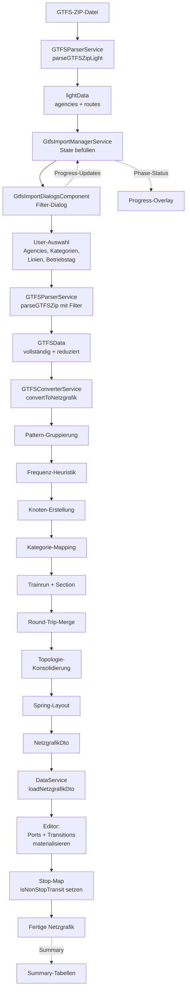
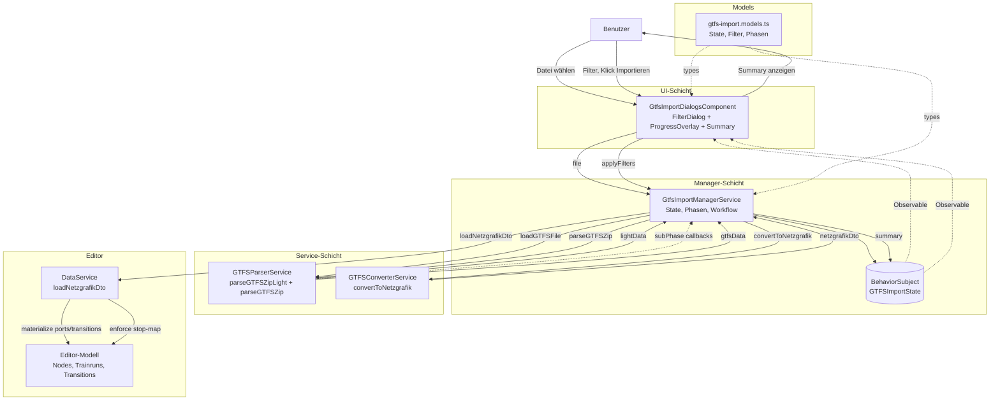
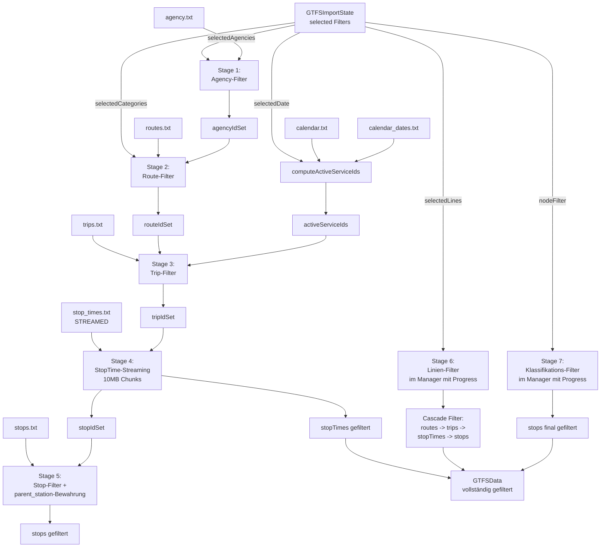
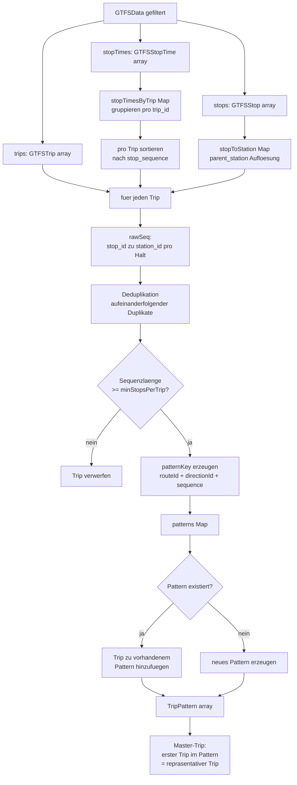
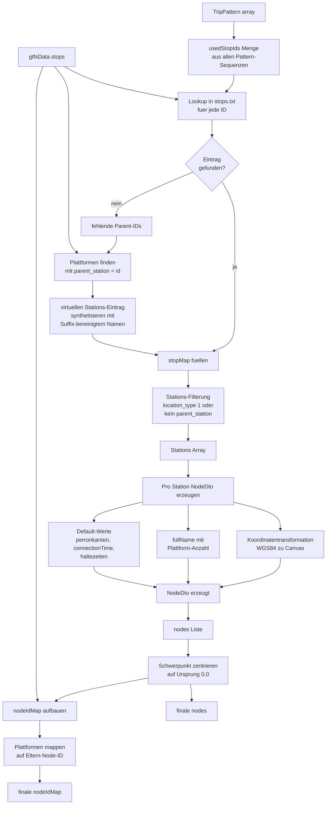
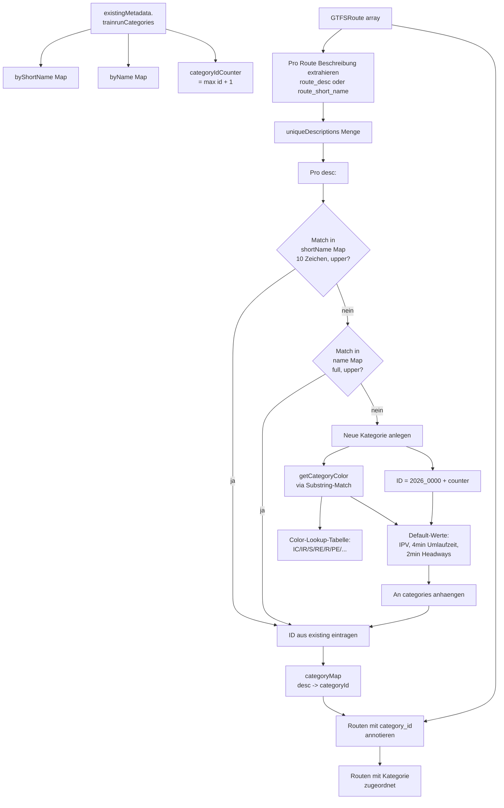
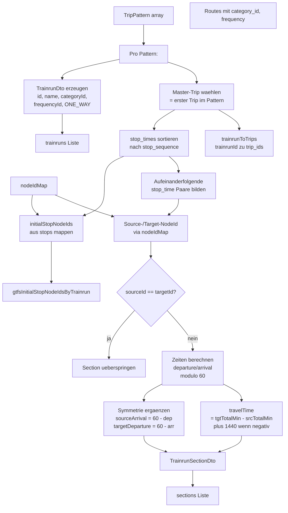
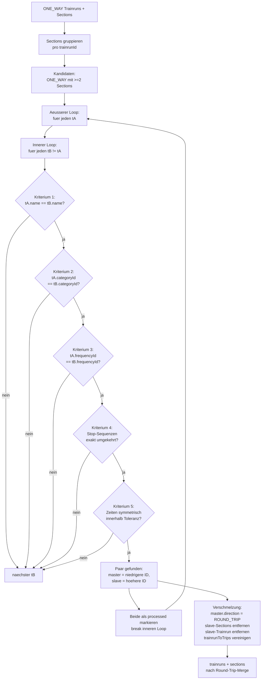
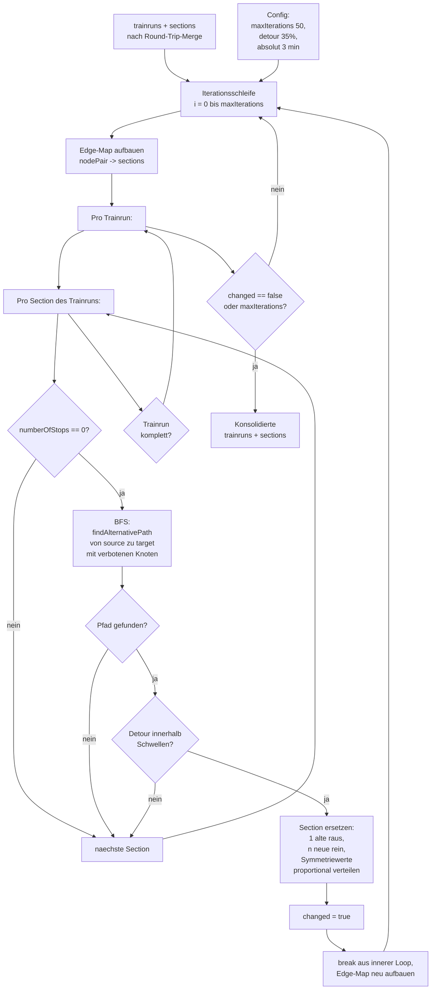
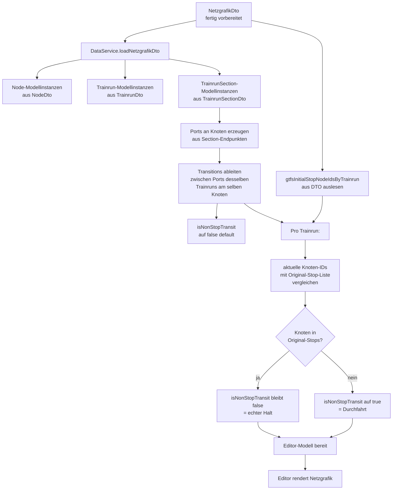

# GTFS-Import im Netzgrafik-Editor
## Vollständige Architektur- und Implementierungsdokumentation

> **Zweck dieses Dokuments:** Diese Dokumentation beschreibt das aktuelle GTFS-Import-Feature so vollständig und verständlich, dass es als Grundlage für eine vollständige Neuentwicklung von Grund auf dienen kann. Jedes Kapitel folgt der gleichen Struktur: **Übersicht → Details → Algorithmus → Heuristik → Datenflussdiagramm**. Wo immer möglich werden konkrete Beispiele aus dem Schweizer Bahnbetrieb verwendet, damit die Logik nicht abstrakt bleibt.

> **Lesehinweis:** Das Dokument ist bewusst in Prosa geschrieben. Stichpunktlisten werden nur dort verwendet, wo sie wirklich helfen. Wer dieses Dokument liest, soll danach in der Lage sein, das Feature ohne Rückfragen neu zu bauen.

---

## Inhaltsverzeichnis

1. [Gesamtüberblick und Architektur](#1-gesamtüberblick-und-architektur)
2. [Komponentenzusammenspiel](#2-komponentenzusammenspiel)
3. [Phase A – Daten laden und Light-Parse](#3-phase-a--daten-laden-und-light-parse)
4. [Phase B – Filterung und Datenreduktion](#4-phase-b--filterung-und-datenreduktion)
5. [Phase C – Pattern-Gruppierung und Master-Trip](#5-phase-c--pattern-gruppierung-und-master-trip)
6. [Phase D – Frequenzberechnung (Heuristik)](#6-phase-d--frequenzberechnung-heuristik)
7. [Phase E – Knoten-Erstellung und Graph-Aufbau](#7-phase-e--knoten-erstellung-und-graph-aufbau)
8. [Phase F – Kategorie-Mapping (Heuristik)](#8-phase-f--kategorie-mapping-heuristik)
9. [Phase G – Trainrun- und Section-Erstellung (Symmetrie)](#9-phase-g--trainrun--und-section-erstellung-symmetrie)
10. [Phase H – Round-Trip-Erkennung (One-Way vs. Symmetrie)](#10-phase-h--round-trip-erkennung-one-way-vs-symmetrie)
11. [Phase I – Topologie-Konsolidierung (Heuristik)](#11-phase-i--topologie-konsolidierung-heuristik)
12. [Phase J – Spring-Layout und finales DTO](#12-phase-j--spring-layout-und-finales-dto)
13. [Phase K – Editor-Integration und Transitions](#13-phase-k--editor-integration-und-transitions)
14. [Datenmapping GTFS → Netzgrafik](#14-datenmapping-gtfs--netzgrafik)
15. [Glossar und Abkürzungen](#15-glossar-und-abkürzungen)

---

# 1. Gesamtüberblick und Architektur

## 1.1 Übersicht

Der GTFS-Import lädt eine standardisierte ZIP-Datei (General Transit Feed Specification), extrahiert daraus Fahrplandaten und transformiert sie schrittweise in das interne Netzgrafik-Editor-Format. Der gesamte Prozess läuft **vollständig im Browser**, also als reines Frontend-Feature in TypeScript. Es gibt keine Server-Seite, keinen API-Endpunkt, keine Backend-Datenbank, die irgendwelche Vorverarbeitungen übernimmt. Alles, was geschieht – das Entpacken der ZIP-Datei, das Parsen der CSV-Tabellen, das Filtern, die Heuristiken zur Frequenzbestimmung, die Erkennung von Hin- und Rückfahrten, die Topologie-Vereinfachung und das Layout-Computing – passiert auf dem Computer des Benutzers, im selben JavaScript-Kontext, in dem auch der Editor läuft.

Diese architektonische Entscheidung hat tiefgreifende Konsequenzen. Erstens muss die gesamte Pipeline mit dem Speicher und der Rechenleistung eines durchschnittlichen Browser-Tabs auskommen. Eine Schweizer GTFS-Datei enthält je nach Periode und Anbieter mehrere hunderttausend Trips und mehrere Millionen Stop-Times-Einträge. Die `stop_times.txt` allein kann mehrere hundert Megabyte gross werden. Ein naives Einlesen der gesamten Datei in einen einzigen JavaScript-String würde sofort an die V8-Engine-Grenze für maximale Stringlängen stossen und einen `Invalid string length`-Fehler werfen. Aus diesem Grund wird `stop_times.txt` chunk-basiert gestreamt: Die Datei wird in Blöcken von zehn Megabyte gelesen, jeder Block wird sofort nach erlaubten Trip-IDs gefiltert, und nur die relevanten Zeilen werden im Speicher behalten. Der Rest wird verworfen, bevor der nächste Chunk gelesen wird. Dadurch skaliert der Speicherverbrauch nicht mit der Grösse der Eingabedatei, sondern mit der Grösse des durch die Filter eingegrenzten Subsets.

Zweitens bedeutet die reine Frontend-Implementierung, dass die Benutzeroberfläche während rechenintensiver Phasen reagibel bleiben muss. Asynchrone Verarbeitung, Promises und gelegentliche `await`-Pausen sorgen dafür, dass der Browser-Hauptthread nicht blockiert wird und die Fortschrittsanzeige flüssig aktualisiert werden kann.

Drittens erlaubt diese Architektur eine vollständige Datenhoheit: Die GTFS-Datei verlässt nie den Browser des Benutzers. Es werden keine Daten hochgeladen, keine Tracking-Calls gemacht, keine Cookies gesetzt. Das ist insbesondere für sensitive Fahrplandaten wichtig, die noch nicht öffentlich freigegeben sind.

Der Prozess selbst ist in mehrere voneinander unabhängige Phasen unterteilt. Jede Phase hat eine klar definierte Eingabe, eine klar definierte Ausgabe und eine klar abgegrenzte Verantwortung. Die Phasen können einzeln getestet, ausgetauscht oder deaktiviert werden, ohne dass die anderen Phasen davon betroffen sind. Das ist insbesondere für die Topologie-Konsolidierung wichtig, die als heuristisches und potenziell fehlerträchtiges Feature optional zugeschaltet werden kann.

## 1.2 Details – Was ist GTFS überhaupt?

Bevor wir in die Implementierung einsteigen, lohnt sich ein kurzer Blick auf das Format, mit dem wir es zu tun haben. GTFS steht für *General Transit Feed Specification* und ist ein von Google ursprünglich für Google Maps entwickelter, mittlerweile international standardisierter Datenaustauschstandard für Fahrplandaten im öffentlichen Verkehr. Ein GTFS-Feed ist ein einfaches ZIP-Archiv, das eine handvoll CSV-Dateien enthält. Jede dieser Dateien beschreibt einen Aspekt des Fahrplans, und alle Dateien zusammen ergeben ein vollständiges Bild der angebotenen Verbindungen.

Die für unseren Import wichtigsten Dateien sind:

`agency.txt` enthält die Verkehrsunternehmen. Bei einem Schweizer Feed sind das beispielsweise die Schweizerischen Bundesbahnen, die BLS, die SOB, aber auch kleinere Anbieter wie Privatbahnen und Postauto-Linien. Jede Agency hat eine eindeutige `agency_id` und einen `agency_name`. Im Filterdialog wählt der Benutzer typischerweise nur eine oder wenige Agencies aus, um die Datenmenge überschaubar zu halten.

`routes.txt` enthält die Linien. Eine Linie ist ein abstraktes Konzept: Die IR15 ist eine Linie, die täglich mehrfach verkehrt. Jede Linie hat eine `route_id`, einen `route_short_name` (zum Beispiel "IR15"), einen `route_long_name` (zum Beispiel "Genève – Luzern"), eine optionale `route_desc` (oft die Kategorie wie "IR" oder "InterRegio"), eine `agency_id`, die auf die zuständige Agency verweist, und einen `route_type`, der den Verkehrsmittelmodus codiert (2 für Bahn, 3 für Bus, 0 für Tram, etc.).

`trips.txt` enthält die konkreten Fahrten. Während eine Linie ein abstraktes Konzept ist, ist ein Trip eine spezifische einzelne Fahrt: Der IR15 um 08:02 Uhr von Genf nach Luzern an einem Dienstag ist ein Trip. Der IR15 um 09:02 Uhr ist ein anderer Trip, auch wenn er dieselbe Strecke befährt. Jeder Trip hat eine `trip_id`, eine `route_id`, eine `service_id`, die auf den Kalender verweist, eine `direction_id` (0 oder 1, oft als Hin- und Rückrichtung interpretiert), einen `trip_headsign` (das Fahrtziel, wie es auf der Anzeigetafel steht) und einen optionalen `trip_short_name`.

`stop_times.txt` ist die mit Abstand grösste Datei. Sie enthält für jeden Trip die genaue Reihenfolge der angefahrenen Halte mit den dazugehörigen Ankunfts- und Abfahrtszeiten. Wenn ein Trip zehn Halte hat, gibt es in dieser Datei zehn Zeilen für diesen Trip. Bei einem nationalen Feed mit hunderttausend Trips und durchschnittlich fünfzehn Halten pro Trip sind das eineinhalb Millionen Zeilen. Jede Zeile enthält `trip_id`, `arrival_time`, `departure_time`, `stop_id`, `stop_sequence` (die Reihenfolge), `pickup_type` und `drop_off_type` (ob ein- und ausgestiegen werden darf).

`stops.txt` enthält die Halte selbst. Wichtig zu wissen: Im GTFS-Modell ist ein "Halt" oft nicht ein Bahnhof, sondern ein einzelner Bahnsteig oder ein einzelnes Gleis. Ein grosser Bahnhof wie Zürich HB hat in einem typischen Schweizer Feed dutzende von "Stops# GTFS-Import im Netzgrafik-Editor
## Vollständige Architektur- und Implementierungsdokumentation

> **Zweck dieses Dokuments:** Diese Dokumentation beschreibt das aktuelle GTFS-Import-Feature so vollständig und verständlich, dass es als Grundlage für eine vollständige Neuentwicklung von Grund auf dienen kann. Jedes Kapitel folgt der gleichen Struktur: **Übersicht → Details → Algorithmus → Heuristik → Datenflussdiagramm**. Wo immer möglich werden konkrete Beispiele aus dem Schweizer Bahnbetrieb verwendet, damit die Logik nicht abstrakt bleibt.

> **Lesehinweis:** Das Dokument ist bewusst in Prosa geschrieben. Stichpunktlisten werden nur dort verwendet, wo sie wirklich helfen. Wer dieses Dokument liest, soll danach in der Lage sein, das Feature ohne Rückfragen neu zu bauen.

---

## Inhaltsverzeichnis

1. [Gesamtüberblick und Architektur](#1-gesamtüberblick-und-architektur)
2. [Komponentenzusammenspiel](#2-komponentenzusammenspiel)
3. [Phase A – Daten laden und Light-Parse](#3-phase-a--daten-laden-und-light-parse)
4. [Phase B – Filterung und Datenreduktion](#4-phase-b--filterung-und-datenreduktion)
5. [Phase C – Pattern-Gruppierung und Master-Trip](#5-phase-c--pattern-gruppierung-und-master-trip)
6. [Phase D – Frequenzberechnung (Heuristik)](#6-phase-d--frequenzberechnung-heuristik)
7. [Phase E – Knoten-Erstellung und Graph-Aufbau](#7-phase-e--knoten-erstellung-und-graph-aufbau)
8. [Phase F – Kategorie-Mapping (Heuristik)](#8-phase-f--kategorie-mapping-heuristik)
9. [Phase G – Trainrun- und Section-Erstellung (Symmetrie)](#9-phase-g--trainrun--und-section-erstellung-symmetrie)
10. [Phase H – Round-Trip-Erkennung (One-Way vs. Symmetrie)](#10-phase-h--round-trip-erkennung-one-way-vs-symmetrie)
11. [Phase I – Topologie-Konsolidierung (Heuristik)](#11-phase-i--topologie-konsolidierung-heuristik)
12. [Phase J – Spring-Layout und finales DTO](#12-phase-j--spring-layout-und-finales-dto)
13. [Phase K – Editor-Integration und Transitions](#13-phase-k--editor-integration-und-transitions)
14. [Datenmapping GTFS → Netzgrafik](#14-datenmapping-gtfs--netzgrafik)
15. [Glossar und Abkürzungen](#15-glossar-und-abkürzungen)

---

# 1. Gesamtüberblick und Architektur

## 1.1 Übersicht

Der GTFS-Import lädt eine standardisierte ZIP-Datei (General Transit Feed Specification), extrahiert daraus Fahrplandaten und transformiert sie schrittweise in das interne Netzgrafik-Editor-Format. Der gesamte Prozess läuft **vollständig im Browser**, also als reines Frontend-Feature in TypeScript. Es gibt keine Server-Seite, keinen API-Endpunkt, keine Backend-Datenbank, die irgendwelche Vorverarbeitungen übernimmt. Alles, was geschieht – das Entpacken der ZIP-Datei, das Parsen der CSV-Tabellen, das Filtern, die Heuristiken zur Frequenzbestimmung, die Erkennung von Hin- und Rückfahrten, die Topologie-Vereinfachung und das Layout-Computing – passiert auf dem Computer des Benutzers, im selben JavaScript-Kontext, in dem auch der Editor läuft.

Diese architektonische Entscheidung hat tiefgreifende Konsequenzen. Erstens muss die gesamte Pipeline mit dem Speicher und der Rechenleistung eines durchschnittlichen Browser-Tabs auskommen. Eine Schweizer GTFS-Datei enthält je nach Periode und Anbieter mehrere hunderttausend Trips und mehrere Millionen Stop-Times-Einträge. Die `stop_times.txt` allein kann mehrere hundert Megabyte gross werden. Ein naives Einlesen der gesamten Datei in einen einzigen JavaScript-String würde sofort an die V8-Engine-Grenze für maximale Stringlängen stossen und einen `Invalid string length`-Fehler werfen. Aus diesem Grund wird `stop_times.txt` chunk-basiert gestreamt: Die Datei wird in Blöcken von zehn Megabyte gelesen, jeder Block wird sofort nach erlaubten Trip-IDs gefiltert, und nur die relevanten Zeilen werden im Speicher behalten. Der Rest wird verworfen, bevor der nächste Chunk gelesen wird. Dadurch skaliert der Speicherverbrauch nicht mit der Grösse der Eingabedatei, sondern mit der Grösse des durch die Filter eingegrenzten Subsets.

Zweitens bedeutet die reine Frontend-Implementierung, dass die Benutzeroberfläche während rechenintensiver Phasen reagibel bleiben muss. Asynchrone Verarbeitung, Promises und gelegentliche `await`-Pausen sorgen dafür, dass der Browser-Hauptthread nicht blockiert wird und die Fortschrittsanzeige flüssig aktualisiert werden kann.

Drittens erlaubt diese Architektur eine vollständige Datenhoheit: Die GTFS-Datei verlässt nie den Browser des Benutzers. Es werden keine Daten hochgeladen, keine Tracking-Calls gemacht, keine Cookies gesetzt. Das ist insbesondere für sensitive Fahrplandaten wichtig, die noch nicht öffentlich freigegeben sind.

Der Prozess selbst ist in mehrere voneinander unabhängige Phasen unterteilt. Jede Phase hat eine klar definierte Eingabe, eine klar definierte Ausgabe und eine klar abgegrenzte Verantwortung. Die Phasen können einzeln getestet, ausgetauscht oder deaktiviert werden, ohne dass die anderen Phasen davon betroffen sind. Das ist insbesondere für die Topologie-Konsolidierung wichtig, die als heuristisches und potenziell fehlerträchtiges Feature optional zugeschaltet werden kann.

## 1.2 Details – Was ist GTFS überhaupt?

Bevor wir in die Implementierung einsteigen, lohnt sich ein kurzer Blick auf das Format, mit dem wir es zu tun haben. GTFS steht für *General Transit Feed Specification* und ist ein von Google ursprünglich für Google Maps entwickelter, mittlerweile international standardisierter Datenaustauschstandard für Fahrplandaten im öffentlichen Verkehr. Ein GTFS-Feed ist ein einfaches ZIP-Archiv, das eine handvoll CSV-Dateien enthält. Jede dieser Dateien beschreibt einen Aspekt des Fahrplans, und alle Dateien zusammen ergeben ein vollständiges Bild der angebotenen Verbindungen.

Die für unseren Import wichtigsten Dateien sind:

`agency.txt` enthält die Verkehrsunternehmen. Bei einem Schweizer Feed sind das beispielsweise die Schweizerischen Bundesbahnen, die BLS, die SOB, aber auch kleinere Anbieter wie Privatbahnen und Postauto-Linien. Jede Agency hat eine eindeutige `agency_id` und einen `agency_name`. Im Filterdialog wählt der Benutzer typischerweise nur eine oder wenige Agencies aus, um die Datenmenge überschaubar zu halten.

`routes.txt` enthält die Linien. Eine Linie ist ein abstraktes Konzept: Die IR15 ist eine Linie, die täglich mehrfach verkehrt. Jede Linie hat eine `route_id`, einen `route_short_name` (zum Beispiel "IR15"), einen `route_long_name` (zum Beispiel "Genève – Luzern"), eine optionale `route_desc` (oft die Kategorie wie "IR" oder "InterRegio"), eine `agency_id`, die auf die zuständige Agency verweist, und einen `route_type`, der den Verkehrsmittelmodus codiert (2 für Bahn, 3 für Bus, 0 für Tram, etc.).

`trips.txt` enthält die konkreten Fahrten. Während eine Linie ein abstraktes Konzept ist, ist ein Trip eine spezifische einzelne Fahrt: Der IR15 um 08:02 Uhr von Genf nach Luzern an einem Dienstag ist ein Trip. Der IR15 um 09:02 Uhr ist ein anderer Trip, auch wenn er dieselbe Strecke befährt. Jeder Trip hat eine `trip_id`, eine `route_id`, eine `service_id`, die auf den Kalender verweist, eine `direction_id` (0 oder 1, oft als Hin- und Rückrichtung interpretiert), einen `trip_headsign` (das Fahrtziel, wie es auf der Anzeigetafel steht) und einen optionalen `trip_short_name`.

`stop_times.txt` ist die mit Abstand grösste Datei. Sie enthält für jeden Trip die genaue Reihenfolge der angefahrenen Halte mit den dazugehörigen Ankunfts- und Abfahrtszeiten. Wenn ein Trip zehn Halte hat, gibt es in dieser Datei zehn Zeilen für diesen Trip. Bei einem nationalen Feed mit hunderttausend Trips und durchschnittlich fünfzehn Halten pro Trip sind das eineinhalb Millionen Zeilen. Jede Zeile enthält `trip_id`, `arrival_time`, `departure_time`, `stop_id`, `stop_sequence` (die Reihenfolge), `pickup_type` und `drop_off_type` (ob ein- und ausgestiegen werden darf).

`stops.txt` enthält die Halte selbst. Wichtig zu wissen: Im GTFS-Modell ist ein "Halt" oft nicht ein Bahnhof, sondern ein einzelner Bahnsteig oder ein einzelnes Gleis. Ein grosser Bahnhof wie Zürich HB hat in einem typischen Schweizer Feed dutzende von "Stops

EINGABE: GTFS-ZIP-Datei (vom Anwender ausgewählt) AUSGABE: NetzgrafikDto, im Editor materialisiert

SCHRITT 1: ZIP-Datei mit JSZip entpacken SCHRITT 2: Light-Parse (nur agency.txt + routes.txt) für Filter-Dialog SCHRITT 3: Anwender wählt Filter (Agency, Kategorie, Linie, Betriebstag) SCHRITT 4: Full-Parse mit aktiven Filtern, stop_times.txt streamen SCHRITT 5: Filter-Pipeline (Agency → Route → Trip → Day) anwenden SCHRITT 6: Trips zu Patterns gruppieren (gleiche Stop-Sequenz = gleiches Pattern) SCHRITT 7: Frequenz pro Route bestimmen (Heuristik mit Histogramm) SCHRITT 8: Knoten aus Stations erstellen, Plattformen zu Stations kollabieren SCHRITT 9: Kategorien aus route_desc ableiten (Substring-Heuristik) SCHRITT 10: Pro Pattern einen Trainrun (initial ONE_WAY) und Sections erzeugen SCHRITT 11: Round-Trip-Pärchen identifizieren und zu ROUND_TRIP zusammenführen SCHRITT 12: Topologie-Konsolidierung (optional, Korridor-Vereinfachung) SCHRITT 13: Spring-Layout für visuelles Resultat SCHRITT 14: NetzgrafikDto zusammenbauen, an Editor übergeben SCHRITT 15: Editor erzeugt Ports/Transitions, setzt isNonStopTransit-Flags


Wichtig zu betonen ist, dass diese Schritte nicht alle in einer einzigen Funktion stattfinden. Sie verteilen sich über mehrere Services, die in Kapitel 2 im Detail beschrieben werden. Die Schritte 1 bis 4 finden im **GTFSParserService** statt, die Schritte 5 bis 13 im **GTFSConverterService**, und Schritt 15 wird vom Editor selbst während der Materialisierung erledigt. Der **GtfsImportManagerService** orchestriert das Ganze, hält den Zustand und sorgt dafür, dass die UI über den Fortschritt informiert wird.

## 1.4 Heuristik

An mehreren Stellen des Imports trifft der Algorithmus Entscheidungen, die nicht eindeutig durch die GTFS-Spezifikation vorgegeben sind, sondern auf heuristischen Annahmen über typische Fahrplandaten basieren. Diese Heuristiken sind das wichtigste Element der Importlogik und gleichzeitig das anfälligste — sie funktionieren bei den meisten Schweizer und europäischen Feeds sehr gut, können aber bei ungewöhnlich strukturierten Feeds (zum Beispiel Bedarfsverkehr, sehr unregelmässige Takte, gemischte Fahrtmuster) zu ungewollten Ergebnissen führen. Die wichtigsten Heuristiken sind:

Die **Frequenz-Erkennung** versucht, aus den Abfahrtsabständen aufeinanderfolgender Trips einer Linie eine sinnvolle Taktfrequenz zu ermitteln. Statt den genauen Mittelwert oder Median zu nehmen, snappt der Algorithmus die ermittelten Intervalle auf die im Editor verfügbaren Standardwerte (15, 20, 30, 60 oder 120 Minuten) und nimmt anschliessend den häufigsten Wert. Diese Snapping-Logik glättet kleine Fahrplanunregelmässigkeiten weg und passt das Ergebnis an die Editor-Realität an, in der nur diese fünf Frequenzwerte unterstützt werden.

Die **Kategorie-Zuordnung** versucht, aus dem `route_desc`-Feld der GTFS-Linie auf die Editor-Kategorie (IR, IC, RE, S, etc.) zu schliessen. Wenn der Feed `route_desc = "InterRegio"` enthält, soll das im Editor als Kategorie "IR" landen. Die Heuristik dafür basiert auf einem zweistufigen Matching: Zuerst wird auf Kurznamen-Übereinstimmung geprüft (die ersten zehn Zeichen der Beschreibung, case-insensitive), dann auf vollen Namen. Wird kein Match gefunden, wird eine neue Kategorie angelegt, deren Farbe durch Substring-Matching gegen ein Wörterbuch bekannter Linienkürzel bestimmt wird ("IR" → blau wie InterRegio, "S" → grün wie S-Bahn, "RE" → rot wie RegionalExpress, etc.).

Die **Round-Trip-Erkennung** versucht, zu jeder Hinrichtung einer Linie die passende Rückrichtung zu finden und beide zu einem bidirektionalen Trainrun zu verschmelzen. Voraussetzung ist, dass beide denselben Linienkurznamen, dieselbe Kategorie, dieselbe Frequenz und exakt umgekehrte Stop-Sequenzen haben. Zusätzlich müssen die Zeiten symmetrisch sein: Wenn der Hinzug um Minute :05 abfährt, muss der Rückzug um Minute :55 ankommen (60-x-Regel, dazu mehr in Kapitel 9 und 10). Ein Toleranzwert in Sekunden (Standardwert 180 Sekunden, also drei Minuten) erlaubt kleine Abweichungen, die aus realen Fahrplanrundungen entstehen.

Die **Topologie-Konsolidierung** versucht, parallele oder redundante Direktverbindungen zwischen Knotenpaaren zu erkennen und durch gemeinsame Korridore zu ersetzen. Wenn zum Beispiel sowohl der IR15 als auch der IR35 von Zürich nach Basel fahren, der IR15 aber als Direktverbindung Zürich–Basel codiert ist, während der IR35 die Zwischenhalte Zürich–Winterthur–Olten–Basel hat, dann kann es sinnvoll sein, den IR15 ebenfalls über diese drei Sections zu führen, statt eine eigene Direktkante Zürich–Basel zu zeichnen. Die Heuristik dafür ist eine Detour-Schwelle: Der Umweg über den Korridor darf maximal X Prozent oder Y Minuten länger sein als die Direktverbindung. Diese Konsolidierung ist optional und wird in Kapitel 11 ausführlich beschrieben.

Die **Knoten-Klassifikation** schliesslich teilt jede Station basierend auf ihrer Rolle im Netzwerk in fünf Kategorien ein: `start` (Station ist Endpunkt mindestens eines Trips), `end` (analog), `junction` (Station hat hohen Grad und wird durchfahren), `major_stop` (Station hat hohen Grad und mindestens ein Trip hält dort) oder `minor_stop` (alles übrige). Diese Klassifikation wird im UI-Filterdialog angeboten, damit der Benutzer entscheiden kann, ob er zum Beispiel nur die Hauptbahnhöfe importieren möchte oder auch alle Durchfahrtsbahnhöfe.

## 1.5 Datenflussdiagramm

Das folgende Diagramm zeigt den Gesamtfluss der Daten durch die einzelnen Phasen, von der ZIP-Eingabe bis zum fertig materialisierten Editor-Zustand. Die einzelnen Komponenten und ihre Verantwortlichkeiten werden in Kapitel 2 detailliert beschrieben.



, S, etc.) zu schliessen. Wenn der Feed `route_desc = "InterRegio"` enthält, soll das im Editor als Kategorie "IR" landen. Die Heuristik dafür basiert auf einem zweistufigen Matching: Zuerst wird auf Kurznamen-Übereinstimmung geprüft (die ersten zehn Zeichen der Beschreibung, case-insensitive), dann auf vollen Namen. Wird kein Match gefunden, wird eine neue Kategorie angelegt, deren Farbe durch Substring-Matching gegen ein Wörterbuch bekannter Linienkürzel bestimmt wird ("IR" → blau wie InterRegio, "S" → grün wie S-Bahn, "RE" → rot wie RegionalExpress, etc.).

Die **Round-Trip-Erkennung** versucht, zu jeder Hinrichtung einer Linie die passende Rückrichtung zu finden und beide zu einem bidirektionalen Trainrun zu verschmelzen. Voraussetzung ist, dass beide denselben Linienkurznamen, dieselbe Kategorie, dieselbe Frequenz und exakt umgekehrte Stop-Sequenzen haben. Zusätzlich müssen die Zeiten symmetrisch sein: Wenn der Hinzug um Minute :05 abfährt, muss der Rückzug um Minute :55 ankommen (60-x-Regel, dazu mehr in Kapitel 9 und 10). Ein Toleranzwert in Sekunden (Standardwert 180 Sekunden, also drei Minuten) erlaubt kleine Abweichungen, die aus realen Fahrplanrundungen entstehen.

Die **Topologie-Konsolidierung** versucht, parallele oder redundante Direktverbindungen zwischen Knotenpaaren zu erkennen und durch gemeinsame Korridore zu ersetzen. Wenn zum Beispiel sowohl der IR15 als auch der IR35 von Zürich nach Basel fahren, der IR15 aber als Direktverbindung Zürich–Basel codiert ist, während der IR35 die Zwischenhalte Zürich–Winterthur–Olten–Basel hat, dann kann es sinnvoll sein, den IR15 ebenfalls über diese drei Sections zu führen, statt eine eigene Direktkante Zürich–Basel zu zeichnen. Die Heuristik dafür ist eine Detour-Schwelle: Der Umweg über den Korridor darf maximal X Prozent oder Y Minuten länger sein als die Direktverbindung. Diese Konsolidierung ist optional und wird in Kapitel 11 ausführlich beschrieben.

Die **Knoten-Klassifikation** schliesslich teilt jede Station basierend auf ihrer Rolle im Netzwerk in fünf Kategorien ein: `start` (Station ist Endpunkt mindestens eines Trips), `end` (analog), `junction` (Station hat hohen Grad und wird durchfahren), `major_stop` (Station hat hohen Grad und mindestens ein Trip hält dort) oder `minor_stop` (alles übrige). Diese Klassifikation wird im UI-Filterdialog angeboten, damit der Benutzer entscheiden kann, ob er zum Beispiel nur die Hauptbahnhöfe importieren möchte oder auch alle Durchfahrtsbahnhöfe.

## 1.5 Datenflussdiagramm

Das folgende Diagramm zeigt den Gesamtfluss der Daten durch die einzelnen Phasen, von der ZIP-Eingabe bis zum fertig materialisierten Editor-Zustand. Die einzelnen Komponenten und ihre Verantwortlichkeiten werden in Kapitel 2 detailliert beschrieben.


# 2. Komponentenzusammenspiel
## 2.1 Übersicht
Das GTFS-Import-Feature ist nicht in einer einzigen monolithischen Klasse implementiert, sondern auf mehrere Services und UI-Komponenten verteilt. Diese Aufteilung folgt dem Prinzip der einfachen Verantwortlichkeit (Single Responsibility): Jede Komponente kennt nur ihren Ausschnitt der Welt und hat klar definierte Schnittstellen zu den anderen. Das macht den Code nicht nur testbar, sondern auch wartbar — wenn sich die GTFS-Spezifikation ändert, muss nur der Parser angepasst werden, der Editor und die UI bleiben unberührt. Wenn sich das Editor-Modell ändert, ist nur der Converter betroffen.

Insgesamt gibt es fünf Hauptbestandteile: zwei datenverarbeitende Services (Parser und Converter), einen orchestrierenden Manager-Service, eine reine Anzeige-Komponente und ein Set von TypeScript-Datenmodellen. Hinzu kommt der allgemeine DataService des Editors, der zwar nicht zum Import-Feature im engeren Sinn gehört, aber am Ende der Pipeline aufgerufen wird, um das fertige NetzgrafikDto in den Editor zu laden.

## 2.2 Details
### 2.2.1 GTFSParserService
Der GTFSParserService ist die unterste Schicht des Imports und beschäftigt sich ausschliesslich mit dem rein technischen Vorgang, eine GTFS-ZIP-Datei einzulesen und in TypeScript-Objekte zu überführen. Er kennt keine Editor-Konzepte, keine Kategorien, keine Trainruns, keine Symmetrie. Seine Welt besteht aus CSV-Tabellen, ZIP-Einträgen und Streaming-Buffern.

Der Service stellt zwei Hauptmethoden bereit, die sich in ihrem Detaillierungsgrad unterscheiden. Die erste Methode heisst parseGTFSZipLight() und führt einen sogenannten Light-Parse durch. Dabei werden nur die kleinsten und für die Filterauswahl relevanten Dateien gelesen — typischerweise agency.txt und routes.txt. Diese Methode ist dafür gedacht, dem Benutzer schnell die Liste der verfügbaren Agencies und Linien anzuzeigen, damit er im Filter-Dialog seine Auswahl treffen kann. Sie ist sehr schnell, weil sie weder Trips noch Stop-Times anfasst und kommt in wenigen Sekunden zurück, selbst bei nationalen Feeds.

Die zweite Methode, parseGTFSZip(), ist der vollständige Parser. Sie wird aufgerufen, nachdem der Benutzer seine Filter gesetzt hat, und führt die eigentliche Hauptarbeit durch. Sie liest alle relevanten Dateien, wendet die Filter direkt während des Lesens an und gibt am Ende ein vollständiges, aber bereits gefiltertes GTFSData-Objekt zurück. Die Filter werden als Parameter übergeben: erlaubte Route-Types, erlaubte Agency-Namen, erlaubte Kategorien und das gewählte Betriebsdatum.

Der entscheidende technische Trick dieses Service ist das Streaming der stop_times.txt. Diese Datei kann, wie schon erwähnt, mehrere hundert Megabyte gross werden. Statt sie als einen einzigen String einzulesen (was JavaScript-Engines an ihre Grenzen bringen würde), wird sie in Chunks von zehn Megabyte gelesen. Jeder Chunk wird sofort als UTF-8 dekodiert, in Zeilen aufgesplittet und gegen die Liste der bereits zugelassenen Trip-IDs (aus dem vorausgehenden Trip-Filter) abgeglichen. Nur Zeilen mit zugelassenen Trip-IDs werden aufbewahrt, der Rest wird verworfen, bevor der nächste Chunk gelesen wird. Eine kleine Komplikation entsteht dadurch, dass eine Zeile am Chunk-Ende abgeschnitten sein kann; dieser Rest wird in einem temporären Puffer aufbewahrt und an den Anfang des nächsten Chunks geklebt, bevor erneut gesplittet wird. Auf diese Weise skaliert der Speicherverbrauch dieses Service nicht mit der Grösse der Eingabedatei, sondern nur mit der Grösse des durch die Vorfilter eingegrenzten Subsets. Wenn der Benutzer beispielsweise nur die SBB-Fernverkehrslinien für einen Werktag importiert, bleibt der Speicherbedarf trotz eines mehrhundertmegabyte-grossen Eingangsfeeds in einem für den Browser verträglichen Rahmen.

Ein weiteres wichtiges Detail des Parsers ist, dass er sich nicht um GTFS-Inkonsistenzen kümmert, sondern diese transparent durchreicht. Wenn arrival_time fehlt, aber departure_time vorhanden ist, wird das Feld nicht ausgefüllt — der Converter weiter oben in der Pipeline muss damit umgehen. Wenn parent_station referenziert wird, aber kein passender Stations-Eintrag in stops.txt existiert, wird das ebenfalls nicht behoben. Der Parser ist eine reine Daten-Mapping-Schicht und verändert die GTFS-Daten nicht über das nötige Mass hinaus.

### 2.2.2 GTFSConverterService

Der GTFSConverterService ist die mittlere und mit Abstand komplexeste Schicht des Imports. Er empfängt ein bereits gefiltertes `GTFSData`-Objekt vom Parser und ist dafür verantwortlich, daraus ein vollständiges `NetzgrafikDto` zu erzeugen. In ihm sind sämtliche heuristischen Algorithmen versammelt: die Pattern-Gruppierung, die Frequenzbestimmung, die Kategorie-Zuordnung, die Symmetriebehandlung, die Round-Trip-Erkennung und die Topologie-Konsolidierung. Wer diesen Service versteht, versteht das gesamte Import-Feature.

Der Converter hat keinerlei Abhängigkeit zur UI. Er kennt keine Angular-Komponenten, kein Translation-System, keine Observable-Streams. Er nimmt Eingangsdaten entgegen, verarbeitet sie und gibt Ausgangsdaten zurück. Das macht ihn extrem gut testbar — wie auch die existierende Spec-Datei zeigt, in der die Topologie-Konsolidierung mit synthetischen TrainrunSection-Arrays getestet wird.

Die Hauptmethode des Service heisst `convertToNetzgrafik()` und nimmt zwei Parameter entgegen: das `GTFSData`-Objekt und ein `options`-Objekt mit Konfigurationsparametern. Diese Optionen umfassen unter anderem die minimale Anzahl Halte pro Trip (Trips mit weniger als drei Halten werden verworfen), die Toleranz für die Symmetrieprüfung in Sekunden, das Aktivierungs-Flag für die Topologie-Konsolidierung sowie deren Schwellenwerte (Detour in Prozent und in absoluten Minuten), die maximale Anzahl Iterationen der Konsolidierungsschleife und ein Flag, das angibt, ob Round-Trip-Merging überhaupt durchgeführt werden soll. Zusätzlich kann ein optionales `existingMetadata`-Objekt übergeben werden, damit der Converter bestehende Editor-Kategorien und -Frequenzen wiederverwenden kann, statt jedes Mal neue zu erzeugen. Schliesslich gibt es einen `labelCreator`-Callback, mit dem der Converter Labels im Editor anlegen kann (für die Filterfunktionen, mit denen der Benutzer später Trainruns nach Round-Trip-Status filtern kann).

Der interne Ablauf des Converter ist eine lineare Sequenz von gut zwölf Verarbeitungsschritten, die jeweils auf den Ergebnissen der vorhergehenden aufbauen. Diese Schritte werden in den Kapiteln 5 bis 12 im Detail beschrieben. Wichtig ist hier nur die Beobachtung, dass der Converter intern Zustand führt — er hat einen Zähler für Kategorie-IDs, einen Zähler für Frequenz-IDs, einen Zähler für Section-IDs — und dass diese Zustände korrekt an die existierenden Editor-Daten anschliessen müssen. Wenn der Editor bereits Kategorien mit IDs bis 5 hat, müssen neu angelegte Kategorien bei 6 anfangen.

Eine besondere Komplikation entsteht dadurch, dass der Converter zwei Zusatzdaten ausgibt, die nicht Teil der offiziellen `NetzgrafikDto`-Schnittstelle sind: eine Map `trainrunToTrips`, die jedem erzeugten Trainrun seine ursprünglichen GTFS-Trip-IDs zuordnet (für Traceability und Diagnose), und eine Map `gtfsInitialStopNodeIdsByTrainrun`, die für jeden Trainrun die Knoten-IDs der ursprünglichen GTFS-Stops auflistet. Diese zweite Map ist essenziell für die spätere Stop-Map-Enforcement durch den Editor — denn nur sie weiss, welche Knoten ursprünglich aus dem GTFS kamen und welche durch die Topologie-Konsolidierung als Durchgangsknoten eingefügt wurden. Diese Unterscheidung ist wichtig, weil im Editor die ersten als "Halt" und die zweiten als "Durchfahrt ohne Halt" dargestellt werden müssen.

### 2.2.3 GtfsImportManagerService

Der GtfsImportManagerService ist der Orchestrator. Er kennt sowohl den Parser als auch den Converter und sorgt dafür, dass die Schritte in der richtigen Reihenfolge ablaufen, dass die UI über den Fortschritt informiert wird, dass Fehler abgefangen und in benutzerfreundliche Meldungen übersetzt werden, und dass am Ende das fertige NetzgrafikDto an den DataService übergeben wird, der es in den Editor lädt.

Der Manager hält den gesamten Importzustand in einem `BehaviorSubject<GTFSImportState>`. Dieses Pattern erlaubt es der UI, sich via Observable-Pipeline an den Zustand zu binden und automatisch über jede Änderung informiert zu werden. Der Zustand umfasst die hochgeladene Datei, das Ergebnis des Light-Parse, die verfügbaren und ausgewählten Filter, den Sichtbarkeitsstatus der Dialoge, die aktuellen Importphasen mit ihren Status-Werten, die Importzusammenfassung nach Abschluss und sämtliche Konfigurationsparameter wie Toleranzen und Topologie-Schwellenwerte.

Die Hauptmethoden des Managers sind `loadGTFSFile()` und `applyFiltersAndImport()`. Die erste wird aufgerufen, wenn der Benutzer eine ZIP-Datei auswählt; sie ruft den Light-Parse auf und füllt die Filteroptionen. Die zweite wird aufgerufen, wenn der Benutzer im Filter-Dialog auf "Importieren" klickt; sie ruft den Full-Parse, dann den Converter, dann den DataService auf und aktualisiert dabei kontinuierlich den Phase-Status, damit die UI eine aussagekräftige Fortschrittsanzeige zeigen kann. Sollte irgendwo in dieser Kette ein Fehler auftreten, fängt der Manager ihn ab, übersetzt ihn in eine benutzerlesbare Meldung (zum Beispiel "Datei zu gross für den Browser-Speicher" bei einem `Invalid string length`-Fehler) und zeigt ihn der UI an.

Eine zusätzliche, etwas versteckte Aufgabe des Managers ist die Generierung der **Import-Zusammenfassung** nach Abschluss. Diese Zusammenfassung enthält nicht nur die Anzahlen (wie viele Knoten, wie viele Trainruns, wie viele Sections), sondern auch eine detaillierte Liste aller Trips, die am gewählten Betriebstag verkehrten. Für jeden Trip wird ermittelt, ob er als "System Path" gilt (also dem häufigsten Pfad seiner Linie entspricht) oder ob es sich um eine verkürzte oder andere Variante handelt. Diese Information ist nicht für den Editor selbst relevant, sondern wird in den Summary-Tabellen des Progress-Overlays angezeigt, damit der Benutzer nachvollziehen kann, welche Daten tatsächlich importiert wurden und welche heuristischen Entscheidungen dabei getroffen wurden.

### 2.2.4 GtfsImportDialogsComponent

Diese Komponente ist die UI-Schicht des Imports. Sie ist eine reine Anzeige-Komponente — sie hält keinerlei Geschäftslogik, keine Konvertierungsregeln, keine Heuristiken. Ihre einzige Aufgabe besteht darin, den Zustand des Managers in HTML zu rendern und Benutzereingaben als Events nach oben zu propagieren.

Die Komponente besteht aus zwei Hauptdialogen, die in zwei separaten `*ngIf`-Blöcken im Template eingeblendet werden. Der **Filter-Dialog** wird gezeigt, sobald der Light-Parse abgeschlossen ist, und enthält die Eingabeelemente für die Filterauswahl: einen Datepicker für den Betriebstag (mit Anzeige des verfügbaren Datumsbereichs aus dem Calendar), drei Chip-Listen mit Autocomplete für Agencies, Kategorien und Linien, eine Reihe von Checkboxen für die Verkehrsmittelmodi, ein Eingabefeld für die Symmetrie-Toleranz und einen Bereich für die Topologie-Konsolidierungsoptionen mit einem Aktivierungs-Häkchen und zwei Eingabefeldern für die Detour-Schwellen.

Der **Progress-Overlay** wird gezeigt, sobald der Benutzer auf "Importieren" klickt, und zeigt eine vertikale Liste aller Importphasen mit Symbolen und Status-Klassen. Jede Phase kann zusätzliche Sub-Phasen haben (zum Beispiel die einzelnen CSV-Dateien innerhalb der Parse-Phase), und Sub-Phasen können einen Fortschrittswert in Prozent anzeigen. Sobald der Import abgeschlossen ist, werden im selben Overlay zusätzlich mehrere Summary-Tabellen eingeblendet: eine Übersichtstabelle mit den Hauptkennzahlen, eine Aufschlüsselung nach Kategorien, eine nach Frequenzen, eine nach Round-Trip-Status und schliesslich die detaillierte Trip-Liste mit Suchfilter.

Die Komponente kommuniziert ausschliesslich via Inputs und Outputs mit dem Manager-Service. Sie empfängt den State über Inputs (gebunden an die vom Manager publizierten Werte) und sendet Benutzeraktionen über Outputs (`addAgency`, `removeAgency`, `addCategory`, `removeCategory`, `addLine`, `removeLine`, `setSelectedDate`, `applyFilters`, `closeFilterDialog`, `closeImportOverlay` und einige mehr). Diese Trennung sorgt dafür, dass die Komponente komplett zustandslos bleibt und der gesamte Import-Workflow im Manager zentralisiert ist.

### 2.2.5 Datenmodelle

Die fünfte und letzte Komponente sind die TypeScript-Interfaces und -Defaults, die in `gtfs-import.models.ts` definiert sind. Sie umfassen die Filtertypen (`GTFSRouteTypeFilter`, `GTFSNodeFilter`), die Phasen-Strukturen (`GTFSImportPhase`, `GTFSSubPhase`), die Trip-Detail-Struktur für die Summary, die State-Schnittstelle (`GTFSImportState`), die Standardwerte für Filter und Toleranzen sowie die Topologie-Konsolidierungsmodelle (`TopologyNode`, `TopologyEdgeSegment`, `PatternMapping`, `TopologyGraph`).

Diese Modelle sind reine Typdefinitionen ohne Logik. Sie dienen als Vertrag zwischen den Services und der UI und sorgen dafür, dass die TypeScript-Compiler-Prüfung beim Übergeben von Daten zwischen den Schichten greift. Insbesondere die `GTFSImportState`-Schnittstelle ist umfangreich und enthält sämtliche Felder, die der Manager im BehaviorSubject hält — von der hochgeladenen Datei über die Filterauswahl bis hin zu den UI-Sichtbarkeitsflags und den Topologie-Konfigurationsparametern.

## 2.3 Algorithmus

Der typische End-to-End-Ablauf einer Importsession aus Sicht der Komponenten sieht folgendermassen aus. Wichtig: Dieser Ablauf beschreibt nur das Zusammenspiel der Komponenten; die fachliche Logik in den einzelnen Phasen wird in den späteren Kapiteln detailliert.

Der Benutzer klickt im Editor auf den GTFS-Import-Knopf. Daraufhin öffnet sich ein nativer Dateiauswahldialog, in dem er die ZIP-Datei auswählt. Sobald die Datei vorliegt, wird `GtfsImportManagerService.loadGTFSFile(file)` aufgerufen. Diese Methode setzt zuerst den State zurück, damit allfällige Reste eines vorherigen Imports verschwinden. Anschliessend ruft sie `GTFSParserService.parseGTFSZipLight(file)` auf. Der Parser entpackt die ZIP-Datei mit JSZip, liest `agency.txt` und `routes.txt` als vollständige Strings ein und parst sie mit PapaParse zu typisierten Objekten. Die `calendar.txt` wird ebenfalls gelesen, um den verfügbaren Datumsbereich zu ermitteln. Das Ergebnis wird als `lightData`-Objekt zurückgegeben.

Der Manager extrahiert aus diesem Light-Parse die verfügbaren Agency-Namen, die in den Routes vorkommenden Kategorien (aus `route_desc` oder, falls leer, aus dem Buchstabenpräfix von `route_short_name`) und die Liste aller Linienkurznamen. Anschliessend setzt er den Light-Parse-Datumsbereich, schlägt sinnvolle Defaults vor (typischerweise die SBB als ausgewählte Agency und die Standardkategorien EC/IC/IR/RE/S, sofern verfügbar) und macht den Filter-Dialog sichtbar.

Die GtfsImportDialogsComponent ist via Input an den State gebunden und rendert nun den Filter-Dialog. Der Benutzer wählt seine Filter, gibt Toleranzwerte ein und klickt auf "Importieren". Die Komponente sendet das `applyFilters`-Event nach oben.

Der aufrufende Container ruft nun `GtfsImportManagerService.applyFiltersAndImport()`. Diese Methode schaltet die UI von Filter-Dialog auf Progress-Overlay um, setzt alle Phasen auf "pending" und beginnt dann mit der ersten Phase: dem Full-Parse. Sie ruft `GTFSParserService.parseGTFSZip()` mit den Filterparametern auf. Der Parser arbeitet jetzt deutlich mehr: Er liest erneut die kleinen Dateien, dazu `trips.txt` und `stops.txt`, wertet `calendar.txt` und `calendar_dates.txt` für den gewählten Tag aus, und streamt schliesslich `stop_times.txt` chunkweise. Bei jedem fertigen CSV-File wird ein Callback aufgerufen, mit dem der Manager die entsprechende Sub-Phase auf "completed" setzen und die nächste auf "running" stellen kann. Dadurch sieht der Benutzer im UI live, wie sich der Parse-Fortschritt entwickelt.

Sobald der Parse abgeschlossen ist, wendet der Manager noch zusätzliche Filter an, die im Parser nicht stattfinden — namentlich die Linien-Filter (falls der Benutzer im Dialog explizit Linien-Kurznamen ausgewählt hat) und der Knoten-Klassifikations-Filter (falls nicht alle Knotentypen aktiviert sind). Diese Filter werden mit Fortschrittsanzeige (Phase 2 im Overlay) ausgeführt: Bei jedem 10-Prozent-Schritt wird der Fortschrittsbalken in der entsprechenden Sub-Phase aktualisiert.

Anschliessend wird `GTFSConverterService.convertToNetzgrafik()` aufgerufen, mit den gefilterten Daten und den Optionen aus dem State. Der Converter führt seine zwölf-Schritte-Pipeline aus und gibt am Ende ein NetzgrafikDto zurück. Während dieser Phase ist die UI auf "running" für die Convert-Phase gestellt; allerdings gibt es hier keinen feingranularen Fortschritt, weil der Converter intern keine Callbacks aufruft.

Das fertige NetzgrafikDto wird dann via `processNetzgrafikJSON()` an den DataService übergeben, der es in den Editor lädt. Beim Laden findet die Editor-Materialisierung statt: Aus den leeren Port- und Transition-Listen der Knoten werden konkrete Port- und Transition-Objekte erzeugt, basierend auf den Sections, die durch jeden Knoten verlaufen. Direkt im Anschluss wird die Stop-Map aus dem DTO ausgelesen und auf jede neu erzeugte Transition angewendet, um die `isNonStopTransit`-Flags korrekt zu setzen.

Schliesslich generiert der Manager die Import-Zusammenfassung. Dazu zählt er die Knoten, Trainruns und Sections im DTO, ermittelt die Round-Trip- und One-Way-Anzahlen, gruppiert nach Kategorie, Frequenz und Label und erstellt die detaillierte Trip-Liste für die Summary-Tabelle. Diese Zusammenfassung wird in den State geschrieben und automatisch von der UI gerendert.

## 2.4 Heuristik

Die Aufteilung in fünf Komponenten folgt strikt dem Prinzip der einfachen Verantwortlichkeit (Single Responsibility Principle). Diese Aufteilung ist nicht zwingend — man könnte alles in einer einzigen Klasse implementieren — aber sie zahlt sich aus zwei Gründen aus:

Der erste Grund ist die **Testbarkeit**. Der Converter ist die kompliziertste Komponente, weil er sämtliche Heuristiken enthält. Gleichzeitig ist er die testbarste, weil er keine Abhängigkeiten zur UI, zum Editor-State oder zum Filesystem hat. Man kann ihn mit synthetischen GTFSData-Objekten füttern und das Ergebnis prüfen, wie es die existierende Spec-Datei für die Topologie-Konsolidierung tut. Diese Tests laufen in Millisekunden und sind völlig unabhängig vom Rest des Editors.

Der zweite Grund ist die **Austauschbarkeit**. Wenn sich die GTFS-Spezifikation ändert (zum Beispiel durch eine neue Version des Standards), muss nur der Parser angepasst werden. Wenn sich das Editor-Datenmodell ändert (zum Beispiel weil neue Pflichtfelder dazukommen), muss nur der Converter angepasst werden. Wenn sich die Filterlogik ändert oder die UI neu gestaltet wird, sind nur Manager und Component betroffen. Diese Lokalität von Änderungen ist in einem mehrjährigen Projekt von unschätzbarem Wert.

Eine alternative Architektur, die in einer Neuentwicklung in Betracht gezogen werden könnte, wäre die Auslagerung des Converters in einen Web Worker. Damit würde der Hauptthread komplett freigehalten, und die UI bliebe auch während rechenintensiver Konsolidierungsschleifen reagibel. Der aktuelle Code macht das nicht, weil die Verarbeitungszeiten bei typischen Schweizer Tagesimporten unter zehn Sekunden liegen und ein Web Worker zusätzliche Komplexität bei der Datenübergabe (Strukturklonen) bringen würde. Bei grösseren Importszenarien (zum Beispiel mehrere Tage gleichzeitig oder ein gesamtes Wochenfahrplanmuster) wäre die Worker-Variante aber sinnvoll.

## 2.5 Datenflussdiagramm

Das folgende Diagramm zeigt die Komponenten und ihre Schnittstellen. Pfeile mit durchgezogenen Linien zeigen direkte Methodenaufrufe, gestrichelte Pfeile zeigen Datenflüsse über Observable-Streams oder Callback-Mechanismen.



# 3. Phase A — Daten laden und Light-Parse
## 3.1 Übersicht
Die allererste Phase des Imports ist konzeptionell einfach, aber technisch heikel: Die ZIP-Datei muss entpackt werden, und es müssen genügend Informationen extrahiert werden, damit der Benutzer im Filter-Dialog sinnvolle Auswahlen treffen kann.

Dabei darf die Operation nicht zu lange dauern, weil der Benutzer noch wartet, bevor er überhaupt mit dem Import beginnen kann. Eine vollständige Verarbeitung der gesamten ZIP-Datei wäre an dieser Stelle Zeitverschwendung und im Extremfall sogar speicherproblematisch — der Benutzer hat ja noch nicht entschieden, welche Agency er überhaupt importieren will, und es macht keinen Sinn, vorher Millionen Stop-Times-Einträge in den Speicher zu laden.

Die Lösung ist der sogenannte **Light-Parse**: Es werden nur diejenigen Dateien gelesen, die für die Filterauswahl relevant sind. Konkret sind das `agency.txt`, `routes.txt` und `calendar.txt`. Die `agency.txt` liefert die Liste der Verkehrsunternehmen, die `routes.txt` liefert die Linien (mit deren Kategorie aus `route_desc` und Linienkurzname) und die `calendar.txt` liefert den Datumsbereich, in dem die Daten gültig sind. Die grossen Dateien — `trips.txt`, `stop_times.txt`, `stops.txt` — werden bewusst **nicht** angefasst.

Diese Phase dauert auf einem typischen Notebook bei einem Schweizer Feed unter zwei Sekunden, selbst wenn die ZIP-Datei mehrere hundert Megabyte gross ist. Das liegt daran, dass die kleinen Dateien zusammen nur wenige hundert Kilobyte ausmachen und JSZip die ZIP-Struktur effizient lesen kann, ohne die ganzen Inhalte zu dekomprimieren.

## 3.2 Details

Der Light-Parse beginnt damit, dass die übergebene File-Instanz mit JSZip geladen wird. JSZip ist eine etablierte JavaScript-Bibliothek für ZIP-Dateien, die den Vorteil hat, dass sie mit `JSZip.loadAsync()` die Struktur einer ZIP-Datei einlesen kann, ohne sofort sämtliche Inhalte zu entpacken. Die einzelnen Einträge werden erst auf Anfrage dekomprimiert. Das ist genau die Eigenschaft, die wir brauchen: Wir wollen nur drei Einträge lesen und den Rest in der ZIP-Datei lassen.

Sobald die ZIP-Struktur geladen ist, wird für jeden gewünschten Eintrag (`agency.txt`, `routes.txt`, `calendar.txt`) der Name in der ZIP-Struktur gesucht. Hier ist eine kleine Komplikation: Manche GTFS-Feeds packen die CSV-Dateien direkt in die Wurzel der ZIP-Datei, andere packen sie in einen Unterordner. Der Parser muss deshalb tolerant sein und sowohl `agency.txt` als auch zum Beispiel `feed/agency.txt` als Treffer akzeptieren. Falls eine erwartete Datei fehlt (was bei `agency.txt` und `routes.txt` ein Fehler wäre, bei `calendar.txt` aber nur bedeutet, dass kein Datumsbereich angezeigt werden kann), wird das je nach Pflichtigkeit als Fehler oder als Warnung behandelt.

Die gefundenen Einträge werden mit der Methode `async("text")` von JSZip in UTF-8-Strings entpackt. Diese Strings können bei `agency.txt` und `calendar.txt` typischerweise wenige Kilobyte gross sein, bei `routes.txt` einige hundert Kilobyte. Das liegt deutlich unter der V8-Stringgrenze von ungefähr 500 Megabyte und ist völlig unproblematisch.

Anschliessend werden diese Strings mit PapaParse geparst. PapaParse ist die Standardbibliothek für CSV-Parsing in JavaScript und kümmert sich automatisch um BOM-Marker (Byte Order Marks, die in manchen GTFS-Feeds am Dateianfang stehen), um quotierte Felder mit Sonderzeichen, um Zeilenumbruchsvarianten (Unix `\n` versus Windows `\r\n`) und um Header-Zeilen (die erste Zeile als Spaltennamen interpretieren). Die Konfiguration `{ header: true, skipEmptyLines: true }` reicht für GTFS aus.

Das Ergebnis sind drei Arrays von typisierten Objekten: `agencies: GTFSAgency[]`, `routes: GTFSRoute[]` und `calendar: GTFSCalendar[]`. Diese werden in einem `lightData`-Objekt zusammengefasst und zurückgegeben.

Eine zusätzliche Aufgabe des Light-Parse ist das Bestimmen des Datumsbereichs. Aus der `calendar.txt` wird das früheste `start_date` und das späteste `end_date` über alle Service-Einträge ermittelt. Das Ergebnis wird in einem `serviceDateRange`-Objekt gespeichert und im Filter-Dialog angezeigt, damit der Benutzer weiss, in welchem Zeitfenster er einen Betriebstag wählen kann.

Eine letzte Aufgabe besteht darin, bereits hier einen ersten Filter anzuwenden — den Verkehrsmittel-Modus-Filter (Bahn, Bus, Tram etc.). Die `routes.txt` enthält für jede Route ein `route_type`-Feld mit einer numerischen Codierung (2 = Bahn, 3 = Bus, 0 = Tram, 4 = Fähre etc.), und der Benutzer hat im UI Checkboxen aktiviert oder deaktiviert. Routen mit einem nicht erlaubten `route_type` werden bereits beim Light-Parse aussortiert, damit die Filterauswahl sauber ist und der Benutzer im Dialog nur die wirklich relevanten Linien und Kategorien sieht.

## 3.3 Algorithmus

Pseudocode-Ablauf des Light-Parse:
EINGABE: File-Instanz (ZIP), erlaubte route_types (Liste von Zahlen) AUSGABE: lightData = { agencies, routes, calendar, serviceDateRange }

zipFile = await JSZip.loadAsync(file)

agencyText = await zipFile.file(“agency.txt”).async(“text”) routeText = await zipFile.file(“routes.txt”).async(“text”) calText = await zipFile.file(“calendar.txt”)?.async(“text”) ?? null

agencies = PapaParse(agencyText) routesAll = PapaParse(routeText) calendar = calText ? PapaParse(calText) : []

routes = routesAll.filter(r => allowedRouteTypes.includes(parseInt(r.route_type)) )

serviceDateRange = calendar.length > 0 ? { startDate: min(calendar.map(c => c.start_date)), endDate: max(calendar.map(c => c.end_date)) } : null

RETURN { agencies, routes, calendar, serviceDateRange }


Im Manager-Service wird das Ergebnis dann weiterverarbeitet, um die Filteroptionen für die UI aufzubauen:

agencyNames = unique(lightData.agencies.map(a => a.agency_name)).sorted()

categories = unique(lightData.routes.flatMap(r => { desc = r.route_desc.trim() if (desc) return [desc.toUpperCase()] prefix = r.route_short_name.match(/^[A-Za-z]+/) return prefix ? [prefix[0].toUpperCase()] : [] })).sorted()

lineNames = unique(lightData.routes.map(r => r.route_short_name || r.route_long_name )).filter(nonEmpty).sorted()


Diese drei Listen werden anschliessend in den State geschrieben und steuern damit die Autocomplete-Vorschläge in den drei Chip-Listen des Filter-Dialogs.

## 3.4 Heuristik

Die wichtigste Heuristik dieser Phase betrifft die **Kategorie-Extraktion**. GTFS sieht das Feld `route_desc` als optionales Beschreibungsfeld vor; einige Anbieter füllen es konsequent mit einer Kategorie wie "InterRegio" oder "RE", andere lassen es leer. Wenn es leer ist, versucht der Light-Parse, die Kategorie aus dem `route_short_name` abzuleiten — konkret aus dem Buchstabenpräfix. "IR15" wird zu "IR", "S25" wird zu "S", "RE3" wird zu "RE". Diese Ableitung funktioniert sehr gut für europäische und insbesondere schweizerische Feeds, weil dort die Linienbezeichnungen praktisch immer dem Muster "Kategorie + Nummer" folgen. Bei amerikanischen Feeds, wo Linien eher unstrukturierte Namen wie "Red Line" oder "Express 7" haben, würde diese Heuristik weniger zuverlässig funktionieren.

Eine zweite Heuristik betrifft die **Default-Auswahl** der Filter. Sobald die Agency-Liste ermittelt ist, sucht der Manager-Service nach einer Agency, deren Name die Begriffe "Schweizerische Bundesbahnen" oder zumindest "SBB" enthält, und wählt diese automatisch aus. Das spiegelt die Tatsache wider, dass das Feature primär für den Schweizer Anwendungsfall entwickelt wurde. Bei einer Neuentwicklung wäre es sinnvoll, diese Default-Logik konfigurierbar zu machen, etwa über eine Umgebungsvariable oder eine Editor-Einstellung.

Bei den Kategorien ist die Default-Auswahl ähnlich opportunistisch: Es wird geprüft, welche der typischen Schweizer Fernverkehrskategorien (EC, IC, IR, RE, S) im Feed verfügbar sind, und alle verfügbaren werden vorausgewählt. Auch das ist kontextspezifisch und sollte in einer Neuentwicklung konfigurierbar sein.

Bei den Linien wiederum gibt es eine vordefinierte Liste mit einigen prominenten Schweizer Linien (IC21, IC26, IR27, IR15, S1, S29, RE24), die bei der ersten Filteranwendung automatisch ausgewählt werden, sofern sie im Feed vorhanden sind. Diese Liste dient nur dazu, dem Benutzer eine sinnvolle Vorauswahl zu zeigen, damit er nicht mit einer leeren Linienauswahl konfrontiert wird. Wenn er anschliessend eigene Linien hinzufügt oder die Default-Auswahl ändert, wird diese Liste ignoriert.

## 3.5 Datenflussdiagramm

 ```mermaid
graph TD
    File[File-Instanz<br/>ZIP-Datei]
    File --> JSZip[JSZip.loadAsync]
    JSZip --> ZipStruct[ZIP-Struktur<br/>nur Index, nicht entpackt]
    
    ZipStruct -->|.file agency.txt| AT[agency.txt Text]
    ZipStruct -->|.file routes.txt| RT[routes.txt Text]
    ZipStruct -->|.file calendar.txt| CT[calendar.txt Text]
    
    AT --> AP[PapaParse]
    RT --> RP[PapaParse]
    CT --> CP[PapaParse]
    
    AP --> AG[agencies Array]
    RP --> RA[routesAll Array]
    CP --> CA[calendar Array]
    
    RT2[allowed route_types]
    RA --> RF{route_type<br/>erlaubt?}
    RT2 --> RF
    RF -->|Ja| RO[routes gefiltert]
    RF -->|Nein| RX[verworfen]
    
    CA --> SDR[serviceDateRange<br/>min start_date,<br/>max end_date]
    
    AG --> LD[lightData]
    RO --> LD
    CA --> LD
    SDR --> LD
    
    LD --> Manager[Manager:<br/>State befüllen]
    Manager --> AN[agencyNames<br/>unique + sorted]
    Manager --> CT2[categories<br/>aus route_desc<br/>oder Buchstabenprefix]
    Manager --> LN[lineNames<br/>aus route_short_name]
    
    AN --> UI[Filter-Dialog<br/>Chip-Listen]
    CT2 --> UI
    LN --> UI
    SDR --> UI[Filter-Dialog<br/>Datepicker mit Range]
```

4. Phase B — Filterung und Datenreduktion
4.1 Übersicht
Sobald der Benutzer im Filter-Dialog seine Auswahl getroffen hat, beginnt die eigentliche Hauptarbeit. Die Filterung ist nicht ein einzelner Schritt, sondern eine Pipeline aus mehreren aufeinander aufbauenden Stufen. Jede Stufe reduziert die Datenmenge weiter, und jede Stufe baut auf den Ergebnissen der vorherigen auf. Das ist deshalb wichtig, weil die einzelnen GTFS-Dateien über Fremdschlüssel (Trip-IDs, Route-IDs, Service-IDs, Stop-IDs) miteinander verbunden sind. Wenn man eine Datei zu früh oder zu aggressiv filtert, ohne die Folgewirkungen auf die anderen Dateien zu berücksichtigen, entstehen Inkonsistenzen.

Die Filterpipeline folgt dem natürlichen Verschachtelungsprinzip der GTFS-Daten: Eine Trip gehört zu einer Route, eine Route gehört zu einer Agency, eine Trip verkehrt an bestimmten Tagen (definiert durch eine Service-ID, die wiederum auf den Calendar verweist), und eine Trip besteht aus Stop-Times, die auf Stops verweisen. Wenn wir die Agency oben filtern, fallen automatisch viele Routen und Trips weg. Wenn wir den Betriebstag setzen, fallen weitere Trips weg. Und wenn wir am Schluss noch nach Linien filtern, bleiben nur die wenigen relevanten übrig. Erst dann werden die zugehörigen Stop-Times geladen.

Diese Reihenfolge ist nicht zufällig. Sie minimiert den Speicherverbrauch in jeder Phase. Die stop_times.txt ist mit Abstand die grösste Datei; sie wird erst dann gelesen, wenn die Liste der relevanten Trip-IDs auf wenige Hundert oder Tausend zusammengeschrumpft ist. Der Streaming-Parser hält dann nur die paar Megabytes der relevanten Zeilen im Speicher, statt mehrerer hundert Megabyte aller Zeilen.

4.2 Details
Die Filterpipeline besteht aus vier Stufen, die in dieser Reihenfolge ausgeführt werden:

4.2.1 Stufe 1 — Agency-Filter
Die Liste der ausgewählten Agency-Namen aus dem State wird genommen. Im Parser werden alle Agency-Einträge aus agency.txt gegen diese Liste abgeglichen, und nur diejenigen, deren agency_name exakt in der Auswahlliste vorkommt (case-insensitive), werden behalten. Die agency_id-Werte der überlebenden Agencies werden in einem Set gesammelt — diese Liste ist die Eingabe für die nächste Stufe. Wenn der Benutzer keine Agencies ausgewählt hat (was eigentlich nicht vorkommen sollte, weil der Default-Wert eine Agency setzt), werden alle Agencies durchgelassen.

4.2.2 Stufe 2 — Routen-Filter
Die routes.txt wird mehrfach gefiltert: Erstens nach route_type, der schon im Light-Parse berücksichtigt wurde. Zweitens nach agency_id — nur Routen, deren agency_id im Set aus Stufe 1 vorkommt, werden behalten. Drittens, falls der Benutzer Kategorien ausgewählt hat, nach route_desc (oder dem Buchstabenpräfix von route_short_name, falls route_desc leer ist). Hier wird ähnlich gearbeitet wie im Light-Parse zur Kategorie-Extraktion: Zunächst wird route_desc.toUpperCase() mit der Liste der ausgewählten Kategorien verglichen; falls keine Übereinstimmung, wird das Buchstabenpräfix von route_short_name extrahiert und gegen die Auswahlliste abgeglichen.

Eine vierte, indirekte Stufe ist der Linien-Filter. Dieser wird allerdings nicht im Parser ausgeführt, sondern später im Manager-Service. Der Grund dafür ist, dass der Linien-Filter eine Sub-Phase im Filter-Phasen-Schema des UIs ist und mit Fortschrittsbalken dargestellt werden soll. Im Parser wäre er einfach Teil des Routen-Filters. Im Manager wird er als separate Sub-Phase mit eigenem Progress-Indicator behandelt.

Die route_id-Werte aller überlebenden Routen werden in einem Set gesammelt. Dieses Set ist die Eingabe für die nächste Stufe.

4.2.3 Stufe 3 — Trip- und Calendar-Filter
Die trips.txt wird gefiltert: Nur Trips mit einer route_id aus dem Set der überlebenden Routen werden behalten. Wenn der Benutzer einen Betriebstag gewählt hat (was praktisch immer der Fall ist), kommt zusätzlich die Calendar-Auswertung zum Tragen.

Die Calendar-Auswertung funktioniert in zwei Schritten. Zuerst wird aus dem Wochentag des gewählten Datums (zum Beispiel “Dienstag”) und dem Datumsbereich aus calendar.txt ermittelt, welche Service-IDs an diesem Wochentag potenziell verkehren. Ein Service-Eintrag mit tuesday = "1" und einem start_date-Wert vor dem gewählten Datum und einem end_date-Wert nach dem gewählten Datum verkehrt an diesem Dienstag. Diese Service-IDs werden in einem Set gesammelt.

Dann wird calendar_dates.txt ausgewertet. Für jeden Eintrag, dessen date mit dem gewählten Datum übereinstimmt, wird der exception_type gelesen. Bei exception_type = "1" wird die Service-ID hinzugefügt (Service ist an diesem Tag zusätzlich aktiv). Bei exception_type = "2" wird sie aus dem Set entfernt (Service ist an diesem Tag ausgesetzt). Das Endergebnis ist die Menge aller Service-IDs, die am gewählten Tag tatsächlich verkehren.

Anschliessend werden die Trips noch einmal gefiltert: Nur Trips, deren service_id in dieser finalen Service-ID-Menge enthalten ist, werden behalten. Die trip_id-Werte der überlebenden Trips werden in einem Set gesammelt — dieses Set ist die Eingabe für die nächste und letzte Stufe.

4.2.4 Stufe 4 — Stop-Times-Streaming und Stop-Filter
Jetzt kommt der Performance-kritische Teil. Die stop_times.txt wird als ArrayBuffer geöffnet und in Chunks von zehn Megabyte gelesen. Jeder Chunk wird als UTF-8-Text dekodiert, an den eventuellen Rest des vorherigen Chunks geklebt, in Zeilen aufgesplittet, und jede Zeile wird mit einem schnellen, manuellen CSV-Parser zerlegt (PapaParse hat hier zu viel Overhead). Für jede Zeile wird die trip_id extrahiert und gegen das Set der überlebenden Trip-IDs aus Stufe 3 abgeglichen. Nur Zeilen mit zugelassener trip_id werden in das stopTimes-Array übernommen, alle anderen Zeilen werden sofort verworfen. Eine eventuell unvollständige letzte Zeile am Chunk-Ende wird als “Rest” gespeichert und an den Anfang des nächsten Chunks geklebt.

Sobald stop_times.txt vollständig durchlaufen ist, wird die stop_id-Menge aller überlebenden Stop-Times gesammelt. Anschliessend wird stops.txt gefiltert: Nur Stops, deren stop_id in dieser Menge vorkommt oder die als parent_station einer überlebenden Stop-Id referenziert werden, werden behalten. Diese zweite Bedingung ist wichtig, damit die Stationshierarchie nicht zerbricht: Wenn eine Plattform “Zürich HB Gleis 7” überlebt, muss auch der Stations-Eintrag “Zürich HB” überleben, weil er als parent_station der Plattform referenziert wird.

4.2.5 Zusätzliche Filter im Manager
Nach dem eigentlichen Parser gibt es im Manager-Service noch zwei nachgelagerte Filterstufen, die beide mit Fortschrittsbalken im UI dargestellt werden.

Der Linien-Filter wird angewendet, falls der Benutzer im Filter-Dialog explizit Linien-Kurznamen ausgewählt hat. Dieser Filter ist konzeptionell identisch mit Stufe 2, aber er wird hier ausgeführt, weil er als eigene UI-Phase dargestellt werden soll. Die routes.txt wird durchgegangen, jede Route mit einem nicht ausgewählten route_short_name wird verworfen, und die abhängigen Trips, Stop-Times und Stops werden entsprechend bereinigt.

Der Knoten-Klassifikations-Filter ist optional und wird nur angewendet, wenn der Benutzer im UI nicht alle fünf Knoten-Typen aktiviert hat (start, end, junction, major_stop, minor_stop). Voraussetzung für diesen Filter ist, dass die Knoten-Klassifikation bereits im Parser durchgeführt wurde — was auch tatsächlich der Fall ist.

Der Parser klassifiziert jeden überlebenden Stop nach seinem topologischen Verhalten: Wenn der Stop in mindestens einem Trip als erster Halt vorkommt, bekommt er das Flag `start`; wenn er in mindestens einem Trip als letzter Halt vorkommt, das Flag `end`; wenn er in vielen Trips durchfahren wird (hoher Knotengrad), das Flag `junction`; wenn er in mindestens einem Trip als Halt mit `pickup_type != "1"` oder `drop_off_type != "1"` vorkommt und einen mittleren Grad hat, das Flag `major_stop`; ansonsten `minor_stop`. Der Knoten-Klassifikations-Filter behält dann nur diejenigen Stops, deren Klassifikation in der Auswahl des Benutzers ist.

## 4.3 Algorithmus
EINGABE: GTFSData (vollständig nach Light-Parse + Full-Parse) selectedAgencies, selectedCategories, selectedLines, selectedDate nodeFilter (start/end/junction/major/minor) AUSGABE: GTFSData (gefiltert)

PIPELINE:

Agency-Filter agencyIdSet = ids of agencies whose name in selectedAgencies gtfsData.agencies = filter where agency_id in agencyIdSet

Routen-Filter (route_type schon im Light-Parse) gtfsData.routes = filter where agency_id in agencyIdSet AND (route_desc.upper() in selectedCategories OR shortNamePrefix.upper() in selectedCategories) routeIdSet = ids of surviving routes

Trip-Filter activeServiceIds = computeActiveServiceIds(selectedDate, calendar, calendarDates) gtfsData.trips = filter where route_id in routeIdSet AND service_id in activeServiceIds tripIdSet = ids of surviving trips

Stop-Times-Filter (Streaming) for each chunk in stop_times.txt: for each line in chunk: if line.trip_id in tripIdSet: gtfsData.stopTimes.push(parsed line)

stopIdSet = ids of stops referenced in stopTimes

Stops-Filter gtfsData.stops = filter where stop_id in stopIdSet OR stop_id is parent_station of any stop in stopIdSet

Linien-Filter (im Manager, mit Progress) if selectedLines.length > 0: gtfsData.routes = filter where route_short_name.upper() in selectedLines gtfsData.trips = filter cascade gtfsData.stopTimes = filter cascade gtfsData.stops = filter cascade

Knoten-Klassifikations-Filter (im Manager, mit Progress) if not all node types selected: for each stop: classify stop based on topology gtfsData.stops = filter where classification in nodeFilter


Die Berechnung `computeActiveServiceIds` aus Schritt 3 verdient eine eigene Darstellung:
EINGABE: selectedDate (YYYY-MM-DD), calendar, calendarDates AUSGABE: Set<string> aktiver Service-IDs

targetDate = parseDate(selectedDate) targetDateStr = selectedDate ohne Bindestriche (YYYYMMDD) dayOfWeek = targetDate.getDay() // 0=So, 1=Mo, …, 6=Sa

activeIds = neue leere Menge

for each cal in calendar: if targetDate >= cal.start_date AND targetDate <= cal.end_date: if (dayOfWeek 1 AND cal.monday “1”) OR (dayOfWeek 2 AND cal.tuesday “1”) OR … (analog für die anderen Wochentage): activeIds.add(cal.service_id)

for each calDate in calendarDates: if calDate.date == targetDateStr: if calDate.exception_type == “1”: activeIds.add(calDate.service_id) else if calDate.exception_type == “2”: activeIds.delete(calDate.service_id)

return activeIds


## 4.4 Heuristik

Die Filterpipeline selbst enthält keine Heuristiken im engeren Sinn — sie ist eine deterministische Datenreduktion entlang fester Kriterien. Die einzige interpretative Entscheidung betrifft das Kategorie-Matching im Routen-Filter: Es wird mit `route_desc` priorisiert, und nur wenn dieses Feld leer ist, wird auf das Buchstabenpräfix von `route_short_name` zurückgegriffen. Das funktioniert für Schweizer und europäische Feeds zuverlässig, kann aber bei amerikanischen Feeds zu unerwarteten Ergebnissen führen, weil dort die Linien-Kurzbezeichnungen oft keine erkennbaren Kategorie-Präfixe haben.

Eine zweite, eher technische Entscheidung betrifft die **Stop-Hierarchie-Bewahrung** in Stufe 5. Wenn eine Plattform überlebt, muss auch ihr Eltern-Stationseintrag überleben, weil später im Converter die Plattformen zu Stationen kollabiert werden. Würde man diese Bewahrung weglassen, hätte man "Waisen-Plattformen" ohne übergeordnete Station — der Converter müsste diese Lücken durch das Erzeugen virtueller Stationen ausgleichen, was zwar als Fallback implementiert ist, aber unnötige Komplexität bringt. Die explizite Bewahrung ist hier deshalb sinnvoll.

Die **Reihenfolge der Filterstufen** ist nicht beliebig austauschbar. Wenn man zum Beispiel zuerst die Stop-Times streamen würde und dann erst die Trips filtert, müsste man die ganze `stop_times.txt` ungefiltert in den Speicher laden, bevor man sie einschränken könnte. Genau das ist der Punkt, an dem der Browser bei grossen Feeds die Grätsche macht. Die gewählte Reihenfolge — Agency → Route → Trip → StopTimes → Stops — minimiert in jedem Schritt die Datenmenge, bevor die nächste, datenintensivere Stufe beginnt.

## 4.5 Datenflussdiagramm


5. Phase C — Pattern-Gruppierung und Master-Trip
5.1 Übersicht
Nach der Filterpipeline liegt eine reduzierte Menge von Trips vor, von denen jeder eine spezifische Fahrt mit konkreten Abfahrtszeiten ist. Aus dieser Menge sollen jetzt Trainruns gemacht werden — also abstrahierte Linien, die im Editor visualisiert werden. Eine Linie wie der IR15 verkehrt typischerweise alle 60 Minuten von Genf nach Luzern. Im GTFS-Feed sind das ungefähr siebzehn einzelne Trips pro Tag, je nach Periode auch mehr. Im Editor wollen wir daraus einen einzigen Trainrun machen, der die Linie repräsentiert, mit einer Frequenz von 60 Minuten und einer einheitlichen Fahrzeit pro Section.

Das Vorgehen dafür ist die Pattern-Gruppierung. Ein Pattern ist eine Gruppe von Trips, die alle dieselbe Linie befahren, dieselbe Richtung haben und dieselbe Stop-Sequenz aufweisen. Wenn der Vormittags-IR15 von Genf nach Luzern dieselben elf Stationen anfährt wie der Mittags-IR15 und der Abend-IR15, dann sind diese drei Trips in einem gemeinsamen Pattern. Ein vierter IR15, der zum Beispiel nur bis Bern fährt (verkürzte Variante), gehört in ein anderes Pattern, weil seine Stop-Sequenz anders ist.

Aus jedem Pattern wird im späteren Verlauf ein Trainrun erzeugt. Die individuellen Trips innerhalb des Patterns werden dann auf den Master-Trip kollabiert — den repräsentativen Trip, dessen Fahrzeiten exemplarisch als Section-Fahrzeiten verwendet werden. Die anderen Trips dienen nur noch zur Frequenzbestimmung (siehe Kapitel 6).

5.2 Details
Die Gruppierung erfolgt über einen Pattern-Schlüssel, der drei Bestandteile vereint: die route_id, die direction_id und die normalisierte Stop-Sequenz als Bindestrich-getrennten String. Zwei Trips landen genau dann im selben Pattern, wenn ihre Pattern-Schlüssel identisch sind.

Die Stop-Sequenz wird vor dem Schlüsselbau normalisiert. Konkret bedeutet das: Die einzelnen Plattform-IDs aus den Stop-Times werden zunächst auf ihre `parent_station`-IDs zurückgeführt. Damit wird verhindert, dass ein Trip, der in Zürich HB auf Gleis 7 hält, einem anderen Pattern zugeordnet wird als ein Trip, der in Zürich HB auf Gleis 12 hält. Beide Trips halten ja im selben Bahnhof; die Plattformwahl ist aus Netzgrafik-Sicht irrelevant. Die Plattform-zu-Station-Zuordnung erfolgt über das `parent_station`-Feld der `stops.txt`. Ein Stop ohne `parent_station` wird als seine eigene Station behandelt.

Nach dieser Normalisierung kann es vorkommen, dass dieselbe Station mehrfach hintereinander in der Sequenz steht — etwa wenn ein Trip auf Gleis 7 ankommt, einige Minuten wartet und dann auf Gleis 8 weiterfährt. In den Stop-Times sind das zwei separate Einträge mit unterschiedlichen `stop_id`-Werten, aber nach der Normalisierung haben beide dieselbe Station-ID. Solche unmittelbar aufeinanderfolgenden Duplikate werden im Pattern-Schlüssel kollabiert: Aus "Zürich HB Gl. 7 → Zürich HB Gl. 8" wird einfach "Zürich HB". Diese Operation ist wichtig, damit Trips, die in verschiedenen Plattformkonstellationen denselben Weg fahren, demselben Pattern zugeordnet werden.

Trips mit weniger als drei Halten werden vor der Gruppierung verworfen. Diese Schwelle ist im Code als `minStopsPerTrip = 3` codiert und kann als Option überschrieben werden. Der Hintergrund: Trips mit nur ein oder zwei Halten sind oft Sonderfälle wie kurze Verstärkerfahrten oder fehlerhafte Daten und tragen wenig zur Netzgrafik bei. Eine Linie braucht mindestens drei Halte, um sinnvoll dargestellt werden zu können (Anfangsbahnhof, Zwischenhalt, Endbahnhof).

Sobald die Patterns gebildet sind, wird aus jedem Pattern ein **Master-Trip** ausgewählt. Das ist im aktuellen Code schlicht der erste Trip im Pattern, also der zeitlich früheste. Diese Wahl ist heuristisch und nicht ideal — sie kann durch eine ungünstige Auswahl Verzerrungen erzeugen, wenn der erste Trip zum Beispiel ein Ausnahmefahrt mit ungewöhnlichen Fahrzeiten ist. In der Anforderungsspezifikation ist eine raffiniertere Variante vorgesehen, bei der der Master-Trip aus dem Modus der Ankunfts- und Abfahrtsminuten pro Station gebildet wird, also gewissermassen ein "synthetischer" Trip, der die häufigsten Zeiten an jeder Station verwendet. Diese Variante ist im aktuellen Code nicht implementiert, sondern eine offene Erweiterung für eine Neuentwicklung.

Innerhalb eines Patterns werden alle Stop-Times des Master-Trips nach `stop_sequence` sortiert. Das ist wichtig, weil die GTFS-Spezifikation nicht garantiert, dass die Zeilen in `stop_times.txt` in der korrekten Reihenfolge stehen — manche Anbieter sortieren sie chronologisch nach `arrival_time`, andere nach `stop_sequence`, andere gar nicht. Eine explizite Sortierung nach `stop_sequence` ist deshalb obligatorisch.

Die so gewonnenen, sortierten Stop-Times des Master-Trips dienen später als Vorlage für die Erzeugung der TrainrunSections (siehe Kapitel 9). Die anderen Trips im Pattern werden im weiteren Verlauf nicht mehr für die Section-Erzeugung verwendet — sie tragen nur noch zur Frequenzbestimmung und zur Trip-Detail-Tabelle in der Summary bei.

## 5.3 Algorithmus
EINGABE: GTFSData (gefiltert), minStopsPerTrip AUSGABE: TripPattern[] (Liste von Pattern-Objekten)

DATENSTRUKTUR TripPattern: { routeId: string directionId: “0” | “1” stopSequence: string[] // Stations-IDs, normalisiert, dedupliziert trips: GTFSTrip[] // alle Trips in diesem Pattern stopTimes: Map // pro Trip die sortierten Halte }

ALGORITHMUS:

Aufbau der stop_id → station_id Mapping (aus parent_station) stopToStation = neue Map for each stop in gtfsData.stops: stopToStation.set( stop.stop_id, stop.parent_station != “” ? stop.parent_station : stop.stop_id )

Gruppierung der Stop-Times pro Trip stopTimesByTrip = neue Map for each st in gtfsData.stopTimes: stopTimesByTrip.append(st.trip_id, st)

Sortierung pro Trip nach stop_sequence for each (tripId, sts) in stopTimesByTrip: sts.sort((a, b) => parseInt(a.stop_sequence) - parseInt(b.stop_sequence))

Pattern-Bildung patterns = neue Map

for each trip in gtfsData.trips: sts = stopTimesByTrip.get(trip.trip_id) if sts is null oder sts.length < minStopsPerTrip: skip

// Stations-Sequenz aufbauen, Duplikate konsolidieren rawSeq = sts.map(st => stopToStation.get(st.stop_id) || st.stop_id) seq = [] for each stationId in rawSeq: if seq.length == 0 oder seq.last() != stationId: seq.push(stationId)

if seq.length < minStopsPerTrip: skip

directionId = trip.direction_id || “0” patternKey = trip.route_id + “” + directionId + “” + seq.join(“-“)

if not patterns.has(patternKey): patterns.set(patternKey, { routeId: trip.route_id, directionId: directionId, stopSequence: seq, trips: [], stopTimes: neue Map })

pattern = patterns.get(patternKey) pattern.trips.push(trip) pattern.stopTimes.set(trip.trip_id, sts)

Rückgabe als Array RETURN Array.from(patterns.values())


## 5.4 Heuristik

Die zentrale heuristische Entscheidung in dieser Phase ist die **Definition eines Patterns**. Die aktuelle Definition — gleicher `route_id` + gleicher `direction_id` + identische normalisierte Stop-Sequenz — ist sehr strikt. Schon die kleinste Abweichung in der Stop-Sequenz führt zu einem separaten Pattern. Das ist gewollt, weil verschiedene Stop-Sequenzen wirklich verschiedene Linienverläufe darstellen. Aber es bedeutet auch, dass Linien mit vielen Fahrtmustervarianten — zum Beispiel S-Bahnen, die manchmal über Gleis A und manchmal über Gleis B fahren, oder Verstärkerfahrten, die zusätzliche Halte einlegen — in mehrere Patterns aufgeteilt werden, was später zu mehreren parallelen Trainruns führt.

Diese Aufteilung ist aus topologischer Sicht korrekt, kann aber visuell unübersichtlich werden, wenn ein Pattern fünf Trips pro Tag hat und ein anderes Pattern nur einen einzigen. Gerade deshalb ist die Topologie-Konsolidierung später so wichtig (siehe Kapitel 11): Sie kann diese parallelen Trainruns nachträglich auf einen gemeinsamen Korridor zusammenführen.

Eine wichtige Beobachtung zur **Master-Trip-Auswahl**: Im aktuellen Code wird einfach der erste Trip im Pattern als Master genommen. Diese naive Wahl ist in der überwiegenden Mehrheit der Fälle ausreichend, weil die meisten Trips innerhalb eines Patterns ähnliche Fahrzeiten haben — sie befahren ja dieselbe Strecke mit dem gleichen Rollmaterial. In Einzelfällen kann es aber zu unerwünschten Effekten kommen:

- Ein einzelner verspäteter oder verlängerter Trip am Anfang eines Patterns würde seine atypischen Fahrzeiten auf den ganzen Trainrun übertragen.
- Bei einem Pattern, das aus Trips mit drei verschiedenen Frequenzklassen besteht (etwa Tag- und Nacht-Trips), kann die Wahl des ersten Trips zu einer Frequenzbestimmung führen, die nicht zur Mehrheit passt.

Eine bessere Heuristik, die in der Anforderungsspezifikation gefordert wird, ist die **Modus-basierte Mastertrip-Bildung**. Dabei wird für jede Station in der Sequenz der Modus aller Ankunfts- und Abfahrtsminuten über alle Trips des Patterns berechnet. Die Master-Fahrzeit zwischen zwei aufeinanderfolgenden Stationen ergibt sich dann aus der Differenz dieser Modus-Werte. Diese Methode glättet Ausreisser weg und ist robust gegen Einzelfälle. Sie ist aber rechnerisch aufwendiger und in der aktuellen Implementierung nicht umgesetzt.

Eine weitere Beobachtung betrifft die **gemeinsamen Sub-Sequenzen verschiedener Patterns**. In der Anforderungsspezifikation wird das Beispiel angeführt, dass die Linie von A bis H verkehrt, aber einige Trips nur A–F, andere nur C–H und wieder andere C–F fahren. Die strikte Pattern-Bildung erzeugt daraus drei separate Patterns mit drei separaten Trainruns. Die Anforderungsspezifikation fordert eine intelligentere Variante, bei der die längste gemeinsame Sub-Sequenz erkannt wird (in diesem Beispiel C–F) und die Frequenz aus dieser gemeinsamen Sub-Sequenz bestimmt wird, weil dort alle Trips mitfahren. Der Trainrun selbst wird dann auf die volle Länge A–H ausgedehnt, und die Trips, die nur Teilstrecken fahren, werden als verkürzte Varianten dargestellt.

Diese erweiterte Heuristik ist im aktuellen Code **nicht** implementiert, sondern nur im Konzept skizziert. In der Trip-Detail-Tabelle der Summary wird ein Ansatz davon sichtbar: Dort wird für jeden Trip ermittelt, ob er als "System Path" gilt (also dem häufigsten Pfad seiner Linie entspricht) oder als "Shortened-Start", "Shortened-End", "Shortened-Both" oder "Other". Diese Klassifikation findet aber erst in der Summary-Generierung statt, nicht in der Pattern-Bildung selbst, und sie wird nicht zur Verschmelzung der Patterns verwendet.

Eine letzte Heuristik betrifft die **Behandlung von Trips ohne `direction_id`**. Manche GTFS-Feeds verwenden dieses Feld konsequent, andere lassen es leer oder setzen alle Trips auf `direction_id = "0"`. Im aktuellen Code wird ein leeres Feld auf "0" defaultet — was bedeutet, dass alle Trips ohne explizite Richtungsangabe demselben Pattern zugeordnet werden. Wenn aber zwei Trips desselben Routes in entgegengesetzten Richtungen fahren und beide kein `direction_id` haben, würden sie hier fälschlicherweise im selben Pattern landen. Die Anforderungsspezifikation fordert deshalb, dass in solchen Fällen die Stop-Sequenz selbst die Richtungserkennung übernimmt — wenn die Sequenz "A-B-C-D" ist, gehört der Trip in Richtung 0; wenn sie "D-C-B-A" ist, in Richtung 1. Diese Logik ist im aktuellen Code teilweise implementiert (durch die strikte Stop-Sequenz im Pattern-Schlüssel), aber nicht explizit als richtungsbezogene Bestimmung modelliert.
 

## 5.5 Datenflussdiagramm



  6. Phase D — Frequenzberechnung (Heuristik)
6.1 Übersicht
Sobald die Patterns gebildet sind, muss zu jedem zugehörigen Trainrun eine Frequenz zugeordnet werden. Eine Frequenz ist im Editor-Modell ein diskreter Wert aus einer fest vorgegebenen Liste: 15, 20, 30, 60 oder 120 Minuten. Andere Werte sind nicht erlaubt — die Editor-Logik hat keine Vorstellung davon, was eine 17-Minuten-Frequenz bedeuten würde, weil die gesamte Visualisierung auf der Annahme einer regelmässigen Stundenbasis aufbaut.

Aus den GTFS-Daten muss also eine diskretisierte Frequenz bestimmt werden, die möglichst gut zur tatsächlichen Taktung der Linie passt. Die Aufgabe ist nicht ganz trivial, weil reale Fahrpläne selten perfekt im Takt fahren. Eine Linie kann nominell einen 30-Minuten-Takt haben, aber in den Daten erscheinen Abstände von 28, 30, 31, 30, 32 Minuten — wegen Anschlussabstimmung an Knotenbahnhöfen, Dispatcher-Entscheidungen oder einfach unterschiedlicher Modellierung in den Quelldaten. Die Heuristik muss diese kleinen Abweichungen wegglätten und auf den nächstgelegenen Standardwert snappen.

Eine zweite Komplikation ist die 120-Minuten-Frequenz. Im Editor wird zwischen “120 Minuten gerade” (Abfahrten zu vollen Stunden wie 06:00, 08:00, 10:00) und “120 Minuten ungerade” (Abfahrten zu ungeraden Stunden wie 07:00, 09:00, 11:00) unterschieden. Diese Unterscheidung ist nötig, damit zwei sich ergänzende 2-Stunden-Linien (eine gerade, eine ungerade) auf der Netzgrafik richtig abgebildet werden können — ihre Abfahrten dürfen nicht aufeinander fallen. Bei der Frequenzbestimmung muss also nicht nur der Wert “120” erkannt werden, sondern auch, in welche der beiden Schichten die Linie gehört.

6.2 Details
Die Frequenzbestimmung erfolgt pro Route, nicht pro Pattern. Das ist bewusst gewählt: Wenn eine Linie aus mehreren Patterns besteht (etwa weil sie verschiedene Fahrtmuster hat), sollen alle Patterns dieselbe Frequenz erhalten. Die Frequenz ist eine Eigenschaft der Linie als Ganzes, nicht des einzelnen Fahrtmusters.

Im aktuellen Code findet die Frequenzbestimmung im Parser statt, bevor der Converter überhaupt zum Zug kommt. Pro Route werden alle ihr zugeordneten Trips betrachtet, und aus den Abfahrtszeiten am Start-Stop wird die Frequenz heuristisch ermittelt. Das Ergebnis wird in das route.frequency-Feld geschrieben — ein vom GTFS-Standard nicht vorgesehenes Feld, das aber als Erweiterung im internen GTFSRoute-Modell vorhanden ist.

Die Bestimmung läuft in mehreren Schritten ab. Zuerst werden alle Trips einer Route gesammelt, und für jeden Trip wird die Abfahrtszeit am ersten Halt extrahiert (genauer: die departure_time des Stop-Times-Eintrags mit dem kleinsten stop_sequence). Diese Abfahrtszeiten werden in Minuten seit Mitternacht umgerechnet, damit sie als reine Zahlen verglichen werden können. GTFS erlaubt Zeitangaben jenseits von 24:00 Uhr (etwa 25:30 für eine Fahrt, die nach Mitternacht um 01:30 endet, aber zum Vortagsservice gehört) — diese werden auf den Bereich [0, 1440] modulo gerechnet, weil für die Frequenzbestimmung nur die intra-day-Abstände relevant sind.

Die Abfahrtszeiten werden anschliessend aufsteigend sortiert. Aus der sortierten Liste werden alle aufeinanderfolgenden Differenzen gebildet — das sind die Intervalle zwischen aufeinanderfolgenden Abfahrten derselben Linie. Wenn zwischen 06:00 und 07:00 abgefahren wird, ist das Intervall 60 Minuten. Wenn als nächstes 07:30 folgt, kommt ein 30-Minuten-Intervall hinzu. Aus all diesen Intervallen wird ein Histogramm gebildet: Wie oft kommt jedes Intervall vor?

Vor dem Histogramm-Aufbau wird jedes Intervall auf den nächstgelegenen Standardwert gesnappt. Die Standardwerte sind {15, 20, 30, 60, 120}. Das Snapping erfolgt mit einer Toleranzschwelle: Liegt ein Intervall innerhalb von ±N% (oder einer absoluten Schwelle in Minuten) eines Standardwerts, wird es auf diesen gerundet. Sonst wird es als “Unbekannt” markiert und nicht ins Histogramm aufgenommen. Die genauen Toleranzwerte sind im Code als Konstanten festgelegt.

Aus dem Histogramm wird der Modus bestimmt — also der häufigste Wert. Wenn 50 Intervalle einer Linie als “60” gesnappt werden und 10 als “120”, dann ist der Modus 60, und der Linie wird die 60-Minuten-Frequenz zugeordnet. Bei Gleichstand entscheidet der kleinere Wert (kürzerer Takt = mehr Fahrten, was meistens das gewünschte Verhalten widerspiegelt).

Wird der ermittelte Modus 120, gibt es einen Zusatzschritt: die Schichtbestimmung. Es wird geprüft, ob die meisten Abfahrten zu geraden oder zu ungeraden Stunden stattfinden. Konkret wird für jede Abfahrt der Stundenanteil der Abfahrtszeit modulo 2 berechnet. Liegt das Ergebnis bei 0, ist die Abfahrt zu einer geraden Stunde; bei 1, zu einer ungeraden. Der Modus dieser Werte ergibt die Schicht: “120_0” für gerade Stunden, “120_60” für ungerade Stunden. Diese Schichtangabe wird im Frequenz-Schlüssel codiert und beim Mapping auf die Editor-Frequenz-Definitionen verwendet.

Im Editor sind die Standardfrequenzen mit ihren Offsets vordefiniert. Die “120_0”-Frequenz hat den Offset 0 (Abfahrt zur vollen geraden Stunde), die “120_60” hat den Offset 60 (Abfahrt zur vollen ungeraden Stunde). Bei den anderen Frequenzen (15, 20, 30, 60) gibt es keinen Offset-Unterschied, weil ihre Periode kleiner als eine Stunde ist und sie sich automatisch in den Stundenraster einfügen.

6.3 Algorithmus


EINGABE:  Liste der Trips einer Route, allowedFrequencies = {15, 20, 30, 60, 120}
AUSGABE:  frequency: number, optional offsetHour: 0 | 1

1. Abfahrtszeiten extrahieren
   departureTimes = []
   for each trip in trips:
   firstStopTime = stopTimesByTrip.get(trip.trip_id).sortedByStopSequence().

first()
       depMinutes = parseToMinutes(firstStopTime.departure_time) % (24 * 60)
       departureTimes.push(depMinutes)

2. Sortieren aufsteigend
   departureTimes.sort()

3. Wenn weniger als 2 Trips: Frequenz nicht bestimmbar
   if departureTimes.length < 2:
   return { frequency: 60, offsetHour: undefined }  // Default-Fallback

4. Intervalle berechnen
   intervals = []
   for i from 1 to departureTimes.length - 1:
   intervals.push(departureTimes[i] - departureTimes[i-1])

5. Snapping auf Standardwerte
   histogram = neue Map<number, number>
   for each interval in intervals:
   nearest = findNearestStandardFrequency(interval, allowedFrequencies, tolerance)
   if nearest != null:
   histogram[nearest] = (histogram[nearest] || 0) + 1

6. Modus bestimmen
   if histogram leer:
   return { frequency: 60, offsetHour: undefined }  // Default-Fallback

   bestFrequency = key of histogram with max value
   (Bei Gleichstand: kleinerer Wert)

7. Spezialfall 120-Minuten: Schicht bestimmen
   if bestFrequency == 120:
   evenCount = 0
   oddCount = 0
   for each depMinutes in departureTimes:
   hour = floor(depMinutes / 60)
   if hour % 2 == 0:
   evenCount++
   else:
   oddCount++

   offsetHour = (evenCount >= oddCount) ? 0 : 1
   else:
   offsetHour = undefined

8. RETURN { frequency: bestFrequency, offsetHour }
Die Hilfsfunktion findNearestStandardFrequency arbeitet so:

EINGABE:  interval (Minuten), allowedFrequencies = [15, 20, 30, 60, 120], tolerance
AUSGABE:  passender Standardwert oder null

1. for each f in allowedFrequencies:
   if abs(interval - f) <= tolerance:
   return f
2. return null

Die Toleranz ist im Code als kleine, feste Schwelle implementiert (typischerweise drei bis fünf Minuten), kann aber in einer Neuentwicklung auch dynamisch in Abhängigkeit vom Standardwert berechnet werden — etwa als Prozentsatz des Standardwerts (zum Beispiel 10 Prozent). Damit hätten kleinere Frequenzen eine kleinere absolute Toleranz und grössere Frequenzen eine grössere — was sinnvoller ist, weil ein 5-Minuten-Fehler bei einer 15-Minuten-Frequenz schwerer wiegt als bei einer 120-Minuten-Frequenz.

6.4 Heuristik
Die Frequenzbestimmung ist eine der heikelsten Heuristiken der gesamten Pipeline, weil sie auf relativ wenig Information beruhen muss und gleichzeitig auf einen sehr engen Wertebereich abbilden soll. Die wichtigsten Designentscheidungen sind:

Modus statt Mittelwert oder Median. Der Modus ist robuster gegen einzelne Ausreisser als der Mittelwert. Wenn eine Linie 30 Trips im 60-Minuten-Takt hat und einen einzigen Verstärkertrip mit 30 Minuten Abstand zum Nachfolger, würde der Mittelwert leicht unter 60 fallen. Der Modus bleibt aber stabil bei 60, weil die Mehrheit der Intervalle dort liegt. Der Median wäre hier ebenfalls stabil, hat aber den Nachteil, dass er bei wenigen Datenpunkten zu zwei Werten führen kann (Median zwischen zwei Werten), was eine zusätzliche Tiebreaker-Logik erfordert.

Snapping vor dem Histogramm. Würde man das Histogramm mit den rohen Intervallen aufbauen, hätten reale Fahrpläne mit ihren kleinen Abweichungen für jeden minutennahen Wert einen eigenen Histogramm-Eintrag. Aus Werten wie 28, 30, 31, 29, 30, 32 würden sechs separate Einträge entstehen, alle mit Häufigkeit 1. Das Snapping fasst diese als “30” zusammen und ergibt einen klaren Modus.

Toleranz-basiertes Verwerfen. Intervalle, die nicht in die Toleranzschwelle passen (etwa 45 Minuten oder 90 Minuten), werden gar nicht ins Histogramm aufgenommen. Das ist eine bewusste Entscheidung: Man will lieber das Risiko eingehen, dass eine ungewöhnliche Linie keine Frequenz bekommt, als dass eine Standard-Linie eine falsche Frequenz erhält. Wenn die Linie wirklich einen ungewöhnlichen Takt hat (zum Beispiel Bedarfsverkehr), ist das ohnehin kein Fall, der sich gut im Editor abbilden lässt.

Gerade/Ungerade-Erkennung nur bei 120 Minuten. Bei Frequenzen unter 60 Minuten ist die Schichtfrage trivial, weil sich die Linie ohnehin mehrfach pro Stunde wiederholt. Bei 60 Minuten ist sie irrelevant, weil jede Stunde eine Abfahrt enthält. Erst bei 120 Minuten oder grösser wird die Stundenparität zum Unterscheidungskriterium. Im Editor sind nur 120 als Sonderfall behandelt; eine 240-Minuten-Frequenz mit vier möglichen Schichten gibt es nicht.

Behandlung von Gleichstand. Wenn zwei Frequenzen gleich häufig im Histogramm vertreten sind, wird die kleinere bevorzugt. Diese Wahl ist heuristisch und basiert auf der Annahme, dass eine Linie mit gemischtem Takt (etwa 30 und 60 Minuten) im Editor besser als 30-Minuten-Linie dargestellt wird, wo die Hälfte der erwarteten Fahrten “fehlt”, als als 60-Minuten-Linie, wo die Hälfte der Fahrten “zusätzlich” eingefügt sein müsste. Beides ist nicht ideal, aber die kleinere Frequenz erlaubt im Editor mehr Flexibilität.

Längste gemeinsame Sub-Sequenz (nicht implementiert). Wie in Kapitel 5 angesprochen, fordert die Anforderungsspezifikation eine Verfeinerung, bei der die Frequenz nicht aus allen Trips einer Route, sondern aus dem gemeinsamen Kernkorridor der Trips bestimmt wird. Das wird besonders wichtig, wenn eine Linie aus zeitlich versetzten Mustern besteht. Ein konkretes Beispiel aus der Anforderungsspezifikation soll das verdeutlichen:

Eine Linie verkehrt nominell von A bis H. In den realen GTFS-Daten gibt es drei Patterns:

Pattern P1 (A–F): nur am frühen Morgen, drei Trips zwischen 04:30 und 06:30
Pattern P2 (C–H): nur am späten Abend, vier Trips zwischen 21:00 und 23:00
Pattern P3 (C–F): tagsüber, sechzehn Trips zwischen 07:00 und 20:00, sauber im 60-Minuten-Takt
Wenn man die Frequenz aus allen Trips zusammen bestimmen würde, hätte man Abfahrten zu sehr unterschiedlichen Stunden (von 04:30 bis 23:00) und die Intervalle wären chaotisch — viele 60er, aber auch einige sehr lange Lücken (zwischen P1 und P3, zwischen P3 und P2). Der Modus wäre möglicherweise zwar 60, aber das Vertrauen in diese Bestimmung wäre niedrig.

Die intelligentere Heuristik: Identifiziere C–F als gemeinsamen Sub-Korridor aller drei Patterns. Bestimme die Frequenz nur aus den 16 Trips von P3, die diesen Korridor sauber bedienen. Resultat: 60-Minuten-Takt mit hohem Vertrauen. Trage diesen Takt dann auf den gesamten Linienverlauf A–H aus und stelle die fehlenden Stunden im A–C-Abschnitt und im F–H-Abschnitt als “ausgedünnt” dar (im Editor: weniger Trips als die Frequenz erwarten lässt, was visuell als unvollständig erkennbar ist).

Diese Verfeinerung erfordert zusätzliche Schritte: das Erkennen der längsten gemeinsamen Sub-Sequenz aller Patterns einer Linie, das Einschränken der Frequenzberechnung auf Trips, die diese Sub-Sequenz vollständig befahren, und das anschliessende Ausdehnen der Frequenz auf die volle Linienlänge. Im aktuellen Code ist das nicht implementiert; jedes Pattern bekommt seine Frequenz aus seinen eigenen Trips. Bei Linien, die aus einem dominanten Pattern bestehen, funktioniert das gut. Bei aufgesplitteten Linien wie im obigen Beispiel kann es zu mehreren Trainruns mit unterschiedlichen Frequenzen führen, die eigentlich eine einzige Linie sind.

Mindest-Datenbasis. Eine Linie mit nur einem einzigen Trip kann keine Frequenz haben — es fehlt das Intervall. Die Heuristik fällt in diesem Fall auf den Default 60 Minuten zurück. Das ist nicht ideal, aber praktikabel: Ein Trainrun ohne zugewiesene Frequenz lässt sich im Editor nicht sinnvoll darstellen, weil sich die ganze Visualisierung um den Frequenz-Begriff dreht. Eine bessere Lösung wäre, solche Linien als “Einzelfahrt” zu kennzeichnen (vielleicht durch eine spezielle Pseudo-Frequenz “irregular”), aber das ist im aktuellen Editor-Modell nicht vorgesehen.

7. Phase E — Knoten-Erstellung und Graph-Aufbau
7.1 Übersicht
Mit den Patterns und ihren Stop-Sequenzen liegt nun fest, welche Stationen im Editor als Knoten dargestellt werden müssen. Aus diesen Stations-Stops müssen NodeDto-Objekte erzeugt werden — vollständige Knoten mit Position, Name, leeren Port- und Transition-Listen und einigen Default-Eigenschaften. Diese Phase ist konzeptionell einfach, hat aber zwei nicht-triviale Sub-Aufgaben: die Plattform-zu-Station-Konsolidierung und die Koordinatentransformation von WGS84-Geokoordinaten in das interne Canvas-Koordinatensystem des Editors.

Das Ergebnis dieser Phase ist eine Liste von NodeDto-Objekten, die in der späteren Pipeline als Endpunkte für die TrainrunSections dienen. Jeder Node bekommt eine eindeutige numerische ID, die in den Sections referenziert wird. Eine zusätzliche Datenstruktur, die nodeIdMap, hält die Zuordnung von GTFS-Stop-IDs (sowohl Stations als auch Plattformen) auf diese numerischen Node-IDs bereit.

7.2 Details
Die Knoten-Erstellung beginnt mit der Bestimmung der verwendeten Stop-IDs. Aus allen ausgewählten Patterns werden die Stops ihrer stopSequence-Arrays in einem Set gesammelt. Diese Stops sind, dank der Normalisierung in der Pattern-Phase, bereits Stations-IDs (Plattformen wurden auf ihre parent_station reduziert). Die Menge dieser IDs ist die Liste der Stations, für die Knoten erzeugt werden sollen.

Anschliessend wird für jede dieser IDs der zugehörige Stations-Eintrag aus stops.txt gesucht. Hier kann es passieren, dass dieser Eintrag fehlt — etwa wenn eine Plattform in den Stop-Times referenziert wird, ihr parent_station-Wert in stops.txt aber keinen separaten Stationseintrag hat. In diesem Fall greift ein Fallback: Aus den Plattformen, die diese fehlende Station als Parent referenzieren, wird ein virtueller Stations-Eintrag synthetisiert. Sein Name wird aus dem Plattformnamen abgeleitet, indem typische Plattform-Suffixe entfernt werden — Reguläre Ausdrücke wie /\s+(Gleis|Track|Platform|Quai)\s+.*$/i werden auf den Plattformnamen angewendet, um Stücke wie “Gleis 7” oder “Track 2” wegzuschneiden. Die Koordinaten werden von der ersten gefundenen Plattform übernommen. So entsteht ein vollwertiger virtueller Stations-Eintrag, der genau wie ein echter behandelt wird.

Sobald die endgültige Liste der Stations feststeht, wird sie noch einmal nach location_type gefiltert. GTFS-Stops haben dieses Feld zur Unterscheidung von Plattform (location_type = "0" oder leer), Station (location_type = "1"), Eingang (location_type = "2") und einigen weiteren Spezialtypen. Für Knoten interessieren uns nur Stations und solche Stops ohne parent_station — sie werden als implizite Stations behandelt, weil sie selbst die oberste Hierarchieebene darstellen. Plattformen, die irrtümlich in der Liste landen würden, werden hier ausgefiltert.

Für jede überlebende Station wird nun ein NodeDto erzeugt. Die ID ist einfach der Index in der Liste plus eins (Knoten-IDs starten bei 1, nicht bei 0, weil das Editor-Modell die Null-ID für “ungebunden” reserviert). Der betriebspunktName ist der Stationsname, gegebenenfalls auf 50 Zeichen gekürzt — eine Begrenzung, die sich aus der Visualisierung ableitet. Der fullName enthält den vollen Namen plus eine Information über die Anzahl der zugehörigen Plattformen (“Zürich HB → #Platform (35)”), was im Tooltip der Netzgrafik angezeigt wird.

Die Position des Knotens wird aus den geografischen Koordinaten transformiert. GTFS verwendet WGS84 (latitude/longitude in Dezimalgrad). Der Editor verwendet ein internes Canvas-Koordinatensystem, in dem die X-Achse nach rechts und die Y-Achse nach unten zeigt. Die Transformation erfolgt linear bezüglich eines zentralen Referenzpunkts (der “Schweizer Mitte” bei ungefähr 46.8°N / 8.2°E) und einer Skalierungskonstanten von 15000. Konkret:

positionX = (lon - 8.2) * 15000
positionY = -(lat - 46.8) * 15000
Das negative Vorzeichen bei positionY invertiert die Y-Achse, weil Canvas-Koordinaten von oben nach unten wachsen, geografische Breitengrade aber von Süden nach Norden. Ohne diese Inversion wäre die Netzgrafik der Schweiz an der Y-Achse gespiegelt — Genf wäre oben, Zürich unten.

Die Skalierungskonstante 15000 ist empirisch gewählt: Sie liefert für die Schweiz eine Netzgrafik, die im Editor in einer sinnvollen Grössenordnung ankommt, ohne dass die Zoom-Stufe extrem angepasst werden muss. Bei einem Import grösserer geografischer Räume (zum Beispiel ganz Europa) wäre die Konstante wahrscheinlich zu gross und müsste angepasst werden — oder besser, die Skalierung würde dynamisch aus dem geografischen Range der importierten Stops berechnet.

Nachdem alle Knoten erzeugt sind, wird die gesamte Knotenwolke zentriert: Der Schwerpunkt aller Knoten (arithmetisches Mittel der Positionen) wird auf den Ursprung verschoben. So ist gewährleistet, dass die Netzgrafik im Editor nicht irgendwo abseits des sichtbaren Bereichs landet, sondern um den Nullpunkt zentriert ist.

Zusätzlich wird die nodeIdMap aufgebaut. Diese Map ordnet GTFS-Stop-IDs auf Editor-Node-IDs zu. Sie enthält Einträge für jede Stations-Stop-ID (mit der zugehörigen Node-ID) und auch für jede Plattform-ID, deren Eltern-Station in den Knoten enthalten ist (wieder auf dieselbe Node-ID gemappt). Das ist später wichtig, wenn die Section-Erzeugung auf die Stop-Times zugreift und für eine Plattform-ID den passenden Knoten finden muss.

7.3 Algorithmus


EINGABE:  patterns, gtfsData.stops
AUSGABE:  nodes (NodeDto[]), nodeIdMap (Map<stopId, nodeId>)

1. usedStopIds aus allen patterns sammeln
   usedStopIds = neue Menge
   for each pattern in patterns:
   for each stopId in pattern.stopSequence:
   usedStopIds.add(stopId)

2. stopMap aufbauen: zuerst echte Stops, dann virtuelle für fehlende Parents
   stopMap = neue Map<stopId, GTFSStop>
   for each stop in gtfsData.stops:
   if stop.stop_id in usedStopIds:
   stopMap.set(stop.stop_id, stop)

   missingParentIds = [id for id in usedStopIds if not stopMap.has(id)]
   for each parentId in missingParentIds:
   children = gtfsData.stops.filter(s => s.parent_station == parentId)
   if children.length > 0:
   firstChild = children[0]
   nameOhneSuffix = firstChild.stop_name.replace(/\s+(Gleis|Track|Platform|Quai)\s+.*$/i, "")
   virtualParent = {
   stop_id: parentId,
   stop_name: nameOhneSuffix,
   stop_lat: firstChild.stop_lat,
   stop_lon: firstChild.stop_lon,
   location_type: "1",
   parent_station: ""
   }
   stopMap.set(parentId, virtualParent)

3. Stations-Filterung
   stations = stopMap.values().filter(stop =>
   stop.location_type == "1"
   OR stop.parent_station == ""
   )

4. Knoten erzeugen
   nodes = []
   for each station, index in stations:
   coords = convertCoordinates(parseFloat(station.stop_lat), parseFloat(station.stop_lon))
   platforms = gtfsData.stops.filter(s => s.parent_station == station.stop_id AND s.stop_id != station.stop_id)
   fullName = platforms.length > 0
   ? station.stop_name + " -> #Platform (" + platforms.length + ")"
   : station.stop_name
   betriebspunktName = station.stop_name.length <= 50
   ? station.stop_name
   : station.stop_name.substring(0, 50)

   nodes.push({
   id: index + 1,
   betriebspunktName: betriebspunktName,
   fullName: fullName,
   positionX: coords.x,
   positionY: coords.y,
   ports: [],
   transitions: [],
   connections: [],
   resourceId: 0,
   perronkanten: 2,
   connectionTime: 4,
   trainrunCategoryHaltezeiten: getDefaultHaltezeit(),
   symmetryAxis: 0,
   warnings: [],
   labelIds: []
   })

5. Schwerpunkt zentrieren
   centerX = mean(nodes.map(n => n.positionX))
   centerY = mean(nodes.map(n => n.positionY))
   for each node in nodes:
   node.positionX -= centerX
   node.

positionY -= centerY

6. nodeIdMap aufbauen
   nodeIdMap = neue Map<stopId, nodeId>

   // Erst die Stations selbst
   for each station, index in stations:
   nodeIdMap.set(station.stop_id, index + 1)

   // Dann alle Plattformen, die zu diesen Stations gehören
   for each stop in gtfsData.stops:
   if stop.parent_station != "":
   parentNodeId = nodeIdMap.get(stop.parent_station)
   if parentNodeId:
   nodeIdMap.set(stop.stop_id, parentNodeId)

7. RETURN { nodes, nodeIdMap }

Die Hilfsfunktion convertCoordinates ist eine einfache Skalierung relativ zum Schweizer Zentrum


EINGABE:  lat, lon (WGS84-Dezimalgrad)
AUSGABE:  { x, y } in Editor-Canvas-Koordinaten

x = (lon - 8.2) * 15000
y = -(lat - 46.8) * 15000
RETURN { x, y }


7.4 Heuristik
Die Knoten-Phase enthält weniger heuristische Entscheidungen als die anderen Phasen, aber einige Designentscheidungen sind erwähnenswert:

Plattform-zu-Station-Konsolidierung ist die wichtigste konzeptionelle Heuristik. GTFS modelliert Bahnhöfe als Aggregat aus mehreren einzelnen Plattformen, weil viele Anwendungen (Routing, Anzeigetafeln) gleisgenaue Information benötigen. Die Netzgrafik dagegen interessiert sich nur für den Bahnhof als Ganzes — die Wahl des Gleises ist visuell nicht relevant und würde die Darstellung unübersichtlich machen. Die Konsolidierung über parent_station ist die direkteste Lösung. Ihre einzige Schwäche: Wenn ein Feed seine Plattformen nicht konsequent über parent_station mit Stationen verbindet, fragmentiert die Konsolidierung. Glücklicherweise ist das bei modernen Schweizer und europäischen Feeds praktisch nie ein Problem.

Virtuelle Stations-Erzeugung ist eine pragmatische Reaktion auf unvollständige Feeds. Manche kleinere Anbieter listen nur ihre Plattformen in stops.txt und referenzieren übergeordnete Stationsnamen über parent_station-Strings, ohne die Stationen selbst als eigene Einträge anzulegen. Das ist gegen die GTFS-Spezifikation, kommt aber in der Praxis vor. Statt diese Feeds abzulehnen, synthetisiert der Importer die fehlenden Stationen aus den Plattform-Daten. Das Risiko: Wenn die Plattform-Namen nicht dem Schema “Stationsname Gleis X” folgen, kann die Suffix-Entfernung fehlschlagen und ein unschöner Stationsname entstehen. In diesem Fall wäre eine manuelle Nachbearbeitung im Editor nötig. In der Praxis funktioniert die Heuristik aber gut, weil die meisten Feeds dem Schema folgen.

Lineare Koordinatentransformation ist mathematisch nicht ganz korrekt — eigentlich müsste man eine Mercator-ähnliche Projektion verwenden, weil bei höheren Breiten Längengrade weniger Distanz pro Grad bedeuten als bei niedrigeren. Die einfache lineare Transformation ist bei der Grösse der Schweiz (etwa 1.4° Längen- und 0.7° Breitengrad-Spanne) ausreichend genau, weil die geometrische Verzerrung im einstelligen Prozentbereich bleibt. Bei einem Import grösserer Räume — etwa Europa — würde die Verzerrung sichtbar. Eine Neuentwicklung könnte hier eine echte Mercator-Transformation einsetzen, was den Code nur unwesentlich komplizierter macht.

Skalierungskonstante 15000 ist empirisch gewählt. Sie liefert für die Schweiz Knoten-Abstände, die im Editor visuell sinnvoll sind: Gross genug, damit die Knotenbeschriftungen lesbar sind; klein genug, damit die ganze Netzgrafik in den sichtbaren Bereich passt. Bei anderen geografischen Räumen oder bei sehr dichten Stationsnetzen (etwa der Pariser Metro) wäre eine andere Konstante besser. Eine adaptive Skalierung — basierend auf dem geografischen Range der importierten Stops — wäre eine sinnvolle Erweiterung. Im aktuellen Code findet ohnehin nach der Initialtransformation noch ein Spring-Layout statt, das die Knotenposition nochmals optimiert (siehe Kapitel 12), so dass die exakte Initialskala weniger kritisch ist.

Schwerpunkt-Zentrierung ist nicht nur kosmetisch, sondern auch praktisch wichtig: Der Editor speichert die Knoten-Positionen absolut, und ein Importergebnis, das weit ausserhalb des Ursprungs liegt, würde beim Öffnen leer wirken (man müsste erst hinscrollen). Durch die Zentrierung sind die Knoten garantiert um die Mitte des Canvas verteilt.

Default-Werte für Knoten-Eigenschaften wie perronkanten: 2, connectionTime: 4 und die Default-Haltezeit-Tabelle sind vom Editor vorgegebene Standardwerte für Schweizer Knoten. Sie sind nicht aus den GTFS-Daten ableitbar (GTFS hat diese Konzepte schlicht nicht) und müssen deshalb fest gesetzt werden. In einer Neuentwicklung könnten diese Defaults konfigurierbar gemacht werden, sodass sich der Importer an unterschiedliche regionale Editor-Konventionen anpassen lässt



# 8. Phase F — Kategorie-Mapping (Heuristik)
## 8.1 Übersicht
Im Netzgrafik-Editor hat jeder Trainrun eine Kategorie, die seinen Liniencharakter beschreibt: IR für InterRegio, IC für InterCity, S für S-Bahn, RE für RegionalExpress, EC für EuroCity und so weiter. Diese Kategorien sind im Editor als Metadaten-Objekte (TrainrunCategory) modelliert, mit Eigenschaften wie Name, Kurzname, Farbreferenz, Mindestumlaufzeit, Knoten-Headway und Section-Headway. Die Kategorie eines Trainruns bestimmt seine Farbe in der Visualisierung, sein Verhalten bei Konflikten und seine Default-Haltezeiten an Knoten.

In den GTFS-Daten gibt es keine direkte Entsprechung. Das Feld, das am ehesten dem Kategorie-Konzept entspricht, ist route_desc — eine optionale Beschreibung der Linie, die manche Anbieter mit Werten wie “InterRegio” oder “RE” füllen, andere lassen sie leer. Daraus muss die Heuristik eine Editor-Kategorie ableiten, gegebenenfalls eine bestehende wiederverwenden oder eine neue anlegen.

Die Phase ist also eine Brücke zwischen einem freien Textfeld und einer strukturierten Editor-Entität. Das Mapping muss tolerant gegenüber Schreibvariationen sein, sich an existierende Kategorien des Editors anpassen können (damit ein Import nicht jedes Mal Duplikate anlegt) und im Fehlerfall sinnvolle Default-Farben für neue Kategorien wählen.

8.2 Details
Die Kategorie-Erkennung beginnt damit, dass alle Routen durchgegangen werden und für jede Route ein Kategoriestring abgeleitet wird. Die Priorität ist klar: Zuerst wird route_desc verwendet, sofern nicht leer; sonst route_short_name; sonst der Default-Wert “Train”. Die so gewonnene Kategoriebeschreibung wird in einem Set gesammelt — am Ende hat man die Liste aller eindeutigen Kategorien, die im Feed vorkommen.

Für jede dieser Kategoriebeschreibungen wird nun versucht, eine bestehende Editor-Kategorie zu finden. Das geschieht in zwei Stufen, beide case-insensitive:

Stufe 1: Match nach Kurznamen. Die ersten zehn Zeichen der Kategoriebeschreibung werden gross geschrieben und gegen die Kurznamen aller existierenden TrainrunCategory-Einträge im existingMetadata verglichen. Wenn der Editor bereits eine Kategorie mit shortName = "IR" hat und im GTFS-Feed eine Beschreibung “IR” vorkommt, gibt es einen Treffer. Das ist der Standardfall für Wiederverwendung: Bei einem zweiten Import in dieselbe Netzgrafik werden die existierenden Kategorien aus dem ersten 8. Phase F — Kategorie-Mapping (Heuristik)
8.1 Übersicht
Im Netzgrafik-Editor hat jeder Trainrun eine Kategorie, die seinen Liniencharakter beschreibt: IR für InterRegio, IC für InterCity, S für S-Bahn, RE für RegionalExpress, EC für EuroCity und so weiter. Diese Kategorien sind im Editor als Metadaten-Objekte (TrainrunCategory) modelliert, mit Eigenschaften wie Name, Kurzname, Farbreferenz, Mindestumlaufzeit, Knoten-Headway und Section-Headway. Die Kategorie eines Trainruns bestimmt seine Farbe in der Visualisierung, sein Verhalten bei Konflikten und seine Default-Haltezeiten an Knoten.

In den GTFS-Daten gibt es keine direkte Entsprechung. Das Feld, das am ehesten dem Kategorie-Konzept entspricht, ist route_desc — eine optionale Beschreibung der Linie, die manche Anbieter mit Werten wie “InterRegio” oder “RE” füllen, andere lassen sie leer. Daraus muss die Heuristik eine Editor-Kategorie ableiten, gegebenenfalls eine bestehende wiederverwenden oder eine neue anlegen.

Die Phase ist also eine Brücke zwischen einem freien Textfeld und einer strukturierten Editor-Entität. Das Mapping muss tolerant gegenüber Schreibvariationen sein, sich an existierende Kategorien des Editors anpassen können (damit ein Import nicht jedes Mal Duplikate anlegt) und im Fehlerfall sinnvolle Default-Farben für neue Kategorien wählen.

8.2 Details
Die Kategorie-Erkennung beginnt damit, dass alle Routen durchgegangen werden und für jede Route ein Kategoriestring abgeleitet wird. Die Priorität ist klar: Zuerst wird route_desc verwendet, sofern nicht leer; sonst route_short_name; sonst der Default-Wert “Train”. Die so gewonnene Kategoriebeschreibung wird in einem Set gesammelt — am Ende hat man die Liste aller eindeutigen Kategorien, die im Feed vorkommen.

Für jede dieser Kategoriebeschreibungen wird nun versucht, eine bestehende Editor-Kategorie zu finden. Das geschieht in zwei Stufen, beide case-insensitive:

Stufe 1: Match nach Kurznamen. Die ersten zehn Zeichen der Kategoriebeschreibung werden gross geschrieben und gegen die Kurznamen aller existierenden TrainrunCategory-Einträge im existingMetadata verglichen. Wenn der Editor bereits eine Kategorie mit shortName = "IR" hat und im GTFS-Feed eine Beschreibung “IR” vorkommt, gibt es einen Treffer. Das ist der Standardfall für Wiederverwendung: Bei einem zweiten Import in dieselbe Netzgrafik werden die existierenden Kategorien aus dem ersten

EINGABE: routes (GTFSRoute[]), existingMetadata (optional) AUSGABE: categories (TrainrunCategory[]), categoryMap (Map)

Initialisierung categories = existingMetadata?.trainrunCategories || [] categoryMap = neue Map existingByShortName = Map aller categories[i].shortName.upper() -> categories[i] existingByName = Map aller categories[i].name.upper() -> categories[i] categoryIdCounter = max(categories.map(c => c.id)) + 1

Eindeutige Kategoriebeschreibungen sammeln uniqueDescriptions = neue Menge for each route in routes: desc = route.route_desc || route.route_short_name || “Train” uniqueDescriptions.add(desc)

Pro Beschreibung: existierende Kategorie suchen oder neue anlegen for each desc in uniqueDescriptions: normalizedDesc = desc.toUpperCase() shortDesc = desc.substring(0, 10).toUpperCase()

if existingByShortName.has(shortDesc): // Stufe 1: Treffer ueber Kurzname categoryMap.set(desc, existingByShortName.get(shortDesc).id)

else if existingByName.has(normalizedDesc): // Stufe 2: Treffer ueber vollen Namen categoryMap.set(desc, existingByName.get(normalizedDesc).id)

else: // Neue Kategorie newId = 2026_0000 + categoryIdCounter categoryIdCounter += 1

newCategory = { id: newId, order: categoryIdCounter - 1, name: desc, shortName: desc.substring(0, 10), colorRef: getCategoryColor(desc), fachCategory: HaltezeitFachCategories.IPV, minimalTurnaroundTime: 4, nodeHeadwayStop: 2, nodeHeadwayNonStop: 2, sectionHeadway: 2 } categories.push(newCategory) categoryMap.set(desc, newId)

Routen mit Kategorie-IDs anreichern for each route in routes: desc = route.route_desc || route.route_short_name || “Train” route.category_id = categoryMap.get(desc)

RETURN { categories, categoryMap }


Die Hilfsfunktion `getCategoryColor`:

EINGABE: categoryName: string AUSGABE: colorRef: string

name = categoryName.toUpperCase() colorMap = { “IC”: “EC”, “INTERCITY”: “EC”, “EC”: “EC”, “IR”: “IR”, “INTERREGIO”: “IR”, “RE”: “RE”, “REGIONALEXPRESS”: “RE”, “R”: “R”, “REGIONAL”: “R”, “S”: “S”, “S-BAHN”: “S”, “SBAHN”: “S”, “PE”: “PE”, “NIGHTJET”: “NJ”, “TGV”: “EC”, “ICE”: “EC” }

for each (key, color) in colorMap: if name.contains(key): return color

return “RE” // Default-Farbe


## 8.4 Heuristik

**Mehrstufiges Matching.** Die zweistufige Suche (zuerst Kurzname, dann voller Name) ist eine pragmatische Annäherung an die Vielfalt der GTFS-Feeds. Manche Anbieter füllen `route_desc` mit dem Kurznamen ("IR"), andere mit dem vollen Namen ("InterRegio"), wieder andere mit gemischten Werten ("IR (InterRegio)"). Die zweistufige Logik fängt die ersten beiden Fälle ab; den dritten Fall müsste man durch zusätzliche Normalisierung (Klammerinhalte ignorieren, Spaces normalisieren) behandeln, was im aktuellen Code nicht gemacht wird.

**Sub-String-Farbheuristik.** Die Farbzuordnung über Substring-Matching ist anfällig für falsche Treffer. Eine Kategorie "RE" ist im Substring-Sinne in "REGIONALEXPRESS" enthalten — aber auch "R" ist in "RE" enthalten. Die Reihenfolge der Schlüsselprüfung in der `colorMap` ist deshalb wichtig: Längere Schlüssel müssten vor kürzeren stehen, damit "REGIONALEXPRESS" nicht versehentlich auf "R" gemappt wird. Im aktuellen Code ist diese Sortierung nicht garantiert, weil JavaScript Object-Keys eine Reihenfolge haben, die zwar in modernen Engines stabil ist, aber nicht semantisch korrekt sortiert nach Stringlänge. Eine Neuentwicklung sollte die Schlüssel explizit nach absteigender Länge sortieren oder ein Array von Tupeln statt eines Objects verwenden.

**Default "RE" als Fallback.** Die Wahl von "RE" als Standardfarbe für unbekannte Kategorien ist eine Verlegenheit. Im Schweizer Kontext ist sie vertretbar, weil die meisten unbekannten Kategorien irgendwie regional sind. Bei einem Import aus anderen Regionen — etwa Deutschland mit ihren ICE/EC/IC-Kategorien — wäre möglicherweise eine andere Farbe sinnvoller. Eine flexiblere Lösung würde die Default-Farbe konfigurierbar machen oder aus dem Kategorie-Histogramm des Feeds ableiten (welche Farbe ist am häufigsten? Diese als Default).

**ID-Schema 2026_xxxx.** Die Kodierung des Importjahres in der ID ist eine Tradition aus den Editor-Anfängen und dient mehr der visuellen Erkennbarkeit (Entwickler sehen sofort, dass eine ID `20260023` aus einem Import von 2026 stammt) als der technischen Funktion. Eine Neuentwicklung könnte hier sauberer mit reinen Sequenz-IDs arbeiten und die Importherkunft in einem separaten Feld festhalten.

**Idempotenz.** Die Tatsache, dass der Importer bestehende Kategorien wiederver wendet, ist eine bewusste Designentscheidung. Sie ermöglicht inkrementelle Importe: Der Anwender kann zuerst die Schweizer Daten importieren, die Netzgrafik manuell verfeinern, dann eine zweite GTFS-Datei mit ergänzenden Daten (z.B. internationale Linien) importieren, ohne dass die Kategorien-Liste explodiert. Voraussetzung ist, dass die existierende Metadaten-Struktur korrekt vom Editor übergeben wird — passiert das nicht, fängt der Importer bei null an und erzeugt parallele Kategorie-Hierarchien.

**Operative Default-Werte.** Die fest gesetzten Werte für Mindestumlaufzeit, Headways usw. sind eine Vereinfachung. In der Realität haben verschiedene Linien-Kategorien sehr unterschiedliche operative Anforderungen: Eine S-Bahn hat einen kürzeren Headway als ein InterCity. Diese Differenzierung wird hier ignoriert, weil GTFS keinerlei Information dazu liefert. Der Anwender muss diese Werte später im Editor manuell anpassen, falls sie wichtig sind. Eine intelligente Heuristik könnte die Headways anhand der berechneten Frequenz schätzen — wenn eine Linie alle 15 Minuten fährt, müssen ihre Headways unter 15 Minuten liegen.

## 8.5 Datenflussdiagramm



9. Phase G — Trainrun- und Section-Erstellung (Symmetrie)
9.1 Übersicht
Mit den vorhergehenden Phasen sind alle Vorarbeiten erledigt: Die Patterns sind gebildet, jede Route hat eine Frequenz, jeder Stop ist als Knoten verfügbar, jede Route hat eine Kategorie. Jetzt geht es an die eigentliche Materialisierung der Linien als Editor-Objekte. Aus jedem Pattern wird ein Trainrun erzeugt, und aus den Stop-Times des Master-Trips dieses Patterns werden die zugehörigen TrainrunSections abgeleitet.

Die zentrale Komplikation in dieser Phase ist die Symmetrieanpassung. Im Editor sind die Sections nicht mit absoluten Uhrzeiten gespeichert, sondern mit Minutenwerten innerhalb eines Stundenrasters. Eine Section trägt vier Zahlen: sourceDeparture, sourceArrival, targetDeparture, targetArrival — alle im Bereich [0, 59]. Diese Zahlen werden nach einer 60-x-Regel organisiert: Wenn der Trainrun in eine Richtung um Minute 5 abfährt, muss er in der Gegenrichtung um Minute 55 ankommen. Diese 60-x-Symmetrie ist der visuelle Anker der Netzgrafik — alle Trainruns einer Frequenzfamilie können auf einem gemeinsamen Stundenraster dargestellt werden, und symmetrische Verhältnisse zwischen Hin- und Rückrichtung machen die Grafik lesbar.

Aus den GTFS-Daten kommen aber rohe Uhrzeiten wie 08:02, 08:15, 08:23 usw. Diese müssen in das 60-x-Schema übersetzt werden. Bei einer 60-Minuten-Frequenz ist das einfach: Man rechnet die Abfahrtszeiten modulo 60 und hat seine Minutenwerte. Bei einer 30-Minuten-Frequenz wird es schon komplexer, weil zwei aufeinanderfolgende Trips dieselben Minutenwerte (ihren ersten Trip um :02 und :32 macht beide Male Minute 2) liefern. Bei kleineren Frequenzen ähnlich. Die Heuristik wählt einen repräsentativen Trip pro Pattern (den Master-Trip aus Kapitel 5) und nimmt dessen Minutenwerte als kanonische Section-Zeiten.

9.2 Details
Die Trainrun-Erstellung läuft in einer Schleife über alle Patterns. Pro Pattern wird zuerst ein TrainrunDto erzeugt, dann werden die Sections gebaut, dann werden die Sections über ein Source-Target-Verkettungsverfahren miteinander verknüpft.

Die TrainrunDto-Erzeugung ist relativ einfach. Es werden die Eigenschaften aus dem Pattern und der zugehörigen Route übernommen: Die Kategorie-ID kommt aus der Route, die Frequenz-ID ebenfalls (wurde in Phase D bzw. F bestimmt), die Zeitkategorie wird auf den Default “7/24” gesetzt (im Editor als trainrunTimeCategoryId = 0 codiert), der Linienname wird aus route_short_name (oder Fallback route_long_name) übernommen, der Trainrun-Name wird aus dem Pattern-Namen erzeugt (etwa “IR15 Genève → Luzern”). Die Richtung wird initial auf ONE_WAY gesetzt — das Round-Trip-Merging passiert erst in Phase H, danach werden manche Trainruns auf ROUND_TRIP umgestellt.

Die ID des Trainruns folgt einem Schema 1xxxx, beginnend bei der höchsten existierenden Trainrun-ID plus eins. Das stellt sicher, dass importierte Trainruns nicht mit existierenden in Konflikt geraten.

Die Section-Erzeugung ist der komplexere Teil. Aus den sortierten Stop-Times des Master-Trips werden alle aufeinanderfolgenden Paare gebildet. Wenn ein Trip elf Halte hat, gibt es zehn Paare und damit zehn Sections. Pro Paar wird folgendes ermittelt:

Der Source-Knoten ist der Knoten, der zum stop_id des ersten Halts im Paar gehört (über nodeIdMap). Der Target-Knoten entsprechend für den zweiten Halt. Die Source-Departure-Minute ist die departure_time des ersten Halts modulo 60. Die Target-Arrival-Minute ist die arrival_time des zweiten Halts modulo 60. Die Fahrzeit ist die Differenz beider Zeiten in absoluten Minuten — also (targetTotalMinutes - sourceTotalMinutes), korrekt über Tageswechsel hinweg gerechnet.

Diese drei Werte (sourceDeparture, targetArrival, travelTime) werden in das Section-Objekt geschrieben. Die zwei anderen Symmetriewerte — sourceArrival und targetDeparture — werden nach der 60-x-Regel berechnet:

sourceArrival = (60 - sourceDeparture) % 60
targetDeparture = (60 - targetArrival) % 60
Diese Berechnung füllt die Symmetriefelder so, als ob es einen Rückzug gäbe, der zu Minute 60 - sourceDeparture ankommt und zu Minute 60 - targetArrival abfährt. Solange der Trainrun ONE_WAY bleibt, sind diese Werte nicht direkt sichtbar — sie spielen erst beim Round-Trip-Merging eine Rolle, wo sie mit den Werten der gegenläufigen Sections verglichen werden müssen. Bei einem reinen ONE_WAY-Trainrun werden diese Symmetriewerte aber dennoch korrekt gesetzt, damit die Section konsistent ist und der Editor sie problemlos visualisieren kann.

Die Anzahl Stops zwischen Source und Target wird in jeder Section auf 0 gesetzt — was heisst, dass es zwischen den beiden Endknoten keinen weiteren Halt gibt. Das ist die Grundannahme für jede Section: Sie verbindet zwei direkte Nachbarn im Trainrun-Verlauf. Erst wenn die Topologie-Konsolidierung in Phase I aktiv wird, kann sich diese Annahme ändern: Wenn eine Section zum Beispiel A→D durch A→B→C→D ersetzt wird, hat die ursprüngliche A→D-Section drei Stops zwischen den Endknoten — aber das wird nicht über die numberOfStops der Original-Section ausgedrückt, sondern durch das Hinzufügen neuer Sections und das Setzen von isNonStopTransit-Flags an den durchfahrenen Zwischenknoten.

Eine wichtige Eigenschaft der Section-Erzeugung ist die Kettenverknüpfung über Ports. Jede Section hat zwei Endpunkte, jeder Endpunkt referenziert einen Port an einem Knoten, und an jedem Knoten werden Ports und Transitions vom Editor erst nach dem Import erzeugt. Während des Imports werden die Sections nur mit den Knoten-IDs (sourceNodeId, targetNodeId) annotiert; die Port-IDs bleiben auf Default-Werten. Das hat den Vorteil, dass der Importer sich nicht um die komplizierte Editor-interne Port-/Transition-Erzeugung kümmern muss — diese passiert beim Laden des DTOs in den Editor automatisch (siehe Kapitel 13).

Die Sections werden in einer flachen Liste gesammelt — eine grosse Liste, die sämtliche Sections aller Trainruns enthält. Jede Section hat eine eindeutige ID (`sectionIdCounter` wird durchgezählt) und ein `trainrunId`-Feld, das auf den zugehörigen Trainrun verweist. Diese ID-Zuordnung ist die einzige Verknüpfung zwischen Sections und Trainruns; sie ist im finalen NetzgrafikDto zentral, weil der Editor seine Modellinstanzen über diese Referenzen aufbaut.

Eine letzte technische Aufgabe der Section-Erzeugung ist die Berechnung der **Mittel-Punkte** (`bezierControlPointAnchor1` und `bezierControlPointAnchor2`, oft `pi.x`, `pi.y` und `pf.x`, `pf.y` genannt). Diese Werte definieren die Lage der Bezier-Kontrollpunkte für die visuelle Darstellung der Section als gekrümmte Linie. Im Importer werden diese Punkte einfach als arithmetisches Mittel der Source- und Target-Knotenpositionen berechnet — eine gerade Linie zwischen den beiden Knoten ohne Krümmung. Spätere manuelle Anpassungen im Editor können diese Werte ändern.

Während dieser Schleife wird eine zweite Datenstruktur aufgebaut: die `trainrunToTrips`-Map. Sie ordnet jedem erzeugten Trainrun-ID die Liste der ursprünglichen GTFS-Trip-IDs zu. Diese Map ist nicht Teil des NetzgrafikDtos im engeren Sinne, aber sie wird vom Manager-Service für die Summary-Generierung verwendet — damit der Anwender in der Trip-Detail-Tabelle sehen kann, welche realen Fahrten zu welchem importierten Trainrun gehören.

Eine dritte Datenstruktur ist die `gtfsInitialStopNodeIdsByTrainrun`-Map. Sie ordnet jedem Trainrun die Knoten-IDs der ursprünglichen GTFS-Stops zu (also genau die Stops, die im Pattern als Halte definiert waren). Diese Information ist wichtig für die spätere Stop-Map-Enforcement: Wenn die Topologie-Konsolidierung neue Knoten zum Trainrun-Verlauf hinzufügt, muss der Editor unterscheiden können, welche Knoten ursprüngliche Halte sind (mit `isNonStopTransit = false`) und welche durch die Konsolidierung als Durchfahrtsknoten eingefügt wurden (mit `isNonStopTransit = true`). Diese Map liefert genau diese Information.

## 9.3 Algorithmus
EINGABE: patterns, routes (mit Kategorie-ID und Frequenz-ID), nodes, nodeIdMap AUSGABE: trainruns (TrainrunDto[]), sections (TrainrunSectionDto[]), trainrunToTrips, gtfsInitialStopNodeIdsByTrainrun

INITIALISIERUNG: trainruns = existingMetadata?.trainruns || [] sections = [] trainrunIdCounter = max(trainruns.map(t => t.id)) + 1 sectionIdCounter = 0 trainrunToTrips = neue Map gtfsInitialStopNodeIdsByTrainrun = neue Map

FUER JEDES PATTERN:

Trainrun erzeugen route = routes.find(r => r.route_id == pattern.routeId) trainrunId = trainrunIdCounter++ trainrun = { id: trainrunId, name: route.route_short_name || route.route_long_name || “?”, categoryId: route.category_id, frequencyId: getFrequencyIdForRoute(route), trainrunTimeCategoryId: 0, labelIds: [], trainrunFrequencyOffset: route.offsetHour || 0, masterId: -1, tdtTrainrunFrequenz: route.frequency || 60, tdtTrainrunTimeCategory: 0, ttdTrainrunCategory: route.category_id, direction: TrainrunDirection.ONE_WAY } trainruns.push(trainrun)

masterTrip = pattern.trips[0] trainrunToTrips.set(trainrunId, pattern.trips.map(t => t.trip_id))

Stop-Times des Master-Trips holen, sortiert stopTimes = pattern.stopTimes.get(masterTrip.trip_id) stopTimes.sort by stop_sequence

Initiale Stop-Node-IDs ermitteln initialStopNodeIds = [] for each stopTime in stopTimes: nodeId = nodeIdMap.get(stopTime.stop_id) if nodeId not null: initialStopNodeIds.push(nodeId) gtfsInitialStopNodeIdsByTrainrun.set(trainrunId, initialStopNodeIds)

Sections aus aufeinanderfolgenden Paaren erzeugen for i from 0 to stopTimes.length - 2: sourceStop = stopTimes[i] targetStop = stopTimes[i+1]

sourceNodeId = nodeIdMap.get(sourceStop.stop_id) targetNodeId = nodeIdMap.get(targetStop.stop_id)

if sourceNodeId null OR targetNodeId null: skip dieses Paar

if sourceNodeId == targetNodeId: skip (selber Knoten, keine Section noetig)

srcDepTotalMin = parseToMinutes(sourceStop.departure_time) tgtArrTotalMin = parseToMinutes(targetStop.arrival_time)

travelTime = tgtArrTotalMin - srcDepTotalMin if travelTime < 0: travelTime += 24 * 60 // Tageswechsel

sourceDeparture = srcDepTotalMin % 60 targetArrival = tgtArrTotalMin % 60 sourceArrival = (60 - sourceDeparture) % 60 targetDeparture = (60 - targetArrival) % 60

section = { id: sectionIdCounter++, trainrunId: trainrunId, sourceNodeId: sourceNodeId, sourceArrival: sourceArrival, sourceDeparture: sourceDeparture, targetNodeId: targetNodeId, targetArrival: targetArrival, targetDeparture: targetDeparture, travelTime: travelTime, numberOfStops: 0, pi: { x: midX, y: midY }, pf: { x: midX, y: midY }, … }

sections.push(section)

RUECKGABE: { trainruns, sections, trainrunToTrips, gtfsInitialStopNodeIdsByTrainrun }


Die Hilfsfunktion `parseToMinutes`:

EINGABE: timeStr (Format “HH:MM:SS”) AUSGABE: Minuten seit Mitternacht

parts = timeStr.split(“:”) hours = parseInt(parts[0]) minutes = parseInt(parts[1]) RETURN hours * 60 + minutes

Beachte: GTFS erlaubt Stundenwerte über 23 (zum Beispiel "25:30:00" für eine Fahrt, die nach Mitternacht um 01:30 endet, aber zum Vortagsservice gehört). `parseToMinutes` rechnet diese Werte korrekt um, weil `hours` einfach die Zahl multipliziert wird. Der Wert kann also über 1440 hinausgehen, was beim Modulo später korrekt behandelt wird.

## 9.4 Heuristik

**60-x-Regel als Symmetriebasis.** Der gewählte Symmetrie-Mechanismus (`sourceArrival = 60 - sourceDeparture`) ist das Herzstück des Editor-Visualisierungsmodells. Er nimmt an, dass alle Trainruns einer Frequenzfamilie auf demselben Stundenraster spielen und dass eine korrekt konstruierte Round-Trip-Linie ihre Hin- und Rückzeiten spiegelbildlich anordnet. Diese Annahme ist in der Realität meist näherungsweise erfüllt — gut konstruierte Fahrpläne folgen tatsächlich dem 60-x-Prinzip, weil es den Verkehrsfluss an Knotenpunkten mit Anschlussabstimmungen vereinfacht. Aber sie ist nicht zwingend: Manche Linien haben Asymmetrien aus betrieblichen Gründen (zum Beispiel langsamere Bergstrecken bergauf), und Bedarfsverkehr folgt überhaupt keinem Symmetrieprinzip.

Beim ONE_WAY-Import sind die Symmetrie-Felder strenggenommen irrelevant — sie werden im Editor nicht visualisiert. Trotzdem werden sie korrekt gesetzt, weil das Round-Trip-Merging sie später benötigt: Es prüft, ob die symmetrischen Werte einer Hin-Section zu den realen Werten der entsprechenden Rück-Section passen. Würden die Werte hier auf Default 0 oder Random gesetzt, würde das Round-Trip-Merging immer fehlschlagen.

**Master-Trip statt Aggregat.** Die Wahl, einen einzelnen Trip als Repräsentanten zu nehmen statt einer Aggregation aller Trips eines Patterns, ist ein bewusster Trade-off zwischen Implementierungseinfachheit und Robustheit. Eine Aggregation (z.B. Modus aller Ankunfts-/Abfahrtsminuten pro Knoten über alle Trips des Patterns) wäre robuster gegen Ausreisser, ist aber schwerer korrekt zu implementieren. Bei sauberen Schweizer Feeds ist der erste Trip eines Patterns typischerweise repräsentativ, weil alle Trips des Patterns sehr ähnliche Fahrzeiten haben. Bei Feeds mit gemischten Trips innerhalb eines Patterns (z.B. ein "Schnellzug-Trip" und ein "Stoppzug-Trip" mit unterschiedlichen Zeiten zwischen denselben Stationen) würde der erste Trip die Section-Zeiten dominieren — was unerwünscht sein kann.

Eine Verbesserung wäre die explizite Aggregation: Pro Source-Target-Paar im Master-Pfad wird die Liste der Fahrzeiten aller Trips des Patterns gesammelt, und davon wird der Median oder Modus genommen. Diese Variante ist im aktuellen Code nicht implementiert.

**Tageswechsel-Behandlung.** Die Korrektur `if travelTime < 0: travelTime += 1440` fängt Fälle ab, in denen die Ankunftszeit am Folgehalt formal kleiner ist als die Abfahrtszeit am Vorhalt — was passiert, wenn der Trip über Mitternacht fährt und GTFS die Stunden nicht über 24 verlängert hat. Bei korrekt formatierten GTFS-Feeds (mit Stunden über 24 für Nacht-Trips) tritt dieser Fall nicht auf, weil `parseToMinutes` die grossen Stunden direkt als grosse Minutenwerte berechnet. Bei abweichend formatierten Feeds — insbesondere solchen, die Mitternacht hart auf 0 zurücksetzen — fängt die Korrektur das Problem ab. Allerdings ist sie nicht perfekt: Würde ein Trip länger als 24 Stunden dauern (was praktisch nicht vorkommt, aber theoretisch möglich wäre), würde die einfache Korrektur immer noch falsch rechnen.

**Skip bei identischem Source und Target.** Wenn nach der Stop-zu-Station-Konsolidierung die Source und das Target eines aufeinanderfolgenden Stop-Time-Paares dieselbe Station-ID haben, wird die Section übersprungen. Das passiert, wenn ein Trip in derselben Station hält und kurz darauf weiterfährt (Plattformwechsel) — dieser interne Vorgang wird in der Netzgrafik nicht abgebildet. Die Heuristik nimmt einfach an, dass der Trainrun an dieser Station für die Plattformwechsel-Dauer wartet und fährt dann in der nächsten Section weiter. Das kann zu kleinen Ungenauigkeiten in den Abfahrts-/Ankunftszeiten führen, ist aber für die Netzgrafik-Darstellung in der Regel akzeptabel.

**Pi/Pf-Defaults.** Die Bezier-Kontrollpunkte werden auf die Mitte zwischen Source und Target gelegt, was zu geraden Linien zwischen Knoten führt. Diese Default-Wahl ist neutral; im Editor können später manuelle Anpassungen die Linien krümmen, um Überlappungen zu vermeiden. Eine Heuristik, die automatisch Krümmungen einführt — etwa basierend auf dem Vorhandensein paralleler Sections zwischen denselben Knoten — wäre sinnvoll, ist aber nicht implementiert.

**ID-Schema.** Die fortlaufende Nummerierung ab `max(existingIds) + 1` ist robust gegen Mehrfach-Importe in dieselbe Netzgrafik. Die `1xxxx`-Konvention für Trainruns und das einfache `0..N`-Schema für Sections sind Editor-Konventionen, die sich aus historischen Gründen so etabliert haben.

## 9.5 Datenflussdiagramm


10. Phase H — Round-Trip-Erkennung (One-Way vs. Symmetrie)
10.1 Übersicht
Nach der Trainrun-Erstellung in Phase G existieren alle Linien zunächst als ONE_WAY-Trainruns. Eine S-Bahn-Linie, die im realen Fahrplan in beide Richtungen verkehrt, ist im aktuellen Stand also durch zwei separate Trainruns repräsentiert: einen für die Hinrichtung (zum Beispiel Pattern P1 mit direction_id = "0" und Stop-Sequenz A→B→C→D) und einen für die Rückrichtung (Pattern P2 mit direction_id = "1" und Stop-Sequenz D→C→B→A). Im Editor sieht das aus wie zwei parallele, voneinander unabhängige Linien, was die Visualisierung unnötig verkompliziert und nicht der Linienlogik entspricht, die sich der Anwender vorstellt.

Phase H sucht deshalb nach Round-Trip-Pärchen: Trainrun-Paaren, die sich als Hin- und Rückfahrt derselben Linie qualifizieren. Wenn ein Pärchen gefunden wird, werden die beiden ONE_WAY-Trainruns zu einem einzigen ROUND_TRIP-Trainrun verschmolzen. Die Sections der Rückfahrt werden gelöscht (sie sind durch die Symmetriewerte der Hin-Sections implizit abgedeckt), der Hin-Trainrun wird auf direction = ROUND_TRIP umgestellt, und sein Name wird ggf. angepasst, sodass er beide Endpunkte enthält (“Genève → Luzern” wird zu “Genève ↔ Luzern” oder ähnlich).

Die Erkennung beruht auf einem Fünf-Kriterien-Test: Zwei ONE_WAY-Trainruns sind ein Round-Trip-Pärchen, wenn alle fünf Kriterien gleichzeitig erfüllt sind. Diese Kriterien sind streng — die Heuristik bevorzugt False Negatives (echtes Pärchen wird nicht erkannt, beide bleiben ONE_WAY) gegenüber False Positives (zwei ähnliche, aber nicht zusammengehörige Linien werden fälschlicherweise verschmolzen). Letzteres wäre datenkorrupt und schwer rückgängig zu machen.

10.2 Details
Der Fünf-Kriterien-Test prüft folgende Bedingungen:

Kriterium 1: Identischer Linien-Kurzname. Beide Trainruns müssen denselben Wert in ihrem name-Feld haben. Eine IR15 ist nur mit einer anderen IR15 zusammenführbar, nicht mit einer IR35. Diese Bedingung ist die strikteste und schliesst die meisten unsinnigen Pärchen sofort aus.

Kriterium 2: Identische Kategorie. Beide Trainruns müssen dieselbe categoryId haben. Auch wenn der Name übereinstimmt, müssen sie zur selben Editor-Kategorie gehören — eine theoretische “IR15”-Bahn-Linie und eine “IR15”-Bus-Linie würden hier nicht zusammengeführt.

Kriterium 3: Identische Frequenz. Beide Trainruns müssen dieselbe frequencyId haben. Das schliesst aus, dass eine 30-Minuten-Hinrichtung mit einer 60-Minuten-Rückrichtung verschmolzen wird, was real durchaus vorkommen kann (z.B. dichtere Spitzenstunden in eine Richtung), aber im Editor-Modell als Round-Trip nicht abbildbar ist.

Kriterium 4: Exakt umgekehrte Stop-Sequenzen. Die Knotenfolge des einen Trainruns muss die exakte Umkehrung der Knotenfolge des anderen sein. Wenn der erste Trainrun A→B→C→D befährt, muss der zweite D→C→B→A befahren — nicht D→B→C→A oder D→C→B→A→E. Diese Bedingung wird über die Listen der Source-/Target-Knoten-IDs der Sections geprüft.

Kriterium 5: Symmetrische Zeiten innerhalb der Toleranz. Für jede Section-Position müssen die Zeiten der beiden Trainruns spiegelbildlich sein. Wenn die Hin-Section A→B die Werte sourceDeparture = 5, targetArrival = 25 hat, muss die entsprechende Rück-Section B→A die Werte sourceDeparture = 35, targetArrival = 55 haben (also 60 - 25 = 35 und 60 - 5 = 55). Diese Bedingung lässt eine Toleranz zu, die in Sekunden gemessen wird (Standard 180 Sekunden, also 3 Minuten). Liegen die tatsächlichen Werte beider Sections innerhalb dieser Toleranz an den symmetrischen Soll-Werten, gilt das Kriterium als erfüllt.

Wichtig zu verstehen: Die Toleranz wird auf jeden einzelnen Wert pro Section angewendet, nicht auf die Summe oder den Durchschnitt. Wenn auch nur eine einzelne Section eine zu grosse Abweichung hat, scheitert das Kriterium für das gesamte Pärchen.

Wenn alle fünf Kriterien erfüllt sind, wird das Pärchen verschmolzen. Der Verschmelzungsvorgang geht so:

Zuerst werden die beiden Trainruns ausgewählt — typischerweise wird der mit der niedrigeren ID als “Master” behandelt und der mit der höheren ID als “Slave”. Der Master überlebt, der Slave wird gelöscht. Diese Wahl ist deterministisch, was wichtig ist, damit der Verschmelzungsvorgang reproduzierbar ist.

Der Master-Trainrun wird auf direction = ROUND_TRIP umgestellt. Sein name wird ggf. angereichert: Die Sections enthalten ja in den Source-/Target-Werten beide Endpunkt-Knoten, und der Name kann aus diesen abgeleitet werden (“X ↔ Y” oder einfach “X – Y” je nach Editor-Konvention). Manche Implementierungen aktualisieren den Namen explizit, andere lassen ihn unverändert — der aktuelle Code lässt ihn unverändert, weil der Linienkurzname (etwa “IR15”) ohnehin der primäre Identifikator ist.

Die Sections des Slave-Trainruns werden komplett aus der sections-Liste entfernt. Sie sind nicht mehr nötig, weil die Symmetriewerte der Master-Sections bereits die volle Hin- und Rückfahrt-Information tragen (Schritt 1: sourceDeparture ist die Hin-Abfahrt, sourceArrival ist die Rück-Ankunft an derselben Station).

Der Slave-Trainrun selbst wird ebenfalls aus der `trainruns`-Liste entfernt. Damit ist der Verschmelzungsvorgang abgeschlossen: Aus zwei ONE_WAY-Trainruns mit doppelt so vielen Sections ist ein einzelner ROUND_TRIP-Trainrun mit der ursprünglichen Section-Anzahl geworden, der aber durch seine Symmetriewerte die volle Hin-und-Rück-Information enthält.

Eine zusätzliche Aktion betrifft die `trainrunToTrips`-Map. Beide Trainruns hatten ihre eigenen Listen ursprünglicher GTFS-Trip-IDs. Beim Verschmelzen werden die Listen vereinigt: Der Master bekommt die Trip-IDs beider Pattern, der Slave-Eintrag wird gelöscht. Damit bleibt die Trip-Detail-Tabelle in der Summary konsistent: Jeder Trip wird genau einem Trainrun zugeordnet.

Die `gtfsInitialStopNodeIdsByTrainrun`-Map wird ähnlich gehandhabt: Der Master übernimmt die Stop-Node-IDs beider Pattern. In der Praxis sind diese identisch (denn die Stop-Sequenzen sind ja umgekehrt, aber die enthaltenen Knoten dieselben), so dass der vereinigte Wert keine echte Vereinigung ist, sondern entweder der Master- oder der Slave-Wert.

Eine wichtige Eigenschaft des Round-Trip-Mergings ist, dass es **trainrun-paarweise und nicht transitiv** arbeitet. Wenn drei Patterns potenziell zueinander passen würden — was praktisch nicht vorkommt, weil die Pattern-Definition ja schon strikt nach `direction_id` trennt — würden nur die ersten beiden zu einem Pärchen verschmolzen, das dritte bliebe ONE_WAY. Diese Beschränkung ist natürlich kein Problem, weil eine Linie real nur eine Hin- und eine Rückrichtung hat.

Eine zweite wichtige Eigenschaft: Das Merging passiert **vor** der Topologie-Konsolidierung. Das ist Absicht, weil die Konsolidierung Sections ändert oder ersetzt, was die Symmetrie-Eigenschaft brechen würde. Würde die Konsolidierung vorher laufen, könnten Round-Trip-Pärchen unerkannt bleiben, weil ihre Sections sich nach der Konsolidierung unterscheiden, obwohl sie ursprünglich symmetrisch waren.

## 10.3 Algorithmus
EINGABE: trainruns, sections, trainrunToTrips, gtfsInitialStopNodeIdsByTrainrun, timeSyncTolerance (in Sekunden, default 180) AUSGABE: trainruns gefiltert, sections gefiltert (Slaves entfernt, Master umgestellt)

ONE_WAY-Trainruns mit ihren Sections gruppieren trainrunSections = neue Map for each section in sections: trainrunSections.append(section.trainrunId, section)

Kandidatenliste: alle ONE_WAY-Trainruns mit mindestens 2 Sections candidates = trainruns.filter(t => t.direction == ONE_WAY AND trainrunSections.get(t.id).length >= 2 )

Pro Kandidat: Suche passenden Partner processed = neue Menge mergedPairs = []

for each tA in candidates: if processed.has(tA.id): continue

for each tB in candidates: if tA.id == tB.id OR processed.has(tB.id): continue

if isRoundTripPair(tA, tB, trainrunSections, timeSyncTolerance): master = tA.id < tB.id ? tA : tB slave = tA.id < tB.id ? tB : tA mergedPairs.push({ master, slave }) processed.add(tA.id) processed.add(tB.id) break

Pro Paar: Verschmelzung for each (master, slave) in mergedPairs: master.direction = ROUND_TRIP

masterTrips = trainrunToTrips.get(master.id) slaveTrips = trainrunToTrips.get(slave.id) trainrunToTrips.set(master.id, masterTrips.concat(slaveTrips)) trainrunToTrips.delete(slave.id)

sections = sections.filter(s => s.trainrunId != slave.id) trainruns = trainruns.filter(t => t.id != slave.id)

RETURN { trainruns, sections, trainrunToTrips, gtfsInitialStopNodeIdsByTrainrun }


Die Hilfsfunktion `isRoundTripPair`:

EINGABE: tA, tB (Trainruns), trainrunSections (Map), tolerance (Sekunden) AUSGABE: boolean

Kriterium 1: gleicher Name if tA.name != tB.name: return false

Kriterium 2: gleiche Kategorie if tA.categoryId != tB.categoryId: return false

Kriterium 3: gleiche Frequenz if tA.frequencyId != tB.frequencyId: return false

Kriterium 4: umgekehrte Stop-Sequenzen sectionsA = trainrunSections.get(tA.id) sortiert nach Reihenfolge sectionsB = trainrunSections.get(tB.id) sortiert nach Reihenfolge

if sectionsA.length != sectionsB.length: return false

for i from 0 to sectionsA.length - 1: sA = sectionsA[i] sB = sectionsB[sectionsA.length - 1 - i] if sA.sourceNodeId != sB.targetNodeId OR sA.targetNodeId != sB.sourceNodeId: return false

Kriterium 5: symmetrische Zeiten innerhalb Toleranz toleranceMin = tolerance / 60

for i from 0 to sectionsA.length - 1: sA = sectionsA[i] sB = sectionsB[sectionsA.length - 1 - i]

expectedSrcDepB = (60 - sA.targetArrival) % 60 expectedTgtArrB = (60 - sA.sourceDeparture) % 60

if abs(sB.sourceDeparture - expectedSrcDepB) > toleranceMin: return false if abs(sB.targetArrival - expectedTgtArrB) > toleranceMin: return false

RETURN true

## 10.4 Heuristik

**Fünf-Kriterien-Strenge.** Die kombinierte Strenge aller fünf Kriterien stellt sicher, dass nur Pärchen verschmolzen werden, die mit hoher Wahrscheinlichkeit echte Hin-/Rück-Pärchen sind. Wenn auch nur eines der Kriterien fehlschlägt, bleiben beide Trainruns als ONE_WAY-Linien stehen. Die Heuristik bevorzugt damit den Status quo (zwei separate Linien) gegenüber einer riskanten Verschmelzung. Das ist eine konservative Haltung, die sich in der Praxis bewährt: False Positives wären datenmodellseitig schwerwiegend, weil die verschmolzenen Linien nachträglich nicht mehr ohne Datenverlust trennbar sind.

**Toleranz nur in Kriterium 5.** Die ersten vier Kriterien sind exakt — keine Toleranz, kein "fast gleich". Nur die Zeiten-Kriterium 5 erlaubt Toleranzen, weil dort reale Fahrplanrundungen ins Spiel kommen. Eine Hin-Section, die formal Minute 5 abfährt, kann eine Rück-Section haben, die nicht exakt Minute 55 ankommt, sondern Minute 53 oder Minute 57 — wegen leichter Asymmetrien in den Fahrzeiten oder wegen Anschlussbindungen an Endbahnhöfen. Die Toleranz von drei Minuten (180 Sekunden) ist empirisch gewählt und für Schweizer Verhältnisse ausreichend. Bei Feeds aus Regionen mit weniger straffer Fahrplanstruktur könnte sie zu eng sein und müsste hochgesetzt werden, was über das UI-Eingabefeld auch möglich ist.

**Master-Auswahl per niedriger ID.** Die Wahl des Master-Trainruns über die niedrigere ID ist deterministisch, aber willkürlich — sie hat keine inhaltliche Rechtfertigung. Eine inhaltlichere Wahl könnte den Trainrun mit mehr ursprünglichen GTFS-Trips als Master nehmen, oder den, dessen `direction_id` "0" ist (in GTFS-Konvention die Hinrichtung). Im aktuellen Code spielt das aber keine Rolle, weil der Inhalt der Sections nach der Verschmelzung beide Richtungen abdeckt.

**Keine transitive Verschmelzung.** Würden drei Trainruns paarweise zueinander passen, würde der Algorithmus nur die ersten beiden verschmelzen und den dritten ignorieren. In der Praxis ist das ein Nicht-Problem, weil die Pattern-Bildung ja schon strikt nach `direction_id` und Stop-Sequenz trennt — es kann höchstens zwei Patterns geben, die in entgegengesetzten Richtungen verkehren. Mehr als zwei zueinander passende Patterns wären ein Datenfehler.

**Keine Behandlung asymmetrischer Linien.** Wenn eine Linie eine echte Asymmetrie hat — zum Beispiel weil die Hin-Trips über den Korridor A-B-C-D laufen, die Rück-Trips aber über A-E-F-D — würde die Heuristik korrekt erkennen, dass sie nicht zusammenpassen, und beide Trainruns als ONE_WAY belassen. Das ist das richtige Verhalten, weil ein ROUND_TRIP-Trainrun im Editor eben gerade Symmetrie voraussetzt. Der Anwender sieht dann zwei separate Linien, die er bei Bedarf manuell anpassen kann.

**Behandlung von Linien mit Stützen-Patterns.** Hat eine Linie sowohl ein Pattern P1 (A-B-C-D, Volllinie) als auch ein Pattern P2 (A-B-C, gekürzte Variante) in dieselbe Richtung, sind P1 und P2 zwei verschiedene Trainruns mit unterschiedlichen Stop-Sequenzen. Sie können nicht als Round-Trip-Pärchen verschmolzen werden (sie sind ja gleichgerichtet), und auch das Round-Trip-Merging der Vollline P1 mit ihrer eigenen Rückrichtung ist nicht betroffen. Allerdings entsteht so ein "Schwesterproblem" — zwei Linien mit demselben Namen, die parallel verlaufen, was visuell unschön sein kann. Hier setzt die Topologie-Konsolidierung in Phase I an.

## 10.5 Datenflussdiagramm



11. Phase I — Topologie-Konsolidierung (Heuristik)
11.1 Übersicht
Die Topologie-Konsolidierung ist die komplexeste und gleichzeitig optionalste Phase des Imports. Sie versucht, parallele und redundante Direktverbindungen zwischen Knotenpaaren zu erkennen und durch gemeinsame Korridore zu ersetzen. Das Ergebnis ist eine deutlich übersichtlichere Netzgrafik, in der parallel verlaufende Linien tatsächlich auch visuell parallel laufen — auf denselben Sections — statt als getrennte Direktverbindungen über die ganze Karte gestreut zu sein.

Ein konkretes Beispiel verdeutlicht das Problem. Stell dir vor, im GTFS-Feed sind drei Linien enthalten, die von Zürich nach Basel verkehren:

IR15 als Schnellzug, der direkt verkehrt mit Halt in Zürich, Olten und Basel (drei Sections: ZH→Olten, Olten→Basel)
IR35 als Verstärker, der zusätzlich in Aarau hält (vier Sections: ZH→Aarau, Aarau→Olten, Olten→Basel)
IC1 als Direktverbindung, der ohne Zwischenhalt von Zürich nach Basel fährt (eine einzige Section: ZH→Basel)
Nach den vorhergehenden Phasen sind das drei separate Trainruns mit insgesamt sechs Sections, von denen mehrere unterschiedliche topologische Pfade beschreiben. Im Editor sieht das wie ein Wirrwarr aus — die IR15 und der IR35 verlaufen ja eigentlich auf derselben Strecke, müssten also auf denselben Sections liegen. Und der IC1, der nominell direkt verkehrt, fährt physisch ja auch durch Aarau und Olten, ohne dort zu halten.

Die Topologie-Konsolidierung versucht genau das: Sie erkennt, dass alle drei Linien einen gemeinsamen Korridor Zürich→Aarau→Olten→Basel benutzen, und ersetzt die abweichenden Sections so, dass alle drei Linien auf diesem Korridor verlaufen. Der IC1 bekommt dabei zusätzliche Durchfahrtsknoten an Aarau und Olten — markiert mit isNonStopTransit = true, damit er dort nicht hält. Der IR15 bekommt einen Durchfahrtsknoten an Aarau. Der IR35 behält seine ursprünglichen Halte. Visuell läuft jetzt alles auf denselben drei Sections, mit unterschiedlichen Halt-/Durchfahrt-Mustern pro Linie.

11.2 Details
Die Konsolidierung läuft als Iteratives Schleifen-Verfahren. In jeder Iteration wird eine einzelne Section einer Linie identifiziert, die durch eine längere Sequenz aus existierenden Sections anderer Linien ersetzt werden kann. Die Section wird ersetzt, alle anderen Linien bleiben unverändert. Im nächsten Schleifendurchgang wird die nächste ersetzbare Section gesucht. Die Schleife terminiert, wenn entweder keine ersetzbare Section mehr gefunden wird oder eine maximale Anzahl Iterationen (Default 50) erreicht ist.

Eine Section einer Linie wird ersetzbar, wenn folgende Bedingungen alle erfüllt sind:

Bedingung 1: Existenz eines alternativen Pfades. Es gibt eine Folge von Sections anderer Linien, die vom selben Source-Knoten zum selben Target-Knoten führt, mit mindestens einem Zwischenknoten dazwischen. In unserem Beispiel: Die direkte Section ZH→Basel des IC1 kann ersetzt werden, weil es einen alternativen Pfad ZH→Olten→Basel des IR15 gibt.

Bedingung 2: Keine Verwendung eines Knotens, der bereits im Trainrun-Verlauf vorkommt. Würde der alternative Pfad einen Knoten enthalten, durch den die Linie schon einmal verläuft (etwa bei einer Ringlinie), wäre das ein Selbstüberschneidungsproblem, das vermieden werden muss.

Bedingung 3: Detour-Schwellen werden eingehalten. Die Fahrzeit über den alternativen Pfad darf nicht zu sehr von der Fahrzeit der Original-Section abweichen. Konkret werden zwei Schwellen geprüft, und beide müssen unterschritten sein:

Relative Schwelle: Die Pfadfahrzeit darf höchstens X% länger sein als die Direktzeit. Default ist X = 35.
Absolute Schwelle: Die Pfadfahrzeit darf höchstens Y Minuten länger sein als die Direktzeit. Default ist Y = 3.
Die “Direktzeit” ist die travelTime-Eigenschaft der zu ersetzenden Section. Die “Pfadzeit” ist die Summe der travelTime-Werte aller Sections im alternativen Pfad. Wenn die Direktzeit zwischen Zürich und Basel 60 Minuten beträgt und der Korridor ZH→Olten→Basel insgesamt 65 Minuten dauert, ist der Detour 5 Minuten oder rund 8% — beide Schwellen werden unterschritten, der Pfad ist ersetzbar.

Bedingung 4: Konstistenz der Section-Endpunkte. Die letzte Bedingung ist, dass nach dem Ersetzen die topologische Konsistenz der Linie gewahrt bleibt. Die neuen Sections, die den Pfad bilden, müssen lückenlos verkettet sein (Source-Target-Source-Target-…), und der Linienverlauf muss mit den restlichen Sections der Linie kompatibel bleiben.

Die Schleife arbeitet iterativ, weil das Ersetzen einer Section neue Möglichkeiten zum Ersetzen anderer Sections eröffnen kann. Wenn der IC1 in der ersten Iteration eine Section ZH→Basel durch ZH→Olten + Olten→Basel ersetzt, ist die ZH→Olten-Section eines anderen Trainruns (z.B. IR15) jetzt bekannt im Graph. In einer späteren Iteration könnte ein vierter Trainrun, dessen Section ZH→Aarau→Olten verläuft, vielleicht Teile dieses neu erschlossenen Pfades nutzen. Die Iteration ist deshalb nötig, um alle solchen Verfeinerungen zu erfassen.

Allerdings muss die Schleife konvergieren — sie darf nicht endlos zwischen verschiedenen Konfigurationen schwanken. Das wird durch zwei Mechanismen sichergestellt: Erstens werden Sections, die einmal ersetzt wurden, in nachfolgenden Iterationen nicht mehr als Ersatzkandidat betrachtet (sie haben bereits den optimalen Pfad). Zweitens gibt es einen maximalen Iteration-Counter (Default 50), der die Schleife im Notfall hart abbricht.

Die zentrale Datenstruktur der Konsolidierung ist die Edge-Map des aktuellen Graphen. Sie ordnet jedem ungerichteten Knotenpaar (sourceNodeId, targetNodeId) die Liste aller Sections zu, die dieses Paar verbinden. Aus dieser Map kann der Algorithmus für jede Section schnell ablesen, welche alternativen Pfade existieren — er sucht in einer Breitensuche im Graph der Edges nach Pfaden, die vom Source-Knoten zum Target-Knoten führen, und prüft jeden gefundenen Pfad gegen die Detour-Schwellen.

Die Pfadsuche ist eine modifizierte Breitensuche (BFS) mit Pfadgedächtnis. Statt nur Knoten zu erkunden, merkt sich der Algorithmus den vollständigen Pfad bis zum aktuellen Knoten. Bei jedem Schritt wird der Pfad verlängert, indem an seinen Endknoten alle ausgehenden Edges hinzugefügt werden. Wird der Target-Knoten erreicht, wird der gefundene Pfad gegen die Detour-Schwellen geprüft. Ist er akzeptabel, wird die Suche erfolgreich beendet — der erste gefundene gültige Pfad wird verwendet. Diese Wahl bevorzugt kurze Pfade über längere, was meistens auch der wünschenswertere Pfad ist (weniger Zwischenknoten = übersichtlichere Visualisierung).

Eine Komplikation entsteht durch Section-Endpunkt-Reihenfolge. Eine Section kann unidirektional sein (Source A, Target B, repräsentiert eine Fahrt von A nach B) oder bidirektional verstanden werden (kann auch von B nach A genutzt werden). Beim Konstruieren der Edge-Map muss klar sein, ob nur die explizite Richtung oder beide Richtungen verbunden werden. Im aktuellen Code wird mit ungerichteten Edges gearbeitet — eine Section A→B trägt zur Verbindung zwischen A und B bei, unabhängig von der Richtung. Das macht den Pfadsuchalgorithmus einfacher, kann aber in Sonderfällen unerwünschte Pfade liefern (etwa wenn eine S-Bahn-Linie nur in eine Richtung verkehrt und ihre Section trotzdem als Konsolidierungs-Kandidat in beide Richtungen interpretiert wird). In der Praxis sind solche Fälle bei einem realistischen GTFS-Feed sehr selten.

Sobald ein gültiger Pfad gefunden ist, wird die **Section-Ersetzung** durchgeführt. Konkret bedeutet das:

Erstens wird die zu ersetzende Section aus der `sections`-Liste entfernt.

Zweitens werden für jeden Schritt im neuen Pfad neue Sections erzeugt, die den Trainrun-Verlauf von Source zu Target führen. Jede dieser neuen Sections trägt:

- die `trainrunId` des Trainruns, dessen Section ersetzt wird (nicht die ID des Trainruns, dem die Korridor-Sections ursprünglich gehörten — diese andere Linie behält ihre eigenen Sections unverändert)
- eine neue, fortlaufende `sectionId`
- die Source- und Target-Knoten-IDs des aktuellen Schritts im Pfad
- die `travelTime` des Pfad-Schritts (übernommen von der existierenden Korridor-Section)
- proportional verteilte Symmetriewerte für `sourceDeparture`, `sourceArrival`, `targetDeparture`, `targetArrival` (siehe gleich)

Drittens werden die Symmetriewerte der neuen Sections proportional zur ursprünglichen Direkt-Section verteilt. Wenn die ursprüngliche ZH→Basel-Section beispielsweise die Werte `sourceDeparture = 5` und `targetArrival = 65 % 60 = 5` hatte (also Abfahrt zu Minute 5, Ankunft zu Minute 5 nach 60 Minuten Fahrzeit), und der neue Pfad ZH→Olten→Basel mit den Schritt-Fahrzeiten 30+30 Minuten verläuft, dann bekommen die zwei neuen Sections folgende Werte:

- ZH→Olten: `sourceDeparture = 5`, `targetArrival = 35` (5 + 30)
- Olten→Basel: `sourceDeparture = 35`, `targetArrival = 5` (35 + 30, modulo 60)

Die Summe der neuen Section-Fahrzeiten ergibt aber nicht die Original-Fahrzeit, sondern die Pfad-Fahrzeit (60 Minuten in unserem Beispiel — hier passt es zufällig). Wenn die Pfad-Fahrzeit 65 Minuten gewesen wäre, müsste der Importer entscheiden, wie diese 5 Extraminuten auf die Sections verteilt werden. Im aktuellen Code wird die ursprüngliche Direkt-Fahrzeit über die einzelnen Pfad-Schritte interpoliert, sodass die Symmetriewerte bei der ursprünglichen Direktzeit landen — der Detour wird also "durch die Sections gerafft", was visuell vertretbar ist und die 60-x-Symmetrie bewahrt. Die Detail-Implementation dieser Interpolation ist heuristisch und im Code an mehreren Stellen verteilt.

Viertens wird die `gtfsInitialStopNodeIdsByTrainrun`-Map nicht verändert — die ursprünglichen Halte des Trainruns bleiben dieselben. Was sich ändert, ist die Liste der Knoten, die der Trainrun durchfährt. Die neu hinzugekommenen Zwischenknoten (im Beispiel: Olten beim IC1) sind nicht in der Liste der ursprünglichen Halte enthalten. Diese Diskrepanz ist genau die Information, die später beim Stop-Map-Enforcement (siehe Kapitel 13) verwendet wird, um `isNonStopTransit = true` für die Durchfahrtsknoten zu setzen.

Sobald die Section-Ersetzung abgeschlossen ist, wird die Edge-Map aktualisiert (oder einfach neu aufgebaut), und die Schleife geht in die nächste Iteration. Beim nächsten Durchlauf wird die nächste ersetzbare Section gesucht und behandelt — bis keine mehr gefunden wird oder die Iterationsobergrenze erreicht ist.

## 11.3 Algorithmus
EINGABE: trainruns, sections, options.topologyDetourPercent (35), options.topologyDetourAbsoluteMinutes (3), options.maxIterations (50) AUSGABE: trainruns, sections (mit konsolidierter Topologie)

Schleifen-Initialisierung iteration = 0 changed = true

Iteration while changed AND iteration < maxIterations: changed = false edgeMap = buildEdgeMap(sections)

for each trainrun in trainruns: trainrunSections = sections.filter(s => s.trainrunId == trainrun.id) trainrunNodeIds = collectNodeIds(trainrunSections)

for each section in trainrunSections: if section.numberOfStops > 0: continue // schon konsolidiert

alternativePath = findAlternativePath( section.sourceNodeId, section.targetNodeId, edgeMap, trainrunNodeIds, // verbotene Knoten section.travelTime, options.topologyDetourPercent, options.topologyDetourAbsoluteMinutes )

if alternativePath != null: replaceSectionWithPath( section, alternativePath, sections, trainrun ) changed = true break // im Trainrun erneut beginnen

if changed: break // Schleife neu starten

iteration += 1

RETURN { trainruns, sections }

Die Hilfsfunktion `buildEdgeMap`:

EINGABE: sections AUSGABE: edgeMap: Map

edgeMap = neue Map for each section in sections: key = unorderedPair(section.sourceNodeId, section.targetNodeId) edgeMap.append(key, section) RETURN edgeMap

Die Hilfsfunktion `findAlternativePath` (Breitensuche):

EINGABE: source, target, edgeMap, forbiddenNodes, directTime, maxPercent, maxAbsoluteMinutes AUSGABE: Pfad als Liste von Sections oder null

queue = [{ node: source, path: [], totalTime: 0 }] visited = neue Menge visited.add(source)

while queue nicht leer: { node: current, path, totalTime } = queue.shift()

if current == target AND path.length >= 2: // Pfadlänge mindestens 2 = mindestens ein Zwischenknoten detour = totalTime - directTime detourPercent = (detour / directTime) * 100 if detour <= maxAbsoluteMinutes OR detourPercent <= maxPercent: RETURN path continue

for each section in adjacentEdges(current, edgeMap): nextNode = otherEnd(section, current) if visited.has(nextNode): continue if forbiddenNodes.contains(nextNode) AND nextNode != target: continue visited.add(nextNode) queue.push({ node: nextNode, path: path + [section], totalTime: totalTime + section.travelTime })

RETURN null


Die Hilfsfunktion `replaceSectionWithPath`:


EINGABE: oldSection, pathSections, sections, trainrun AUSGABE: sections (modifiziert)

Alte Section entfernen sections = sections.filter(s => s.id != oldSection.id)

Neue Sections erzeugen pathTotalTime = sum(pathSections.map(s => s.travelTime)) currentDeparture = oldSection.sourceDeparture accumulatedTime = 0

for each step in pathSections: newSection = { id: nextSectionId++, trainrunId: trainrun.id, sourceNodeId: step.sourceNodeId or step.targetNodeId, // je nach Richtung targetNodeId: step.targetNodeId or step.sourceNodeId, travelTime: step.travelTime, sourceDeparture: (currentDeparture + accumulatedTime) % 60, targetArrival: (currentDeparture + accumulatedTime + step.travelTime) % 60, sourceArrival: (60 - sourceDeparture) % 60, targetDeparture: (60 - targetArrival) % 60, numberOfStops: 0, pi: { x: 0, y: 0 }, pf: { x: 0, y: 0 } }

accumulatedTime += step.travelTime sections.push(newSection)


## 11.4 Heuristik

**Detour-Schwellen.** Die zwei Schwellen (relativ und absolut) sind eine pragmatische Lösung für das Problem, dass eine reine Prozent-Schwelle bei kurzen Direktverbindungen zu strikt wäre und bei langen zu locker. Wenn die Direktzeit 10 Minuten beträgt, sind 35% Detour nur 3.5 Minuten — bei kurzen Strecken ist das eng. Wenn die Direktzeit 120 Minuten beträgt, sind 35% Detour 42 Minuten — das ist weit. Die kombinierte Schwelle erlaubt entweder bis zu 35% relativ oder bis zu 3 Minuten absolut, je nachdem, was günstiger ist. Diese Disjunktion ist eine Verallgemeinerung des intuitiven "etwas mehr ist okay, aber nicht zu viel" — formal eine sehr robuste Heuristik.

**Erste-gefundener-Pfad-Strategie.** Die Breitensuche findet automatisch den kürzesten Pfad (in Anzahl Sections, nicht in Fahrzeit). Das ist meistens auch der visuell beste Pfad, weil er die wenigsten Zwischenknoten einführt. Allerdings kann es Fälle geben, in denen ein etwas längerer Pfad mit sinnvolleren Zwischenknoten besser wäre — etwa wenn der kürzeste Pfad einen wenig genutzten Knoten als Zwischenstation hat, ein leicht längerer Pfad aber über einen wichtigen Knoten verläuft, der ohnehin schon viele andere Linien aufnimmt. Eine raffiniertere Heuristik könnte mehrere Pfade finden und den mit den meisten geteilten Sections bevorzugen ("Korridor-Konzentration"). Im aktuellen Code ist das nicht umgesetzt.

**Verbotene Knoten.** Die Bedingung, dass kein Knoten verwendet werden darf, der bereits im Trainrun-Verlauf vorkommt, schützt vor Selbstüberschneidungen. Sie hat aber auch eine Nebenwirkung: Bei Linien mit Endbahnhöfen, die in die Mitte einer anderen Linie ragen (etwa wenn IR15 und IR35 nebeneinander verlaufen, aber unterschiedliche Endpunkte haben), kann der Konsolidierungsalgorithmus den Endbahnhof nicht als Zwischenknoten in einer anderen Linie verwenden. In der Regel ist das das gewünschte Verhalten — die Linie soll am Endbahnhof tatsächlich enden — aber in Edge-Cases (etwa Wendezüge, die in einer Linie ankommen und in einer anderen weiterfahren) kann es zu suboptimalen Konsolidierungen führen.

**Maximale Iterationsobergrenze.** Die Schranke von 50 Iterationen ist defensiv und in der Praxis selten erreicht. Bei typischen Schweizer Tagesimporten konvergiert die Schleife nach 5 bis 15 Iterationen. Die Schranke schützt vor pathologischen Fällen, in denen die Heuristik zwischen zwei Konfigurationen oszilliert — was theoretisch möglich ist, wenn das Ersetzen einer Section neue Pfade aufdeckt, die wiederum andere Sections ersetzbar machen, deren Ersetzung wieder die ursprüngliche Section ersetzbar machen würde, und so weiter. In der Praxis sind solche Zyklen extrem selten, weil das Ersetzen einer Section deren `numberOfStops`-Wert von 0 auf einen positiven Wert erhöht (durch die neuen Sections wird die ursprüngliche Section "länger"), und dies dient als Sperre gegen erneute Konsolidierung.

**Konservative Wahl der Schwellen.** Die Default-Werte 35% und 3 Minuten sind so gewählt, dass sie typische Schweizer Kurzkorridore zuverlässig erkennen, ohne unsinnige Konsolidierungen zu verursachen. Bei einer Lockerung der Schwellen (etwa 50% und 10 Minuten) würden mehr Linien konsolidiert, aber auch mehr fragwürdige Konsolidierungen. Bei einer Verschärfung (etwa 15% und 1 Minute) würde die Konsolidierung sehr selten greifen und die Netzgrafik bliebe unaufgeräumter. Das UI exponiert beide Schwellen als einstellbare Felder, sodass der Anwender ein Gefühl dafür entwickeln kann, was für seine Daten geeignet ist.

**Reihenfolge der Trainruns.** Der Algorithmus durchläuft die Trainruns in der Reihenfolge ihrer IDs. Das hat Auswirkungen auf das Ergebnis, weil eine frühe Konsolidierung Pfade aufdecken kann, die für spätere Trainruns ebenfalls nutzbar sind. Wenn die Reihenfolge zufällig wäre, würden potenziell andere Konsolidierungen entstehen. Im aktuellen Code ist diese Reihenfolge deterministisch und reproduzierbar, was für Tests und Debugging wertvoll ist. Eine raffiniertere Variante könnte die Trainruns nach einer Heuristik sortieren (etwa: erst die mit den meisten Sections, weil sie das meiste Konsolidierungspotenzial bieten), was möglicherweise bessere Endergebnisse liefert. Im aktuellen Code ist das nicht implementiert.

**Verteilung der Symmetriewerte.** Die Verteilung der Section-Zeiten beim Ersetzen ist eine Heuristik mit subtilen Effekten. Würde man jede neue Section mit ihrer eigenen, vom Korridor übernommenen `travelTime` versehen, ergäbe die Summe aller neuen Sections die Pfad-Zeit (also gegebenenfalls länger als die Direktzeit). Das wäre realistischer, aber visuell unschöner: Der Trainrun würde nach der Konsolidierung anders aussehen als vorher. Stattdessen wird die Direktzeit auf die neuen Sections verteilt, sodass die Gesamtfahrzeit gleich bleibt — was visuell Konsistenz bewahrt, aber technisch eine kleine Manipulation der Section-Zeiten bedeutet. Diese Designwahl bewahrt die 60-x-Symmetrie und ist deshalb für die Editor-Visualisierung wichtiger als die exakte Treue zur originalen Korridor-Zeit.

**Optionalität.** Die Topologie-Konsolidierung ist im UI als Toggle exponiert. Bei deaktiviertem Toggle wird die Phase übersprungen, und der Trainrun-Graph bleibt mit allen seinen Direktverbindungen und Parallelitäten erhalten. Diese Option ist wichtig, weil die Konsolidierung als heuristisches Feature in Edge-Cases unerwünschte Effekte haben kann (etwa wenn eine Linie eigentlich tatsächlich eine Direktverbindung ohne Zwischenhalte sein soll, aber durch die Konsolidierung Zwischenknoten bekommt). Der Anwender kann dann ohne Konsolidierung importieren und das Ergebnis prüfen.

## 11.5 Datenflussdiagramm



unterschiedliche Endpunkte haben), kann der Konsolidierungsalgorithmus den Endbahnhof nicht als Zwischenknoten in einer anderen Linie verwenden. In der Regel ist das das gewünschte Verhalten — die Linie soll am Endbahnhof tatsächlich enden — aber in Edge-Cases (etwa Wendezüge, die in einer Linie ankommen und in einer anderen weiterfahren) kann es zu suboptimalen Konsolidierungen führen.

**Maximale Iterationsobergrenze.** Die Schranke von 50 Iterationen ist defensiv und in der Praxis selten erreicht. Bei typischen Schweizer Tagesimporten konvergiert die Schleife nach 5 bis 15 Iterationen. Die Schranke schützt vor pathologischen Fällen, in denen die Heuristik zwischen zwei Konfigurationen oszilliert — was theoretisch möglich ist, wenn das Ersetzen einer Section neue Pfade aufdeckt, die wiederum andere Sections ersetzbar machen, deren Ersetzung wieder die ursprüngliche Section ersetzbar machen würde, und so weiter. In der Praxis sind solche Zyklen extrem selten, weil das Ersetzen einer Section deren `numberOfStops`-Wert von 0 auf einen positiven Wert erhöht (durch die neuen Sections wird die ursprüngliche Section "länger"), und dies dient als Sperre gegen erneute Konsolidierung.

**Konservative Wahl der Schwellen.** Die Default-Werte 35% und 3 Minuten sind so gewählt, dass sie typische Schweizer Kurzkorridore zuverlässig erkennen, ohne unsinnige Konsolidierungen zu verursachen. Bei einer Lockerung der Schwellen (etwa 50% und 10 Minuten) würden mehr Linien konsolidiert, aber auch mehr fragwürdige Konsolidierungen. Bei einer Verschärfung (etwa 15% und 1 Minute) würde die Konsolidierung sehr selten greifen und die Netzgrafik bliebe unaufgeräumter. Das UI exponiert beide Schwellen als einstellbare Felder, sodass der Anwender ein Gefühl dafür entwickeln kann, was für seine Daten geeignet ist.

**Reihenfolge der Trainruns.** Der Algorithmus durchläuft die Trainruns in der Reihenfolge ihrer IDs. Das hat Auswirkungen auf das Ergebnis, weil eine frühe Konsolidierung Pfade aufdecken kann, die für spätere Trainruns ebenfalls nutzbar sind. Wenn die Reihenfolge zufällig wäre, würden potenziell andere Konsolidierungen entstehen. Im aktuellen Code ist diese Reihenfolge deterministisch und reproduzierbar, was für Tests und Debugging wertvoll ist. Eine raffiniertere Variante könnte die Trainruns nach einer Heuristik sortieren (etwa: erst die mit den meisten Sections, weil sie das meiste Konsolidierungspotenzial bieten), was möglicherweise bessere Endergebnisse liefert. Im aktuellen Code ist das nicht implementiert.

**Verteilung der Symmetriewerte.** Die Verteilung der Section-Zeiten beim Ersetzen ist eine Heuristik mit subtilen Effekten. Würde man jede neue Section mit ihrer eigenen, vom Korridor übernommenen `travelTime` versehen, ergäbe die Summe aller neuen Sections die Pfad-Zeit (also gegebenenfalls länger als die Direktzeit). Das wäre realistischer, aber visuell unschöner: Der Trainrun würde nach der Konsolidierung anders aussehen als vorher. Stattdessen wird die Direktzeit auf die neuen Sections verteilt, sodass die Gesamtfahrzeit gleich bleibt — was visuell Konsistenz bewahrt, aber technisch eine kleine Manipulation der Section-Zeiten bedeutet. Diese Designwahl bewahrt die 60-x-Symmetrie und ist deshalb für die Editor-Visualisierung wichtiger als die exakte Treue zur originalen Korridor-Zeit.

**Optionalität.** Die Topologie-Konsolidierung ist im UI als Toggle exponiert. Bei deaktiviertem Toggle wird die Phase übersprungen, und der Trainrun-Graph bleibt mit allen seinen Direktverbindungen und Parallelitäten erhalten. Diese Option ist wichtig, weil die Konsolidierung als heuristisches Feature in Edge-Cases unerwünschte Effekte haben kann (etwa wenn eine Linie eigentlich tatsächlich eine Direktverbindung ohne Zwischenhalte sein soll, aber durch die Konsolidierung Zwischenknoten bekommt). Der Anwender kann dann ohne Konsolidierung importieren und das Ergebnis prüfen.

## 11.5 Datenflussdiagramm

```mermaid
graph TD
    Input[trainruns + sections<br/>nach Round-Trip-Merge]
    Config[Config:<br/>maxIterations 50,<br/>detour 35%,<br/>absolut 3 min]
    
    Input --> Loop[Iterationsschleife<br/>i = 0 bis maxIterations]
    Config --> Loop
    
    Loop --> EM[Edge-Map aufbauen<br/>nodePair -> sections]
    
    EM --> TLoop[Pro Trainrun:]
    TLoop --> SLoop[Pro Section des Trainruns:]
    
    SLoop --> Skip{numberOfStops == 0?}
    Skip -->|nein| NextS[naechste Section]
    Skip -->|ja| Search[BFS:<br/>findAlternativePath<br/>von source zu target<br/>mit verbotenen Knoten]
    
    Search --> Found{Pfad gefunden?}
    Found -->|nein| NextS
    Found -->|ja| Detour{Detour innerhalb<br/>Schwellen?}
    
    Detour -->|nein| NextS
    Detour -->|ja| Replace[Section ersetzen:<br/>1 alte raus,<br/>n neue rein,<br/>Symmetriewerte<br/>proportional verteilen]
    
    Replace --> Changed[changed = true]
    Changed --> Restart[break aus innerer Loop,<br/>Edge-Map neu aufbauen]
    Restart --> Loop
    
    NextS --> SLoop
    SLoop --> NoChange{Trainrun<br/>komplett?}
    NoChange --> TLoop
    
    TLoop --> Term{changed == false<br/>oder maxIterations?}
    Term -->|nein| Loop
    Term -->|ja| Out[Konsolidierte<br/>trainruns + sections]
12. Phase J — Spring-Layout und finales DTO
12.1 Übersicht
Nach der Topologie-Konsolidierung sind alle Trainruns und Sections fertig. Die Knotenpositionen, die in Phase E aus den geografischen Koordinaten abgeleitet wurden, repräsentieren die Realtopografie der Schweiz. Für eine Netzgrafik-Darstellung ist das oft suboptimal: Bahnhöfe, die geografisch dicht beieinander liegen, würden sich auf der Karte überlappen, während wenig genutzte Verbindungen riesige leere Räume durchqueren. Die Netzgrafik soll aber primär die topologischen Beziehungen abbilden — Knoten dort visuell platzieren, wo es für die Lesbarkeit der Linien sinnvoll ist, nicht wo sie tatsächlich liegen.

Phase J führt deshalb ein Spring-Embedded-Layout durch. Das ist eine etablierte Technik aus der Graph-Visualisierung, die einen Graphen so anordnet, dass Knoten, die durch viele Edges verbunden sind, nahe beieinander platziert werden, während weniger verbundene Knoten weiter auseinanderrücken. Das Verfahren simuliert physikalische Federkräfte zwischen den Knoten und konvergiert nach mehreren Iterationen zu einer stabilen Konfiguration.

Im aktuellen Code wird das Spring-Layout aber nur als Verfeinerung der bereits geografisch gesetzten Positionen verwendet, nicht als Ersatz. Die Initialpositionen aus Phase E dienen als Startwerte, und das Spring-Layout schiebt sie nur leicht zurecht. Das hat den Vorteil, dass die Schweizer Karte topologisch erkennbar bleibt (Genf links, Zürich Mitte, St.Gallen rechts), aber die Abstände zwischen den Knoten gleichmässiger werden.

Nach dem Spring-Layout wird das finale NetzgrafikDto zusammengebaut. Dieses DTO ist die zentrale Datenstruktur, die der Editor erwartet: Es enthält die Knoten, die Trainruns, die Sections, die Metadaten, die Labels, die Filter-Konfiguration und einige weitere Felder. Aus dieser Struktur wird beim Laden in den Editor das vollständige Netzgrafik-Modell aufgebaut.

12.2 Details
Das Spring-Layout verwendet einen einfachen kraftbasierten Algorithmus mit zwei Kraftarten: Anziehende Kräfte zwischen verbundenen Knoten (durch Sections) und abstossende Kräfte zwischen allen Knoten (unabhängig von Verbindungen). Die anziehende Kraft ist proportional zum Abstand der Knoten — je weiter sie auseinander sind, desto stärker werden sie zueinander gezogen. Die abstossende Kraft ist umgekehrt proportional zum Quadrat des Abstands — je näher sie sind, desto stärker stossen sie sich ab. Das Gleichgewicht zwischen beiden Kräften ergibt die finale Position.

In jedem Iterationsschritt werden für jeden Knoten beide Kraftbeiträge addiert und auf die Knotenposition angewendet. Eine zusätzliche Dämpfung verlangsamt die Bewegung, damit das System konvergiert statt zu oszillieren. Nach typischerweise 50 bis 200 Iterationen ist eine stabile Konfiguration erreicht.

Im aktuellen Code ist das Spring-Layout zurückhaltend implementiert: Es läuft nur eine begrenzte Anzahl Iterationen (etwa 10), und die Kraftparameter sind so gewählt, dass die Bewegung der Knoten klein bleibt. Das Ergebnis ist eine “geglättete” Karte, in der die geografische Identität erhalten bleibt, aber Überlappungen reduziert sind.

Nach dem Spring-Layout werden die finalen Knotenpositionen in die nodes-Liste geschrieben, und die pi/pf-Werte aller Sections werden an die neuen Positionen angepasst (also wieder zur Mitte zwischen Source und Target gesetzt).

Der Zusammenbau des NetzgrafikDto ist ein einfacher Mapping-Schritt. Aus den in den vorhergehenden Phasen erzeugten Datenstrukturen wird ein einziges Objekt zusammengesetzt, das der Editor als Eingabe akzeptiert. Die wichtigsten Felder sind:

- `nodes`: die Liste der `NodeDto`-Objekte aus Phase E, mit den durch Spring-Layout angepassten Positionen
- `trainruns`: die Liste der `TrainrunDto`-Objekte aus Phasen G und H (nach Round-Trip-Merging)
- `trainrunSections`: die Liste der `TrainrunSectionDto`-Objekte aus Phasen G, H und I (nach Konsolidierung)
- `metadata`: das `MetadataDto`-Objekt mit den Kategorien, Frequenzen und Zeitkategorien
- `labels`: die Liste der erzeugten Labels (typischerweise "ROUND_TRIP" und "ONE_WAY", die der Anwender im Editor zum Filtern verwenden kann)
- `labelGroups`: die Gruppierung der Labels (üblicherweise ein einziger Label-Typ "Trainrun")
- `filterData`: die Default-Filter-Einstellung des Editors, typischerweise alle Filter aktiviert
- `freeFloatingTexts`: leeres Array (für freie Textnotationen, die der Anwender nachträglich anlegen kann)

Zusätzlich werden zwei interne Maps am DTO angehängt, die nicht Teil der offiziellen Schnittstelle sind, aber vom Manager-Service ausgewertet werden: `trainrunToTrips` (für die Trip-Detail-Tabelle in der Summary) und `gtfsInitialStopNodeIdsByTrainrun` (für das spätere Stop-Map-Enforcement im Editor).

Eine wichtige Eigenschaft des DTOs ist seine **Selbstkonsistenz**. Alle Referenzen zwischen den Objekten müssen gültig sein: Jede `categoryId` in einem Trainrun muss auf eine existierende Kategorie in `metadata.trainrunCategories` zeigen. Jede `frequencyId` muss auf eine existierende Frequenz zeigen. Jeder `sourceNodeId` und `targetNodeId` in einer Section muss auf einen existierenden Knoten zeigen. Jede `trainrunId` in einer Section muss auf einen existierenden Trainrun zeigen. Diese Konsistenz wird beim Aufbau implizit durch die fortlaufende ID-Vergabe gewährleistet, müsste aber bei einer Neuentwicklung explizit validiert werden, weil ein inkonsistentes DTO beim Editor-Laden zu schwer diagnostizierbaren Fehlern führt.

Eine letzte Aufgabe in dieser Phase ist die Erzeugung der **Round-Trip-Labels**. Wenn der Anwender im Editor später nach Round-Trip-Status filtern möchte, braucht es entsprechende Label-Objekte. Der Manager-Service erzeugt zwei Labels: "ROUND_TRIP" und "ONE_WAY". Diese werden mit fortlaufenden Label-IDs in die `labels`-Liste geschrieben und in einer einzigen Label-Gruppe (etwa "Trainrun-Status") gruppiert. Anschliessend wird jedem Trainrun die entsprechende Label-ID in sein `labelIds`-Array gepusht, je nach `direction`. Im Editor erscheinen diese Labels dann als Filteroptionen, mit denen sich Round-Trip- und One-Way-Linien einzeln ein- und ausblenden lassen.

## 12.3 Algorithmus
EINGABE: nodes, trainruns, sections, metadata, labelCreator (Callback) AUSGABE: netzgrafikDto

Spring-Layout for iteration from 1 to springIterations: forces = computeForces(nodes, sections) for each node in nodes: node.positionX += forces[node.id].x * damping node.positionY += forces[node.id].y * damping

updateSectionMidpoints(sections, nodes)

Labels erzeugen labels = [] roundTripLabelId = labelCreator(“ROUND_TRIP”) oneWayLabelId = labelCreator(“ONE_WAY”) labels.push({ id: roundTripLabelId, label: “ROUND_TRIP”, labelGroupId: 1 }) labels.push({ id: oneWayLabelId, label: “ONE_WAY”, labelGroupId: 1 })

labelGroups = [{ id: 1, name: “Trainrun-Status”, labelRef: LabelRef.Trainrun }]

Trainruns mit Labels annotieren for each trainrun in trainruns: if trainrun.direction == ROUND_TRIP: trainrun.labelIds.push(roundTripLabelId) else: trainrun.labelIds.push(oneWayLabelId)

NetzgrafikDto zusammensetzen netzgrafikDto = { nodes: nodes, trainruns: trainruns, trainrunSections: sections, resources: [{ id: 0, capacity: 2 }], metadata: { trainrunCategories: metadata.categories, trainrunFrequencies: metadata.frequencies, trainrunTimeCategories: getDefaultTimeCategories(), netzgrafikColors: getDefaultColors() }, labels: labels, labelGroups: labelGroups, filterData: getDefaultFilterData(), freeFloatingTexts: [] }

Interne Maps anhaengen (nicht Teil der offiziellen Schnittstelle) netzgrafikDto.trainrunToTrips = trainrunToTrips netzgrafikDto.gtfsInitialStopNodeIdsByTrainrun = gtfsInitialStopNodeIdsByTrainrun

RETURN netzgrafikDto


## 12.4 Heuristik

**Spring-Layout als Verfeinerung, nicht Ersatz.** Die Wahl, das Spring-Layout nur als kleine Korrektur der geografischen Initialpositionen zu verwenden, ist eine bewusste Designentscheidung. Ein vollständiges Spring-Layout ohne geografische Vorinitialisierung würde zu einer abstrakten Topologie-Darstellung führen, in der die Schweiz nicht mehr als Schweiz erkennbar wäre. Das wäre für viele Anwendungsfälle des Netzgrafik-Editors unerwünscht, weil der Anwender ja die geografische Topologie als Orientierungshilfe braucht. Andererseits würde ein reines geografisches Layout (ohne Spring-Korrektur) bei dichten Stationsnetzen zu Überlappungen führen. Die hybride Lösung ist ein guter Kompromiss.

**Begrenzte Iterationsanzahl.** Mit nur etwa 10 Iterationen wird das Spring-Layout nicht zur Konvergenz gefahren — es ist eine sanfte Glättung, kein vollwertiges Layout-Verfahren. Das ist Absicht: Eine vollständige Konvergenz würde die geografische Identität zerstören, weil das System dann zu einer abstrakten Topologie-Darstellung tendieren würde. Die zehn Iterationen reichen aus, um Knoten-Überlappungen weitgehend zu beseitigen, ohne die Karte unkenntlich zu machen.

**Selbstkonsistenz des DTO.** Die Tatsache, dass alle Referenzen im DTO durch fortlaufende IDs implizit konsistent sind, ist ein robustes Designprinzip. Alternativen wären explizite Validierungs-Schritte oder relationale Datenbank-ähnliche Constraint-Prüfungen. Beides wäre overkill für die Imports, die in dieser Pipeline produziert werden — fortlaufende IDs reichen aus, solange der Code disziplinär ist und keine ID-Räume überschreitet.

**Round-Trip-Labels als Filter-Hilfe.** Die Erzeugung dedicated Labels für die Round-Trip-Klassifikation ist eine Komfort-Funktion für den Anwender. Im Editor erscheinen sie als Filterboxen, die sich aktivieren oder deaktivieren lassen. Das ist eine Standard-Editor-Funktion, die der Importer durch das Anlegen passender Labels und das Annotieren der Trainruns transparent unterstützt. Ohne diese Labels könnte der Anwender Round-Trip- und One-Way-Linien nicht visuell unterscheiden.

**Default-Filter-Konfiguration.** Die `filterData` im DTO wird auf "alle Filter aktiv" gesetzt, sodass nach dem Import alle Trainruns sichtbar sind. Diese Wahl ist freundlich für den Anwender, weil ein leeres Editor-Bild nach einem aufwändigen Import frustrierend wäre. Sollten manche Datenmengen sehr gross sein, könnte eine intelligente Default-Filterung (etwa nur die häufigsten Kategorien sichtbar) sinnvoller sein, ist aber nicht implementiert.

## 12.5 Datenflussdiagramm

```mermaid
graph TD
    Input[trainruns + sections + nodes<br/>nach Konsolidierung]
    Init[Initialpositionen aus<br/>Phase E geografisch]
    
    Input --> SL[Spring-Layout<br/>10 Iterationen<br/>anziehende und<br/>abstossende Kraefte]
    Init --> SL
    SL --> Adjusted[nodes mit<br/>angepassten Positionen]
    
    Adjusted --> Mid[Section-Midpoints<br/>neu berechnen]
    Mid --> Final[finale Sections]
    
    Final --> Labels[Labels erzeugen<br/>ROUND_TRIP und ONE_WAY]
    Labels --> Annotate[Trainruns annotieren<br/>mit Label-ID]
    Adjusted --> Build[NetzgrafikDto zusammenbauen]
    Annotate --> Build
    Final --> Build
    Build --> Meta[Metadata einbinden:<br/>Kategorien, Frequenzen,<br/>Zeitkategorien, Farben]
    
    Meta --> Maps[Interne Maps anhaengen:<br/>trainrunToTrips,<br/>gtfsInitialStopNodeIdsByTrainrun]
    
    Maps --> DTO[NetzgrafikDto<br/>vollstaendig]
```

13. Phase K — Editor-Integration und Transitions
13.1 Übersicht
Mit dem fertig zusammengebauten NetzgrafikDto ist die eigentliche Importpipeline abgeschlossen. Was jetzt noch passiert, ist nicht mehr Teil des Importers im engeren Sinne, sondern wird vom Editor selbst übernommen, sobald das DTO an ihn übergeben wird. Diese Editor-Integration umfasst zwei zentrale Aufgaben: Die Materialisierung der Editor-Modell-Instanzen aus den DTO-Daten, und das Stop-Map-Enforcement, mit dem die Halt-/Durchfahrt-Information aus den GTFS-Originaldaten korrekt auf die durch Topologie-Konsolidierung möglicherweise erweiterten Knotenlisten der Trainruns übertragen wird.

Die Materialisierung erfolgt über den `DataService` des Editors. Dieser Service hat eine Methode `loadNetzgrafikDto(dto)`, die das gesamte Editor-Modell aus dem übergebenen DTO neu aufbaut. Dabei werden Trainrun-Modellinstanzen, Section-Modellinstanzen und Node-Modellinstanzen erzeugt; die Verbindungen zwischen ihnen werden über Ports und Transitions hergestellt, die der Editor selbst aus den Section-Definitionen ableitet.

Das Stop-Map-Enforcement ist eine Spezialaufgabe des Imports und betrifft die Frage, an welchen Knoten ein Trainrun tatsächlich hält und welche er nur durchfährt. Diese Information ist zentral für die Visualisierung — Halte werden mit einem ausgefüllten Punkt markiert, Durchfahrten ohne. Im Originaldaten-GTFS war ein Halt durch das Vorkommen eines Stops in den Stop-Times eines Trips definiert. Durch die Topologie-Konsolidierung können aber zusätzliche Knoten zu einem Trainrun hinzukommen, die nicht in den ursprünglichen Stop-Times waren — diese sollen als Durchfahrten markiert werden, nicht als Halte.

## 13.2 Details

Die **Materialisierung** durch den `DataService` ist ein etablierter Editor-Mechanismus, der nicht nur beim GTFS-Import, sondern auch beim Laden gespeicherter Netzgrafiken zum Einsatz kommt. Sie funktioniert in groben Zügen so:

Zuerst werden alle `NodeDto`-Objekte zu `Node`-Modellinstanzen instanziiert. Pro Knoten wird ein leeres Modell-Objekt mit der ID, dem Namen und der Position angelegt. Die Listen `ports` und `transitions` werden dabei explizit leer gelassen — sie werden im nächsten Schritt befüllt.

Dann werden alle `TrainrunDto`-Objekte zu `Trainrun`-Modellinstanzen instanziiert, mit ihren Kategorie-, Frequenz- und Richtungsreferenzen.

Schliesslich werden alle `TrainrunSectionDto`-Objekte zu `TrainrunSection`-Modellinstanzen instanziiert. Pro Section passiert dabei mehr als nur das einfache Anlegen: Der Editor analysiert die Section-Endpunkte und erzeugt automatisch die nötigen **Ports** an den beteiligten Knoten. Ein Port ist ein logischer Anschlusspunkt an einem Knoten, an dem eine Section andockt; mehrere Sections, die durch denselben Knoten verlaufen, teilen sich Ports oder bekommen jeweils eigene, je nach Trainrun-Zugehörigkeit.

Aus den Ports werden dann **Transitions** abgeleitet. Eine Transition ist eine Verbindung zwischen zwei Ports am selben Knoten, die zum selben Trainrun gehören. Wenn ein Trainrun durch einen Knoten verläuft (mit einer Section hinein und einer Section hinaus), erzeugt der Editor eine Transition zwischen den beiden zugehörigen Ports. Die Transition trägt eine Reihe von Eigenschaften — unter anderem das `isNonStopTransit`-Flag, das angibt, ob der Trainrun an diesem Knoten hält oder nur durchfährt.

Das Default-Verhalten beim Anlegen einer Transition ist `isNonStopTransit = false`, also "Halt". Diese Default-Wahl ist sinnvoll für den manuell erstellten Editor-Workflow, in dem der Anwender explizit Sections zwischen Knoten zieht und impliziert, dass der Trainrun an jedem Knoten hält. Beim GTFS-Import muss diese Default-Wahl aber an manchen Stellen überschrieben werden — nämlich genau dort, wo die Topologie-Konsolidierung Zwischenknoten eingefügt hat, an denen der Trainrun nur durchfährt.

Hier setzt das **Stop-Map-Enforcement** an. Es geschieht direkt nach der Materialisierung und arbeitet so:

Zuerst wird die `gtfsInitialStopNodeIdsByTrainrun`-Map aus dem DTO ausgelesen. Diese Map enthält für jeden importierten Trainrun die Liste der Knoten-IDs der ursprünglichen GTFS-Stops — also genau die Knoten, an denen der Trainrun real hält.

Dann wird für jeden Trainrun seine aktuelle Knotenliste ermittelt. Diese kann durch die Topologie-Konsolidierung erweitert worden sein und enthält jetzt potenziell Knoten, die nicht in der Original-Stop-Liste waren.

Für jeden Knoten in der aktuellen Liste wird geprüft, ob er auch in der Original-Stop-Liste vorkommt. Falls ja, ist es ein echter Halt — `isNonStopTransit` bleibt `false` (Default). Falls nein, ist es ein Durchfahrtsknoten, der durch die Konsolidierung eingefügt wurde — `isNonStopTransit` wird auf `true` gesetzt.

Konkret wird das umgesetzt, indem für jede Transition des Trainruns am Knoten `n` geprüft wird, ob `n` in der Original-Stop-Liste vorkommt. Falls nicht, wird das `isNonStopTransit`-Flag der Transition auf `true` gesetzt.

Das Resultat ist, dass jeder Trainrun nach der Editor-Integration genau die Halt-Markierungen trägt, die er auch im realen GTFS-Fahrplan hatte — auch wenn er durch die Konsolidierung mehr Knoten passiert. Das ist die finale visuelle Wahrheit des Imports.

## 13.3 Algorithmus
EINGABE: netzgrafikDto (mit gtfsInitialStopNodeIdsByTrainrun) AUSGABE: Editor-Modell vollstaendig materialisiert

DataService.loadNetzgrafikDto(netzgrafikDto)

Alle Nodes als Modellinstanzen anlegen
Alle Trainruns als Modellinstanzen anlegen
Alle Sections als Modellinstanzen anlegen
Pro Section: Ports an Source-/Target-Knoten erzeugen
Pro Knoten: Transitions zwischen Ports desselben Trainruns ableiten
isNonStopTransit auf Default false setzen
Stop-Map-Enforcement stopMap = netzgrafikDto.gtfsInitialStopNodeIdsByTrainrun

for each trainrun in trainruns: originalStopNodeIds = stopMap.get(trainrun.id) || []

currentSections = sections.filter(s => s.trainrunId == trainrun.id) currentNodeIds = collectAllNodeIds(currentSections)

for each nodeId in currentNodeIds: if nodeId not in originalStopNodeIds: transition = findTransition(trainrun, nodeId) if transition: transition.isNonStopTransit = true

3 Editor rendert die Netzgrafik

## 13.4 Heuristik

**Default-Halt vs. Default-Durchfahrt.** Die Wahl, beim Anlegen von Transitions defaultmässig `isNonStopTransit = false` zu setzen, ist eine Editor-Konvention, die ausserhalb des Imports getroffen wurde. Beim Import passt sie zwar nicht zum natürlichen Standardfall (denn nach Konsolidierung sind viele Transitions Durchfahrten), aber sie wird durch das nachgelagerte Stop-Map-Enforcement korrigiert. Eine alternative Architektur könnte beim DTO-Build die `isNonStopTransit`-Information bereits in der Section selbst codieren (ähnlich wie bei manuell erstellten Netzgrafiken), aber das würde die DTO-Struktur erweitern und einen Mechanismus für Halt-Information pro Section pro Endpunkt verlangen, der im aktuellen DTO-Modell so nicht existiert.

**Stop-Map als Whitelist statt Modifikation.** Die Stop-Map ist eine Whitelist der echten Halte. Sie sagt nicht "an Knoten X soll der Trainrun nicht halten", sondern "an Knoten Y bis Z soll er halten". Alle anderen werden zu Durchfahrten. Dieses Modell ist robuster gegen kleine Inkonsistenzen — wenn die Topologie-Konsolidierung neue Knoten hinzufügt, die nicht explizit in der Stop-Map sind, werden sie automatisch zu Durchfahrten, ohne dass der Importer eine separate "Durchfahrtsliste" pflegen müsste.

**Zeitpunkt des Enforcements.** Das Enforcement geschieht nach der Materialisierung, nicht davor. Der Grund: Vor der Materialisierung gibt es keine Transitions im Editor-Modell — diese werden ja erst durch den `DataService` erzeugt. Erst nach der Materialisierung kann der Importer auf einzelne Transition-Objekte zugreifen und ihre `isNonStopTransit`-Flags setzen. Diese Ablaufreihenfolge ist daher zwingend.

**Konsistenz mit manuellen Edits.** Wenn der Anwender später im Editor manuell Knoten hinzufügt oder bestehende Halt-Markierungen ändert, bleibt das gespeicherte Editor-Modell konsistent. Die Stop-Map aus dem GTFS-Import ist ein einmaliger Initialisierungsschritt; sie wird nicht persistent gehalten. Das ist sinnvoll, weil das Editor-Modell nach dem Import den Anwender zur weiteren Bearbeitung gehört und der GTFS-Import nicht versuchen sollte, weiterhin "die Wahrheit" über die Halte vorzugeben.

## 13.5 Datenflussdiagramm



14. Datenmapping GTFS → Netzgrafik
Dieses Kapitel fasst alle Datenmappings zwischen GTFS- und Netzgrafik-Modell zusammen, die in den vorhergehenden Phasen verteilt beschrieben wurden. Es dient als Nachschlagewerk für die Implementierung und zeigt im Detail, welches GTFS-Feld in welches Netzgrafik-Feld fliesst und welche Heuristik dazwischen liegt.

14.1 Knoten (NodeDto)
Netzgrafik-Feld	Quelle aus GTFS	Heuristik / Transformation
id	(synthetisch)	Fortlaufender Zähler beginnend bei 1
betriebspunktName	stops.stop_name	Auf 50 Zeichen gekürzt
fullName	stops.stop_name	Mit Plattform-Anzahl angereichert: name → #Platform (N)
positionX	stops.stop_lon	(lon - 8.2) * 15000, dann zentriert, dann Spring-Layout
positionY	stops.stop_lat	-(lat - 46.8) * 15000, dann zentriert, dann Spring-Layout
ports	(leer initial)	Vom Editor materialisiert
transitions	(leer initial)	Vom Editor materialisiert
connections	(leer)	Default leer
resourceId	(Default)	0
perronkanten	(Default)	2
connectionTime	(Default)	4 Minuten
trainrunCategoryHaltezeiten	(Default)	Schweizer Standard-Tabelle
symmetryAxis	(Default)	0
warnings	(leer)	Leeres Array
labelIds	(leer)	Wird nicht aus GTFS gefüllt
Plattformen aus GTFS (Stops mit parent_station != "") werden nicht zu eigenen Knoten, sondern auf ihre Eltern-Station kollabiert. Eine nodeIdMap hält die Zuordnung von Plattform-Stop-IDs auf die jeweilige Stations-Knoten-ID.

Wenn ein Eltern-Stationseintrag in stops.txt fehlt, wird er virtuell synthetisiert: Name aus dem ersten Plattformnamen mit entferntem Suffix (“Gleis X”, “Track X”, etc.), Koordinaten von der ersten Plattform übernommen.

14.2 Linien (TrainrunDto)
Netzgrafik-Feld	Quelle aus GTFS	Heuristik / Transformation
id	(synthetisch)	Fortlaufender Zähler ab max(existingTrainruns) + 1
name	routes.route_short_name (Fallback route_long_name)	Direkt übernommen
categoryId	routes.route_desc (Fallback route_short_name)	Mehrstufiges Matching gegen existierende Kategorien, sonst neu angelegt
frequencyId	abgeleitet aus Trip-Intervall-Histogramm	Snapping auf 15/20/30/60/120 Minuten, Modus, Spezial-Schicht für 120
trainrunTimeCategoryId	(Default)	0 (= “7/24”)
labelIds	(synthetisch)	“ROUND_TRIP” oder “ONE_WAY” je nach Direction
trainrunFrequencyOffset	aus 120-Minuten-Schicht	0 für gerade Stunden, 1 für ungerade
direction	direction_id + Round-Trip-Heuristik	Initial ONE_WAY, durch Pärchen-Test zu ROUND_TRIP konsolidiert
Eine GTFS-Route wird nicht direkt zu einem Trainrun. Vielmehr werden ihre Trips in Patterns gruppiert, und aus jedem Pattern wird ein eigener Trainrun. Bei korrekt strukturierten Schweizer Feeds entspricht eine Route meist einem oder zwei Patterns (Hin- und Rückrichtung), so dass die Anzahl Trainruns ungefähr der doppelten Anzahl Routes entspricht — bevor das Round-Trip-Merging die Pärchen wieder zusammenführt.

14.3 Sections (TrainrunSectionDto)
Netzgrafik-Feld	Quelle aus GTFS	Heuristik / Transformation
id	(synthetisch)	Fortlaufender Zähler
trainrunId	(synthetisch)	Verweist auf den Pattern-Trainrun
sourceNodeId	stop_times.stop_id (i. Halt)	Über nodeIdMap auf Knoten-ID
targetNodeId	stop_times.stop_id (i+1. Halt)	Über nodeIdMap auf Knoten-ID
sourceDeparture	stop_times.departure_time (i. Halt)	Modulo 60
targetArrival	stop_times.arrival_time (i+1. Halt)	Modulo 60
sourceArrival	(synthetisch)	(60 - sourceDeparture) % 60 (60-x-Symmetrie)
targetDeparture	(synthetisch)	(60 - targetArrival) % 60 (60-x-Symmetrie)
travelTime	stop_times Differenz	(targetTotalMin - sourceTotalMin), mit +1440 bei Tageswechsel
numberOfStops	(Default 0)	Bleibt 0, sofern keine Topologie-Konsolidierung greift
pi.x, pi.y, pf.x, pf.y	aus Knotenpositionen	Mittelpunkte zwischen Source und Target
Sections werden aus den Stop-Times des Master-Trips des jeweiligen Patterns erzeugt. Die anderen Trips eines Patterns werden nicht in eigene Sections übersetzt; sie tragen nur zur Frequenzbestimmung und zur Trip-Detail-Tabelle bei.

Bei der Topologie-Konsolidierung werden Sections nachträglich ersetzt: Eine Direkt-Section A→D kann durch eine Sequenz A→B→C→D von neuen Sections ersetzt werden, deren Symmetriewerte proportional aus der ursprünglichen Direktzeit verteilt werden, sodass die Summe gleich bleibt.

14.4 Kategorien (TrainrunCategory in metadata)
Netzgrafik-Feld	Quelle aus GTFS	Heuristik / Transformation
id	(synthetisch)	Bei neuer Kategorie: 2026_0000 + counter
order	(synthetisch)	Fortlaufend
name	routes.route_desc	Direkt übernommen
shortName	routes.route_desc	Erste 10 Zeichen
colorRef	aus Substring-Matching	“EC” für IC/EC/TGV/ICE, “IR” für InterRegio, “S” für S-Bahn etc., Default “RE”
fachCategory	(Default)	IPV
minimalTurnaroundTime	(Default)	4 Minuten
nodeHeadwayStop	(Default)	2 Minuten
nodeHeadwayNonStop	(Default)	2 Minuten
sectionHeadway	(Default)	2 Minuten
Existierende Kategorien aus dem existingMetadata werden wiederverwendet, sobald entweder ihr shortName oder ihr name mit der GTFS-Beschreibung matcht (case-insensitive).

14.5 Frequenzen (TrainrunFrequency in metadata)
Frequenzen werden nicht aus dem GTFS-Feed neu erzeugt — sie kommen aus den Default-Werten des Editors oder aus dem existingMetadata. Die Heuristik bestimmt nur, welche dieser bestehenden Frequenzen einem Trainrun zugewiesen wird.

Frequenz-Schlüssel	Editor-Frequency-ID	Bedeutung
15	(Editor-Default)	4 Abfahrten pro Stunde
20	(Editor-Default)	3 Abfahrten pro Stunde
30	(Editor-Default)	2 Abfahrten pro Stunde
60	(Editor-Default)	1 Abfahrt pro Stunde
120_0	(Editor-Default)	1 Abfahrt zu jeder geraden Stunde
120_60	(Editor-Default)	1 Abfahrt zu jeder ungeraden Stunde
Die Bestimmung erfolgt durch Modus-Histogramm der Trip-Intervalle einer Route, mit Snapping auf die Standardwerte unter Toleranz.

14.6 Labels und Filter
Beim Import werden zwei dedizierte Labels angelegt:

Label	Trainrun-Zuordnung
ROUND_TRIP	Trainruns mit direction = ROUND_TRIP
ONE_WAY	Trainruns mit direction = ONE_WAY
Diese erscheinen im Editor als Filter-Optionen, mit denen die jeweiligen Linien einzeln aus- und eingeblendet werden können. Sie werden in einer einzigen Label-Gruppe (labelGroupId = 1, Name “Trainrun-Status”, Referenz LabelRef.Trainrun) zusammengefasst.

14.7 Stop-Map (Halt vs. Durchfahrt)
Diese Information ist nicht Teil des offiziellen NetzgrafikDto-Schemas, sondern wird über die Map gtfsInitialStopNodeIdsByTrainrun als Anhang am DTO mitgeliefert und vom Editor nach der Materialisierung ausgewertet.

Quelle	Bedeutung
stop_times mit `pickup_type	!= "1"` oder `drop_off_type != "1"` | echter Halt (`isNonStopTransit = false`) |
| Knoten, die durch Topologie-Konsolidierung in den Trainrun-Verlauf eingefügt wurden | Durchfahrt (`isNonStopTransit = true`) |

Das Stop-Map-Enforcement durch den Editor stellt sicher, dass die Halt-Markierungen visuell genau dort gesetzt werden, wo der Trainrun in den ursprünglichen GTFS-Daten gehalten hat — auch wenn er durch die Konsolidierung weitere Knoten passiert.

## 14.8 Felder, die nicht aus GTFS abgeleitet werden

Folgende Eigenschaften des NetzgrafikDto haben **keine Quelle in den GTFS-Daten** und werden auf Defaults gesetzt:

- `resources` — Editor-Standard mit Kapazität 2
- `metadata.trainrunTimeCategories` — Editor-Default-Liste (7/24, Tag, Nacht, etc.)
- `metadata.netzgrafikColors` — Editor-Default-Farbpalette
- `filterData` — Editor-Default mit allen Filtern aktiv
- `freeFloatingTexts` — leeres Array
- Knoten-Eigenschaften wie `perronkanten`, `connectionTime`, `trainrunCategoryHaltezeiten`
- Trainrun-Eigenschaft `trainrunTimeCategoryId` (immer 0 = "7/24")

Diese Felder müssen im Importer mit sinnvollen Defaults gefüllt werden, weil sie für ein konsistentes Editor-Modell zwingend nötig sind, aber nicht aus den GTFS-Daten ermittelt werden können.

## 14.9 Verlorene Information

Beim Import werden bewusst einige GTFS-Informationen **nicht übernommen**, weil sie im Netzgrafik-Modell keine Entsprechung haben:

- **Konkrete Abfahrtszeiten einzelner Trips** — die einzelnen Trips werden zu Patterns aggregiert, die individuellen Zeiten gehen verloren. Nur der Master-Trip eines Patterns liefert die Section-Zeiten.
- **Plattform-/Gleis-Information** — durch die Plattform-zu-Station-Konsolidierung verschwindet die Information, an welchem Gleis ein Trainrun hält.
- **Service-Kalender-Detail** — der Importer betrachtet immer nur einen einzigen Betriebstag. Saisonale Variationen oder Sonderfahrpläne gehen verloren.
- **Shapes (geografische Linienführung)** — falls `shapes.txt` im Feed vorhanden ist, wird sie ignoriert. Die Visualisierung verwendet gerade Linien zwischen Knoten.
- **Fahrtinformationen wie `wheelchair_accessible`, `bikes_allowed`** — werden nicht ausgewertet.
- **Tarifinformationen** (`fare_attributes.txt`, `fare_rules.txt`) — komplett ignoriert.

Diese Auslassungen sind bewusst und entsprechen dem Anwendungsfall des Netzgrafik-Editors, der primär die topologische und taktische Struktur des Fahrplans visualisiert, nicht die operative Detailebene.

---

# 15. Glossar und Abkürzungen

Dieses Glossar listet die wichtigsten Begriffe und Abkürzungen, die in diesem Dokument verwendet werden, mit jeweils einer kurzen Erklärung. Es soll als Nachschlagewerk dienen und die einheitliche Verwendung der Terminologie sicherstellen.

**Agency** — Verkehrsunternehmen im GTFS-Modell, repräsentiert durch eine eindeutige `agency_id` und einen `agency_name`. Beispiele: SBB, BLS, SOB.

**BFS (Breitensuche)** — Graph-Suchalgorithmus, der Knoten in der Reihenfolge ihrer Entfernung vom Startknoten besucht. In der Topologie-Konsolidierung verwendet, um den kürzesten alternativen Pfad zwischen zwei Knoten zu finden.

**Bezier-Kontrollpunkte (`pi`, `pf`)** — Punkte, die die Krümmung der Section-Visualisierung steuern. Beim Import werden sie auf die Mitte zwischen Source- und Target-Knoten gesetzt, was zu geraden Linien führt.

**Calendar** — GTFS-Datei, die für jede `service_id` ein Wochentagsmuster (Montag bis Sonntag) und einen Gültigkeitszeitraum festlegt. Bestimmt, an welchen Wochentagen ein Service grundsätzlich verkehrt.

**Calendar-Dates** — GTFS-Datei mit Ausnahmen vom Regelfahrplan: Einzelne Daten, an denen ein Service zusätzlich (`exception_type = 1`) oder ausnahmsweise nicht (`exception_type = 2`) verkehrt.

**Chunk** — Block aus einer grossen Datei, der einzeln gelesen und verarbeitet wird. Beim Streaming der `stop_times.txt` werden Chunks von 10 MB verwendet, um den Speicherverbrauch unter Kontrolle zu halten.

**Detour-Schwelle** — Maximaler erlaubter Umweg bei der Topologie-Konsolidierung, ausgedrückt als Prozentsatz (Default 35%) und als absolute Minutenzahl (Default 3 Minuten). Beide Schwellen sind disjunktiv — eine reicht, um den Pfad zu akzeptieren.

**Direction** — Richtungsangabe in GTFS (`direction_id` 0 oder 1) sowie im Netzgrafik-Modell (`ONE_WAY` oder `ROUND_TRIP`). Im GTFS rein konventionell, im Editor als Linieneigenschaft mit visueller Konsequenz.

**DTO (Data Transfer Object)** — TypeScript-Interface, das die Form eines Datensatzes festlegt. Im Editor: `NodeDto`, `TrainrunDto`, `TrainrunSectionDto`, `NetzgrafikDto`. Diese sind die Schnittstelle zwischen Importer und Editor.

**Edge-Map** — Datenstruktur in der Topologie-Konsolidierung, die für jedes ungerichtete Knotenpaar die Liste aller Sections zwischen ihnen enthält. Wird aus den aktuellen Sections aufgebaut und für die Pfadsuche verwendet.

**Frequenz** — Taktintervall einer Linie in Minuten. Im Editor sind nur die Werte 15, 20, 30, 60 und 120 erlaubt; bei 120 zusätzlich die Schicht (gerade oder ungerade Stunden). Heuristisch aus dem Histogramm der Trip-Intervalle einer Route bestimmt.

**Frequenz-Schlüssel** — Stringschlüssel zur Identifikation einer Frequenz im Editor-Modell. Für 15/20/30/60 ist es einfach der Wert als String, für 120 zusätzlich der Schicht-Suffix `_0` (gerade) oder `_60` (ungerade).

**GTFS (General Transit Feed Specification)** — Standardisiertes Datenformat für Fahrplandaten im öffentlichen Verkehr, ursprünglich von Google entwickelt. Ein GTFS-Feed ist ein ZIP-Archiv mit einer Reihe definierter CSV-Dateien.

**Halt vs. Durchfahrt** — Im Netzgrafik-Modell wird unterschieden, ob ein Trainrun an einem Knoten anhält (`isNonStopTransit = false`) oder nur durchfährt (`isNonStopTransit = true`). Standardmässig sind alle Knoten Halte; Durchfahrten werden nur durch das Stop-Map-Enforcement gesetzt.

**Light-Parse** — Erste, schnelle Phase des Imports, in der nur die kleinen Filter-relevanten Dateien (`agency.txt`, `routes.txt`, `calendar.txt`) gelesen werden, um dem Anwender den Filter-Dialog mit verfügbaren Optionen zu zeigen.

**Master-Trip** — Repräsentativer Trip eines Patterns, dessen Stop-Times als Vorlage für die Section-Erzeugung dienen. Im aktuellen Code: erster Trip im Pattern (zeitlich frühester). Heuristik ist verbesserbar.

**Modus** — Statistischer Begriff: häufigster Wert in einer Datenmenge. Bei der Frequenzbestimmung der gewählte Aggregationswert (statt Mittelwert oder Median).

**Netzgrafik-Editor** — Die Anwendung, in die das GTFS-Importformat lädt. Visualisiert Bahnnetze als Topologie mit Knoten (Bahnhöfen) und Linien (Trainruns).

**NodeDto** — DTO-Format für einen Knoten (Bahnhof) im Netzgrafik-Modell. Enthält Position, Name, leere Port-/Transition-Listen und einige Default-Eigenschaften.

**ONE_WAY / ROUND_TRIP** — Die zwei möglichen Werte für `Trainrun.direction`. Initial sind alle Trainruns ONE_WAY; durch Round-Trip-Merging werden Pärchen zu ROUND_TRIP konsolidiert.

**Pattern (TripPattern)** — Gruppe von GTFS-Trips mit identischer Route, Direction und Stop-Sequenz. Aus jedem Pattern wird ein einzelner Trainrun erzeugt, dessen Sections aus dem Master-Trip abgeleitet werden.

**Plattform** — Im GTFS-Modell ein Stops mit `parent_station != ""`. Repräsentiert ein einzelnes Gleis oder einen einzelnen Bahnsteig. Im Netzgrafik-Modell auf die Eltern-Station kollabiert.

**Port** — Logischer Anschlusspunkt am Knoten, an dem eine Section andockt. Wird vom Editor automatisch beim Materialisieren einer Section erzeugt; im DTO bleiben die `ports`-Listen leer.

**Round-Trip-Merging** — Phase H des Imports, in der ONE_WAY-Trainrun-Pärchen mit Hin- und Rückrichtung zu einem einzigen ROUND_TRIP-Trainrun verschmolzen werden. Voraussetzung: Fünf-Kriterien-Test mit Toleranz für die Zeitsymmetrie.

**Route** — Linie im GTFS-Modell, identifiziert durch `route_id`. Hat einen `route_short_name` (z.B. "IR15"), einen `route_long_name` (z.B. "Genève – Luzern") und eine optionale `route_desc`.

**Route-Type** — Numerische Codierung des Verkehrsmittels in GTFS: 0 für Tram, 1 für Metro, 2 für Bahn, 3 für Bus, 4 für Fähre, etc. Beim Import als Filter mit Checkboxen exponiert.

**Section (TrainrunSection)** — Verbindung zwischen zwei benachbarten Knoten innerhalb eines
Trainruns. Trägt Source- und Target-Knoten-IDs, Symmetriewerte für Abfahrts-/Ankunftsminuten und eine Fahrzeit. Die zentrale Atom-Einheit der Linientopologie im Netzgrafik-Modell.

**Service-ID** — Identifikator einer Service-Variante in GTFS, verbindet Trips mit dem Calendar. Mehrere Trips können dieselbe `service_id` teilen, was bedeutet, dass sie an denselben Tagen verkehren.

**Spring-Layout** — Kraftbasiertes Graph-Layout-Verfahren, das Knoten anhand simulierter physikalischer Federkräfte anordnet. Im Importer als sanfte Verfeinerung der geografischen Initialpositionen verwendet (etwa 10 Iterationen).

**Stop** — Halt im GTFS-Modell. Kann eine Plattform sein (`location_type = 0`, mit `parent_station`-Verweis), eine Station (`location_type = 1`), ein Eingang (`location_type = 2`) oder weitere Spezialtypen.

**Stop-Map-Enforcement** — Spezialaufgabe in Phase K, mit der die Halt-/Durchfahrt-Information aus den GTFS-Originaldaten auf den möglicherweise durch Topologie-Konsolidierung erweiterten Trainrun-Verlauf übertragen wird.

**Stop-Sequence** — Reihenfolge der Halte innerhalb eines Trips. Im GTFS als numerisches Feld `stop_sequence` in `stop_times.txt`. Beim Pattern-Bildung wird die Stop-Sequenz nach Stations-Auflösung dedupliziert.

**Stop-Times** — GTFS-Datei `stop_times.txt`, die für jeden Trip die genaue Reihenfolge und Zeitenabfolge der Halte definiert. Mit Abstand grösste Datei in einem GTFS-Feed; wird beim Import gestreamt verarbeitet.

**Stream / Streaming-Parser** — Verfahren zum chunkweisen Einlesen einer Datei, um den Speicherverbrauch unter Kontrolle zu halten. Im Importer für `stop_times.txt` verwendet, mit 10 MB grossen Chunks.

**Symmetrie (60-x-Regel)** — Grundannahme der Editor-Visualisierung: Wenn ein Trainrun in eine Richtung um Minute X abfährt, kommt er in der Gegenrichtung um Minute (60 - X) modulo 60 an. Beim Import wird diese Symmetrie beim Section-Build automatisch eingerechnet.

**Topologie-Konsolidierung** — Phase I des Imports, in der parallele oder redundante Direktverbindungen durch gemeinsame Korridore ersetzt werden. Optional aktivierbar; arbeitet iterativ mit Detour-Schwellen als Heuristik.

**Toleranz (Time-Sync-Tolerance)** — Erlaubte Abweichung in Sekunden bei der Symmetrieprüfung im Round-Trip-Merging. Default 180 Sekunden (3 Minuten); im UI durch den Anwender einstellbar.

**Trainrun (TrainrunDto)** — Linie im Netzgrafik-Modell. Aus jedem GTFS-Pattern wird zunächst ein Trainrun erzeugt; Round-Trip-Merging kann Pärchen verschmelzen. Trägt Kategorie, Frequenz, Richtung und Label-Zuordnungen.

**Trip** — Konkrete einzelne Fahrt in GTFS, identifiziert durch `trip_id`. Eine Linie hat typischerweise viele Trips (eine pro Abfahrtszeit). Beim Import werden Trips zu Patterns gruppiert.

**Trip-Pattern** — Siehe Pattern.

**WGS84** — Geografisches Koordinatensystem (Latitude/Longitude in Dezimalgrad), das von GTFS verwendet wird. Beim Import in das interne Editor-Canvas-Koordinatensystem transformiert.

**ZIP / JSZip** — GTFS-Feeds sind ZIP-Archive. Der Importer verwendet die JavaScript-Bibliothek JSZip zum Entpacken, ohne die ganze ZIP-Datei in den Speicher laden zu müssen.

---

# Anhang: Technische Konstanten und Defaults

Dieser Anhang listet die wichtigsten Konstanten und Default-Werte des Imports an einem Ort, damit sie bei einer Neuimplementierung schnell auffindbar sind.

## A.1 Filter-Defaults

| Konstante | Default-Wert | Bedeutung |
|-----------|--------------|-----------|
| `DEFAULT_ROUTE_TYPE_FILTER` | `{rail: true, andere: false}` | Bei Import nur Bahnverkehr aktiv |
| `DEFAULT_NODE_FILTER` | alle 5 Typen aktiv | Alle Knotentypen werden importiert |
| `DEFAULT_TIME_SYNC_TOLERANCE` | 180 Sekunden | Toleranz für Round-Trip-Symmetrieprüfung |
| `DEFAULT_TOPOLOGY_DETOUR_PERCENT` | 35 | Maximaler relativer Umweg bei Konsolidierung |
| `DEFAULT_TOPOLOGY_DETOUR_ABSOLUTE_MINUTES` | 3 | Maximaler absoluter Umweg bei Konsolidierung |

## A.2 Schwellen und Limiten

| Konstante | Wert | Verwendung |
|-----------|------|------------|
| Stream-Chunk-Grösse | 10 MB | beim Lesen von `stop_times.txt` |
| Min. Stops pro Trip | 3 | unterhalb wird Trip verworfen |
| Frequenz-Snap-Toleranz | 3-5 Minuten | beim Frequenz-Histogramm |
| Max. Topologie-Iterationen | 50 | Sicherheitsschranke gegen Endlosschleifen |
| Spring-Layout-Iterationen | 10 | sanfte Verfeinerung der Knotenpositionen |
| Max. Knotenname-Länge | 50 Zeichen | bei `betriebspunktName` |

## A.3 Koordinaten-Transformation

| Parameter | Wert | Bedeutung |
|-----------|------|-----------|
| Referenz-Latitude | 46.8 | Zentrum für Y-Achsen-Transformation (Schweizer Mitte) |
| Referenz-Longitude | 8.2 | Zentrum für X-Achsen-Transformation |
| Skalierungsfaktor | 15000 | Multiplikator für die lineare Transformation |

Formeln:
- `positionX = (lon - 8.2) * 15000`
- `positionY = -(lat - 46.8) * 15000`

## A.4 Frequenz-Standardwerte

| Frequenz-ID-Schlüssel | Wert in Minuten | Bedeutung |
|------------------------|----------------|-----------|
| `15` | 15 | 4 Abfahrten pro Stunde |
| `20` | 20 | 3 Abfahrten pro Stunde |
| `30` | 30 | 2 Abfahrten pro Stunde |
| `60` | 60 | 1 Abfahrt pro Stunde |
| `120_0` | 120 | Abfahrten zu jeder geraden Stunde |
| `120_60` | 120 | Abfahrten zu jeder ungeraden Stunde |

## A.5 Default-Kategorie-Farben

| GTFS-Substring | Editor-Farbreferenz | Visualisierungsfarbe |
|----------------|---------------------|----------------------|
| `IC`, `INTERCITY`, `EC`, `NIGHTJET`, `TGV`, `ICE` | `EC` | dunkelblau (Fernverkehr) |
| `IR`, `INTERREGIO` | `IR` | mittelblau (InterRegio) |
| `RE`, `REGIONALEXPRESS` | `RE` | rot (RegionalExpress) |
| `R`, `REGIONAL` | `R` | hellrot (Regional) |
| `S`, `S-BAHN`, `SBAHN` | `S` | grün (S-Bahn) |
| `PE` | `PE` | violett (Peak Express) |
| (kein Match) | `RE` | Default-Fallback |

## A.6 Standard-Trainrun-Eigenschaften

| Eigenschaft | Default-Wert |
|-------------|--------------|
| `trainrunTimeCategoryId` | 0 (= "7/24") |
| `trainrunFrequencyOffset` | 0 (gerade Stunde, ausser bei `120_60`) |
| `masterId` | -1 (kein Master) |
| `direction` (initial) | `ONE_WAY` |

## A.7 Standard-Section-Eigenschaften

| Eigenschaft | Default-Wert |
|-------------|--------------|
| `numberOfStops` | 0 (kein Zwischenhalt) |
| `pi` (Bezier-Anchor 1) | Mitte zwischen Source und Target |
| `pf` (Bezier-Anchor 2) | Mitte zwischen Source und Target |

## A.8 Standard-Knoten-Eigenschaften

| Eigenschaft | Default-Wert |
|-------------|--------------|
| `perronkanten` | 2 |
| `connectionTime` | 4 Minuten |
| `resourceId` | 0 |
| `symmetryAxis` | 0 |

---

# Schlusswort

Diese Dokumentation hat das aktuelle GTFS-Import-Feature des Netzgrafik-Editors in seiner Gesamtheit beschrieben — von der ersten Datei-Auswahl durch den Anwender bis zum fertig materialisierten Editor-Modell. Die Dokumentation ist bewusst sehr ausführlich gehalten, weil das Feature an mehreren Stellen heuristische Entscheidungen trifft, deren Begründung und Nebenwirkungen ohne ausreichenden Kontext schwer nachvollziehbar wären.

Wer dieses Dokument durchgearbeitet hat, sollte in der Lage sein, das Feature ohne Rückgriff auf den existierenden Code von Grund auf neu zu implementieren. Dabei sind einige Bereiche besonders zu beachten:

**Erstens** die Streaming-Architektur des Stop-Times-Parsings. Sie ist nicht optional — ein naives Einlesen würde bei nationalen Feeds an die JavaScript-Engine-Grenzen stossen. Eine Neuimplementierung sollte hier von Anfang an mit Chunks arbeiten und die Filter so früh wie möglich ansetzen, damit der Speicherverbrauch nicht mit der Eingabegrösse skaliert.

**Zweitens** die Pipeline-Reihenfolge der Filter (Agency → Route → Trip → Day → StopTimes → Stops). Sie ist nicht beliebig austauschbar; jede Stufe baut auf den IDs der vorherigen auf, und eine falsche Reihenfolge würde die Datenmengen explodieren lassen, bevor die nötigen Reduzierungen greifen.

**Drittens** die heuristischen Entscheidungen in der
Frequenzbestimmung, der Round-Trip-Erkennung und der Topologie-Konsolidierung. Diese drei Heuristiken sind das Herzstück der inhaltlichen Importlogik. Sie sind in der aktuellen Implementierung pragmatisch, aber nicht optimal — eine Neuentwicklung kann hier mit einigen gezielten Verbesserungen viel gewinnen:

- Bei der **Frequenzbestimmung**: Implementierung der längsten gemeinsamen Sub-Sequenz mehrerer Patterns einer Linie, damit Frequenzen aus dem stabilsten Kernkorridor berechnet werden statt aus dem Gesamttrip-Mix. Das ist die im Anforderungsdokument geforderte Verfeinerung und verbessert besonders bei Linien mit zeitlich aufgesplitteten Mustern (Morgen-, Tag- und Abendvarianten) das Resultat deutlich.

- Bei der **Master-Trip-Wahl** für ein Pattern: Ersatz des "ersten Trips" durch einen synthetischen Master, der den Modus oder Median aller Stop-Times-Werte über alle Trips des Patterns verwendet. Das schützt gegen einzelne Ausreissertrips und führt zu repräsentativeren Section-Zeiten.

- Bei der **Round-Trip-Erkennung**: Erweiterung der fünf Kriterien um eine sechstes Kriterium für gleiche Anzahl Stops, was im aktuellen Code durch die exakte Stop-Sequenz-Spiegelung implizit gegeben ist, aber bei Asymmetrien (etwa wenn Hin- und Rückrichtung unterschiedlich viele Halte haben) explizit gemacht werden müsste. Zusätzlich könnte die Toleranz zwischen Sections proportional zur Section-Länge skaliert werden — eine 60-Minuten-Section verträgt mehr Toleranz als eine 5-Minuten-Section.

- Bei der **Topologie-Konsolidierung**: Sortierung der Trainruns nach absteigender Anzahl Sections, damit grosse Linien mit hohem Konsolidierungspotenzial zuerst behandelt werden. Zusätzlich könnte die Pfadsuche statt "erstes Match" mehrere Pfade evaluieren und denjenigen mit der höchsten Korridor-Konzentration (gemessen an der Anzahl bereits durch andere Linien genutzter Sections) bevorzugen.

**Viertens** die strikte Trennung zwischen Parser, Converter, Manager und UI. Diese Aufteilung ist kein architektonischer Selbstzweck, sondern zahlt sich konkret aus — sowohl bei der Testbarkeit als auch bei der Wartbarkeit. Der Converter mit seinen Heuristiken kann ohne Browser, ohne UI, ohne ZIP-Datei rein mit synthetischen GTFSData-Objekten getestet werden, was die Iterationsgeschwindigkeit bei Heuristik-Anpassungen massiv erhöht. Eine Neuentwicklung sollte diese Trennung beibehalten oder sogar noch ausbauen — etwa durch eine eigene Schicht für die Editor-Integration zwischen Converter und DataService, damit auch die Stop-Map-Enforcement-Logik isoliert testbar wird.

**Fünftens** die Berücksichtigung von zukünftiger Skalierbarkeit. Der aktuelle Code arbeitet komplett synchron auf dem Hauptthread. Bei typischen Schweizer Tagesimporten ist das ausreichend (Verarbeitungszeit unter 10 Sekunden), aber bei umfangreicheren Szenarien — mehrere Tage gleichzeitig, ein vollständiger Wochenfahrplan, oder ein nicht-schweizerischer Feed mit mehr Trips — kann die UI für längere Zeit unresponsiv werden. Eine Neuentwicklung sollte den Converter als Web Worker konzipieren. Das erlaubt nicht nur saubere Hauptthread-Befreiung, sondern erleichtert auch die Migration zu noch grösseren Importen, wenn das Feature in Zukunft erweitert wird.

**Sechstens** die Konfigurierbarkeit der Heuristiken. Die meisten Heuristiken haben Schwellen und Default-Werte, die im Code hartcodiert sind. Ein Teil davon (Toleranz, Detour-Schwellen) ist bereits über das UI exponiert. Andere — die Frequenz-Snap-Toleranz, die Min-Stops-pro-Trip-Schwelle, die Spring-Layout-Iterationen, die maximale Konsolidierungs-Iteration — sind im Code versteckt. Eine Neuentwicklung sollte alle diese Werte in einem zentralen Konfigurationsobjekt sammeln, das vom UI ausgelesen werden kann. Damit können erfahrene Anwender das Importverhalten gezielt steuern, ohne den Code anzupassen.

**Siebtens** die Bewahrung von Diagnostik-Information. Die aktuelle Implementierung erzeugt nach dem Import eine Summary mit Trip-Details, was für die Nachvollziehbarkeit hilfreich ist. Eine Neuentwicklung könnte diese Diagnostik systematisch ausbauen: Pro Phase ein eigenes Logbuch mit Zwischenresultaten und Heuristik-Entscheidungen; pro Trainrun eine vollständige Pipeline-Trace ("aus Pattern P5 mit 23 Trips, Master = trip_id Y, Frequenz aus Modus 30 mit 18 Übereinstimmungen, Round-Trip-Merging mit T_42 erfolgreich"); Export aller Zwischenstände als JSON, damit man bei Problemen exakt nachvollziehen kann, an welcher Stelle die Heuristik unerwartet entschieden hat. Diese Investition zahlt sich bei jeder späteren Heuristik-Anpassung doppelt aus, weil man Bugs viel schneller lokalisieren kann.

**Achtens** die Behandlung von Fehlern und Inkonsistenzen in den GTFS-Daten. Der aktuelle Importer ist tolerant — er fängt einige bekannte Probleme (fehlende Eltern-Stations, leere `direction_id`, Tageswechsel-Fahrten) ab, ignoriert andere stillschweigend (Stops ohne Koordinaten, Trips mit zu wenig Halten, ungültige Zeitformate). Eine Neuentwicklung sollte hier strenger sein und einen Validierungs-Pass vor dem eigentlichen Import durchführen, der dem Anwender einen Bericht über Datenprobleme gibt: Wie viele Trips wurden wegen zu kurzer Stop-Sequenz verworfen? Wie viele Stops haben fehlende Koordinaten? Wie viele Calendar-Ausnahmen wurden gefunden? Diese Transparenz hilft dem Anwender zu verstehen, was tatsächlich importiert wurde — und was nicht.

**Neuntens** die Idempotenz und der Umgang mit existierenden Editor-Inhalten. Der aktuelle Importer kann zwar bestehende Kategorien wiederverwenden, aber er lädt einen Import grundsätzlich als komplett neue Netzgrafik. Wenn der Anwender bereits eine Netzgrafik im Editor hat und einen GTFS-Import zusätzlich integrieren will, gibt es keinen sauberen Mechanismus dafür. Eine Neuentwicklung sollte zwei Modi unterstützen: "Ersetzen" (aktuelles Verhalten) und "Hinzufügen" (neue Trainruns und Knoten werden zur bestehenden Netzgrafik addiert, mit ID-Konflikt-Auflösung und Metadaten-Wiederverwendung). Damit wird der Import zu einem flexiblen Werkzeug für inkrementelles Aufbauen einer Netzgrafik aus mehreren Quellen.

**Zehntens und letztens** die Frage der Internationalisierung. Der aktuelle Code ist stark auf den Schweizer Anwendungsfall ausgerichtet — von den Default-Agency-Vorschlägen über die Default-Kategorien bis hin zur Skalierungskonstante 15000 für die Koordinatentransformation. Eine Neuentwicklung sollte konfigurierbar sein für andere Regionen: deutsche Feeds mit ihrer ICE/EC/IC-Hierarchie, französische Feeds mit TGV/TER, amerikanische Feeds mit ihrer freieren Linienstruktur. Das bedeutet auch, dass die Default-Werte (Skalierung, Frequenzliste, Kategorie-Farb-Mapping) als regionale Profile angelegt werden, zwischen denen der Anwender wählen kann.

---

Mit diesen Punkten als Leitlinie und der vorhergehenden Phasen-Beschreibung als Spezifikation ist eine vollständige Neuentwicklung des GTFS-Imports eine umfangreiche, aber sehr klar definierte Aufgabe. Die Pipeline ist linear, die Schnittstellen sind klar, die Heuristiken sind dokumentiert mit Begründung und Beispielen. Die wichtigsten Risikobereiche — Speicherverbrauch beim Streaming, Heuristik-Robustheit bei ungewöhnlichen Feeds, Konsistenz nach Topologie-Konsolidierung — sind explizit benannt und können bei einer Neuentwicklung von Anfang an adressiert werden.

Wir wünschen viel Erfolg.
 


